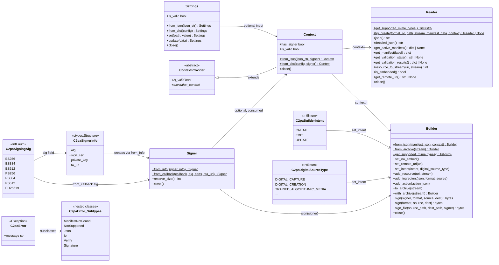

# Class diagram

This diagram shows the public classes in the Python library and their relationships.

```mermaid
classDiagram
    direction LR

    class Settings {
        +from_json(json_str) Settings$
        +from_dict(config) Settings$
        +set(path, value) Settings
        +update(data) Settings
        +close()
        +is_valid bool
    }

    class ContextProvider {
        <<abstract>>
        +is_valid bool*
        +execution_context*
    }

    class Context {
        +from_json(json_str, signer) Context$
        +from_dict(config, signer) Context$
        +has_signer bool
        +is_valid bool
        +close()
    }

    class Reader {
        +get_supported_mime_types() list~str~$
        +try_create(format_or_path, stream, manifest_data, context) Reader | None$
        +json() str
        +detailed_json() str
        +get_active_manifest() dict | None
        +get_manifest(label) dict
        +get_validation_state() str | None
        +get_validation_results() dict | None
        +resource_to_stream(uri, stream) int
        +is_embedded() bool
        +get_remote_url() str | None
        +close()
    }

    class Builder {
        +from_json(manifest_json, context) Builder$
        +from_archive(stream) Builder$
        +get_supported_mime_types() list~str~$
        +set_no_embed()
        +set_remote_url(url)
        +set_intent(intent, digital_source_type)
        +add_resource(uri, stream)
        +add_ingredient(json, format, source)
        +add_action(action_json)
        +to_archive(stream)
        +with_archive(stream) Builder
        +sign(signer, format, source, dest) bytes
        +sign(format, source, dest) bytes
        +sign_file(source_path, dest_path, signer) bytes
        +close()
    }

    class Signer {
        +from_info(signer_info) Signer$
        +from_callback(callback, alg, certs, tsa_url) Signer$
        +reserve_size() int
        +close()
    }

    class C2paSignerInfo {
        <<ctypes.Structure>>
        +alg
        +sign_cert
        +private_key
        +ta_url
    }

    class C2paSigningAlg {
        <<IntEnum>>
        ES256
        ES384
        ES512
        PS256
        PS384
        PS512
        ED25519
    }

    class C2paBuilderIntent {
        <<IntEnum>>
        CREATE
        EDIT
        UPDATE
    }

    class C2paDigitalSourceType {
        <<IntEnum>>
        DIGITAL_CAPTURE
        DIGITAL_CREATION
        TRAINED_ALGORITHMIC_MEDIA
        ...
    }

    class C2paError {
        <<Exception>>
        +message str
    }

    class C2paError_Subtypes {
        <<nested classes>>
        ManifestNotFound
        NotSupported
        Json
        Io
        Verify
        Signature
        ...
    }

    ContextProvider <|-- Context : extends
    Settings --> Context : optional input
    Signer --> Context : optional, consumed
    C2paSignerInfo --> Signer : creates via from_info
    C2paSigningAlg --> C2paSignerInfo : alg field
    C2paSigningAlg --> Signer : from_callback alg
    Context --> Reader : context=
    Context --> Builder : context=
    Signer --> Builder : sign(signer)
    C2paBuilderIntent --> Builder : set_intent
    C2paDigitalSourceType --> Builder : set_intent
    C2paError --> C2paError_Subtypes : subclasses
```