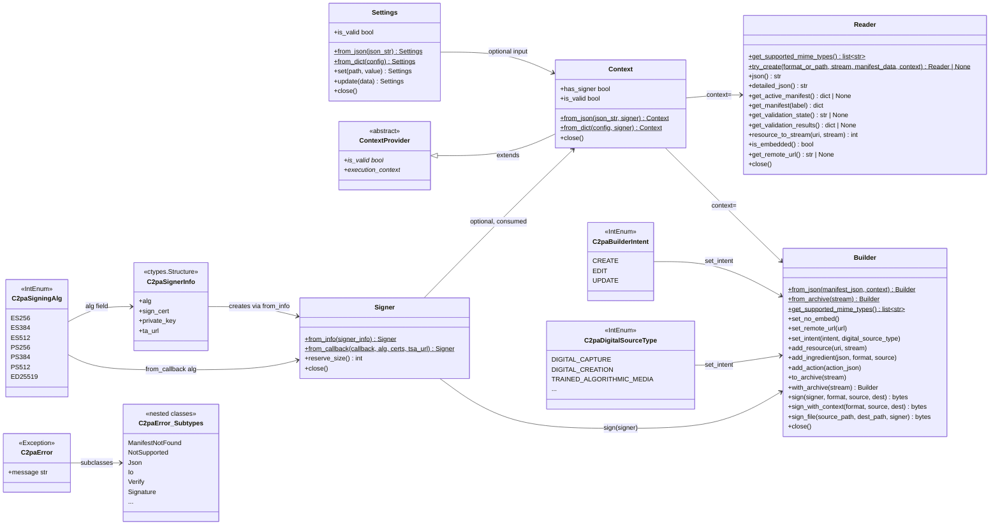
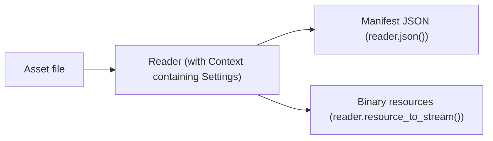
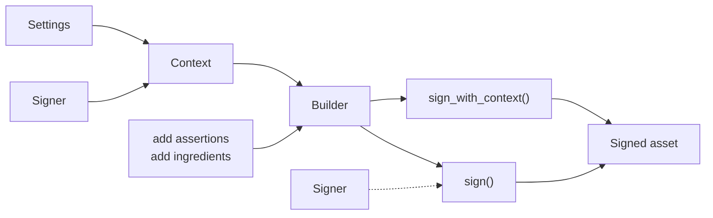

# Using Context to configure the SDK

Use the `Context` class to configure how `Reader`, `Builder`, and other aspects of the SDK operate.

## What is Context?

Context encapsulates SDK configuration:

- **Settings**: Verification options, [Builder behavior](#configuring-builder), [Reader trust configuration](#configuring-reader), thumbnail configuration, and more. See [Using settings](settings.md) for complete details.
- [**Signer configuration**](#configuring-a-signer): Optional signer credentials that can be stored in the Context for reuse.
- **State isolation**: Each `Context` is independent, allowing different configurations to coexist in the same application.

### Why use Context?

`Context` is better than the deprecated global `load_settings()` function because it:

- **Makes dependencies explicit**: Configuration is passed directly to `Reader` and `Builder`, not hidden in global state.
- **Enables multiple configurations**: Run different configurations simultaneously. For example, one for development with test certificates, another for production with strict validation.
- **Eliminates global state**: Each `Reader` and `Builder` gets its configuration from the `Context` you pass, avoiding subtle bugs from shared state.
- **Simplifies testing**: Create isolated configurations for tests without worrying about cleanup or interference between them.
- **Improves code clarity**: Reading `Builder(manifest_json, ctx)` immediately shows that configuration is being used.

### Class diagram

This diagram shows the public classes in the SDK and their relationships.



> [!NOTE]
> The deprecated `load_settings()` function still works for backward compatibility but you are encouraged to migrate your code to use `Context`. See [Migrating from load_settings](#migrating-from-load_settings).

## Workflow overview

The SDK supports two main workflows. `Settings` and `Context` are currently optional in both (but recommended). `Reader` and `Builder` can still be used directly with SDK defaults.

### Reading provenance

Read and inspect C2PA data already embedded in (or attached to) an asset:



```py
from c2pa import Reader

reader = Reader("signed_image.jpg")
print(reader.json())  # Manifest store as JSON
```

### Signing content

Create new C2PA provenance data and sign it into an asset:



```py
from c2pa import Builder, Signer, C2paSignerInfo, C2paSigningAlg

builder = Builder(manifest_json)
# ... add assertions, ingredients, resources ...
with open("source.jpg", "rb") as src, open("signed.jpg", "w+b") as dst:
    builder.sign(signer, "image/jpeg", src, dst)
```

`Settings` and `Context` enable to customize behavior (trust configuration, thumbnail settings, claim generator info, and so on).

## Creating a Context

There are several ways to create a `Context`, depending on your needs:

- [Using SDK default settings](#using-sdk-default-settings)
- [From a JSON string](#from-a-json-string)
- [From a dictionary](#from-a-dictionary)
- [From a Settings object](#from-a-settings-object)

### Using SDK default settings

Without additional parameters, a default context is using [SDK default settings](settings.md#default-configuration).

**When to use:** For quick prototyping, or when you're happy with SDK default behavior (verification enabled, thumbnails enabled at 1024px, and so on).

```py
from c2pa import Context

ctx = Context()  # Uses SDK defaults
```

### From a JSON string

You can create a `Context` directly from a JSON configuration string.

**When to use:** For simple configuration that doesn't need to be shared across the codebase, or when hard-coding settings for a specific purpose (for example, a utility script).

```py
ctx = Context.from_json('''{
  "verify": {"verify_after_sign": true},
  "builder": {
    "thumbnail": {"enabled": false},
    "claim_generator_info": {"name": "An app", "version": "0.1.0"}
  }
}''')
```

### From a dictionary

You can create a `Context` from a Python dictionary.

**When to use:** When you want to build configuration programmatically using native Python data structures.

```py
ctx = Context.from_dict({
    "verify": {"verify_after_sign": True},
    "builder": {
        "thumbnail": {"enabled": False},
        "claim_generator_info": {"name": "An app", "version": "0.1.0"}
    }
})
```

### From a Settings object

You can build a `Settings` object programmatically, then create a `Context` from that.

**When to use:** For configuration that needs runtime logic (such as conditional settings based on environment), or when you want to build settings incrementally.

```py
from c2pa import Settings, Context

settings = Settings()
settings.set("builder.thumbnail.enabled", "false")
settings.set("verify.verify_after_sign", "true")
settings.update({
    "builder": {
        "claim_generator_info": {"name": "An app", "version": "0.1.0"}
    }
})

ctx = Context(settings)
```

## Common configuration patterns

### Development environment with test certificates

During development, you often need to trust self-signed or custom CA certificates:

```py
# Load your test root CA
with open("test-ca.pem", "r") as f:
    test_ca = f.read()

ctx = Context.from_dict({
    "trust": {
        "user_anchors": test_ca
    },
    "verify": {
        "verify_after_reading": True,
        "verify_after_sign": True,
        "remote_manifest_fetch": False,
        "ocsp_fetch": False
    },
    "builder": {
        "claim_generator_info": {"name": "Dev Build", "version": "dev"},
        "thumbnail": {"enabled": False}
    }
})
```

### Configuration from environment variables

Adapt configuration based on the runtime environment:

```py
import os

env = os.environ.get("ENVIRONMENT", "dev")

settings = Settings()
if env == "production":
    settings.update({"verify": {"strict_v1_validation": True}})
else:
    settings.update({"verify": {"remote_manifest_fetch": False}})

ctx = Context(settings)
```

### Layered configuration

Load base configuration and apply runtime overrides:

```py
import json

# Load base configuration from a file
with open("config/base.json", "r") as f:
    base_config = json.load(f)

settings = Settings.from_dict(base_config)

# Apply environment-specific overrides
settings.update({"builder": {"claim_generator_info": {"version": app_version}}})

ctx = Context(settings)
```

For the full list of settings and defaults, see [Using settings](settings.md).

## Configuring Reader

Use `Context` to control how `Reader` validates manifests and handles remote resources, including:

- **Verification behavior**: Whether to verify after reading, check trust, and so on.
- [**Trust configuration**](#trust-configuration): Which certificates to trust when validating signatures.
- [**Network access**](#offline-operation): Whether to fetch remote manifests or OCSP responses.

> [!IMPORTANT]
> `Context` is used only at construction. `Reader` copies the configuration it needs internally, so the `Context` object does not need to outlive the `Reader`. A `Context` object can also be reused for multiple `Reader` object instances.

```py
ctx = Context.from_dict({"verify": {"remote_manifest_fetch": False}})
reader = Reader("image.jpg", context=ctx)
```

### Reading from a file

```py
ctx = Context.from_dict({
    "verify": {
        "remote_manifest_fetch": False,
        "ocsp_fetch": False
    }
})

reader = Reader("image.jpg", context=ctx)
print(reader.json())
```

### Reading from a stream

```py
with open("image.jpg", "rb") as stream:
    reader = Reader("image/jpeg", stream, context=ctx)
    print(reader.json())
```

### Trust configuration

Example of trust configuration in a settings dictionary:

```py
ctx = Context.from_dict({
    "trust": {
        "user_anchors": "-----BEGIN CERTIFICATE-----\nMIICEzCCA...\n-----END CERTIFICATE-----",
        "trust_config": "1.3.6.1.4.1.311.76.59.1.9\n1.3.6.1.4.1.62558.2.1"
    }
})

reader = Reader("signed_asset.jpg", context=ctx)
```

### Full validation

To configure full validation, with all verification features enabled:

```py
ctx = Context.from_dict({
    "verify": {
        "verify_after_reading": True,
        "verify_trust": True,
        "verify_timestamp_trust": True,
        "remote_manifest_fetch": True
    }
})

reader = Reader("asset.jpg", context=ctx)
```

For more information, see [Settings - Verify](settings.md#verify).

### Offline operation

To configure `Reader` to work with no network access:

```py
ctx = Context.from_dict({
    "verify": {
        "remote_manifest_fetch": False,
        "ocsp_fetch": False
    }
})

reader = Reader("local_asset.jpg", context=ctx)
```

For more information, see [Settings - Offline or air-gapped environments](settings.md#offline-or-air-gapped-environments).

## Configuring Builder

`Builder` uses `Context` to control how to create and sign C2PA manifests. The `Context` affects:

- **Claim generator information**: Application name, version, and metadata embedded in the manifest.
- **Thumbnail generation**: Whether to create thumbnails, size, quality, and format.
- **Action tracking**: Auto-generation of actions like `c2pa.created`, `c2pa.opened`, `c2pa.placed`.
- **Intent**: The purpose of the claim (create, edit, or update).
- **Verification after signing**: Whether to validate the manifest immediately after signing.
- **Signer configuration** (optional): Credentials can be stored in the context for reuse.

> [!IMPORTANT]
> The `Context` is used only when constructing the `Builder`. The `Builder` copies the configuration it needs internally, so the `Context` object does not need to outlive the `Builder`. A `Context` object can also be reused for multiple `Builder` object instances.

### Context and archives

Archives (`.c2pa` files) store only the manifest definition. They do **not** store settings or context. This means:

- **`Builder.from_archive(stream)`** creates a context-free builder. All settings revert to SDK defaults regardless of what context the original builder had.
- **`Builder({}, ctx).with_archive(stream)`** creates a builder with a context first, then loads the archived manifest definition into it. The context settings are preserved and propagated to this Builder instance.

Use `with_archive()` when your workflow depends on specific settings (thumbnails, claim generator, intent, and so on). Use `from_archive()` only for quick prototyping where SDK defaults are acceptable.

```py
# Recommended: with_archive propagates context settings
ctx = Context.from_dict({
    "builder": {
        "thumbnail": {"enabled": False},
        "claim_generator_info": {"name": "My App", "version": "1.0"}
    }
})

with open("manifest.c2pa", "rb") as archive:
    builder = Builder({}, ctx)
    builder.with_archive(archive)
    # builder now has the archived definition + context settings
```

For more details on archive workflows, see [Working with archives](working-stores.md#working-with-archives).

### Basic use

```py
ctx = Context.from_dict({
    "builder": {
        "claim_generator_info": {
            "name": "An app",
            "version": "0.1.0"
        },
        "intent": {"Create": "digitalCapture"}
    }
})

builder = Builder(manifest_json, ctx)

# Pass signer explicitly at signing time
with open("source.jpg", "rb") as src, open("output.jpg", "w+b") as dst:
    builder.sign(signer, "image/jpeg", src, dst)
```

### Controlling thumbnail generation

```py
# Disable thumbnails for faster processing
no_thumbnails_ctx = Context.from_dict({
    "builder": {
        "claim_generator_info": {"name": "Batch Processor"},
        "thumbnail": {"enabled": False}
    }
})

# Or customize thumbnail size and quality e.g. for mobile
mobile_ctx = Context.from_dict({
    "builder": {
        "claim_generator_info": {"name": "Mobile App"},
        "thumbnail": {
            "enabled": True,
            "long_edge": 512,
            "quality": "low",
            "prefer_smallest_format": True
        }
    }
})
```

## Configuring a Signer

### Signing concepts

C2PA uses a certificate-based trust model to prove who signed an asset. When creating a `Signer`, the following parameters are required:

- **Certificate chain** (`sign_cert`): An X.509 certificate chain in PEM format. The first certificate identifies the signer; subsequent certificates form a chain up to a trusted root (trust anchor). Verifiers use this chain to confirm that the signature comes from a trusted source.
- **Timestamp authority URL** (`ta_url`): An optional [RFC 3161](https://www.rfc-editor.org/rfc/rfc3161) timestamp server URL. When provided, the SDK requests a trusted timestamp during signing. This proves _when_ the signature was made. Timestamping matters because signatures remain verifiable even after the signing certificate expires, as long as the certificate was valid at the time of signing.

### Signer creation patterns

A Signer can be configured two ways:

- [From Settings (signer-on-context)](#from-settings): pass the signer when creating the `Context`.
- [Explicit signer passed to sign()](#explicit-programmatic-signer): pass the signer directly at signing time.

### From Settings

Create a `Signer` and pass it to the `Context`. The signer is **consumed**: the `Signer` object becomes invalid after this call and must not be reused directly after that point. The `Context` takes ownership of the underlying native signer.

```py
from c2pa import Context, Settings, Builder, Signer, C2paSignerInfo, C2paSigningAlg

# Create a signer
signer_info = C2paSignerInfo(
    C2paSigningAlg.ES256, cert_data, key_data, b"http://timestamp.digicert.com"
)
signer = Signer.from_info(signer_info)

# Create context with signer (signer is consumed)
ctx = Context(settings, signer)
# signer is now invalid and must not be used directly again

# Build and sign, no signer argument needed since a Signer is in the Context
builder = Builder(manifest_json, ctx)
with open("source.jpg", "rb") as src, open("output.jpg", "w+b") as dst:
    builder.sign_with_context("image/jpeg", src, dst)
```

### Explicit (programmatic) signer

For full programmatic control, create a `Signer` and pass it directly to `Builder.sign()`:

```py
signer = Signer.from_info(signer_info)
builder = Builder(manifest_json, ctx)

with open("source.jpg", "rb") as src, open("output.jpg", "w+b") as dst:
    builder.sign(signer, "image/jpeg", src, dst)
```

You can also use the fluent `ContextBuilder` API to attach a signer programmatically via `with_signer`:

```py
ctx = Context.builder().with_settings(settings).with_signer(signer).build()
```

### Precedence rules for Signer configuration

If both an explicit signer and a context signer are available, the explicit signer always takes precedence:

```py
# Explicit signer wins over context signer
builder.sign(explicit_signer, "image/jpeg", source, dest)
```

## Context lifetime and usage

### `with` statement

`Context` supports the `with` statement for automatic resource cleanup:

```py
with Context() as ctx:
    reader = Reader("image.jpg", context=ctx)
    print(reader.json())
# Resources are automatically released
```

### Reusable contexts

You can reuse the same `Context` to create multiple readers and builders:

```py
ctx = Context(settings)

# All three use the same configuration through usage of the same context
builder1 = Builder(manifest1, ctx)
builder2 = Builder(manifest2, ctx)
reader = Reader("image.jpg", context=ctx)

# Context can be closed after construction; readers/builders still work
```

Using the `with` statement for automatic cleanup:

```py
with Context(settings) as ctx:
    builder1 = Builder(manifest1, ctx)
    builder2 = Builder(manifest2, ctx)
    reader = Reader("image.jpg", context=ctx)
# Resources are automatically released
```

### Multiple contexts for different purposes

Use different `Context` objects when you need different settings. Ror example, for development vs. production, or different trust configurations:

```py
dev_ctx = Context(dev_settings)
prod_ctx = Context(prod_settings)

# Different builders with different configurations
dev_builder = Builder(manifest, dev_ctx)
prod_builder = Builder(manifest, prod_ctx)
```

### ContextProvider abstract base class

`ContextProvider` is an abstract base class (ABC) that enables context provider implementations. Subclass it and implement the `is_valid` and `execution_context` abstract properties to create a provider that can be passed to `Reader` or `Builder` as `Context`.

```py
from c2pa import ContextProvider, Context

# The built-in Context inherits from ContextProvider
ctx = Context()
assert isinstance(ctx, ContextProvider)  # True
```

## Migrating from load_settings

The `load_settings()` function is deprecated. Replace it with `Settings` and `Context` APIs instead:

| Aspect | load_settings (legacy) | Context |
|--------|------------------------|---------|
| Scope | Global state | Per Reader/Builder, passed explicitly |
| Multiple configs | Not supported | One context per configuration |
| Testing | Shared global state | Isolated contexts per test |

**Deprecated:**

```py
from c2pa import load_settings, Reader

load_settings({"builder": {"thumbnail": {"enabled": False}}})
reader = Reader("image.jpg")  # uses global settings
```

**Using current APIs:**

```py
from c2pa import Settings, Context, Reader

settings = Settings.from_dict({"builder": {"thumbnail": {"enabled": False}}})
ctx = Context(settings)
reader = Reader("image.jpg", context=ctx)
```

## See also

- [Using settings](settings.md): schema, property reference, and examples.
- [Usage](usage.md): reading and signing with Reader and Builder.
- [CAI settings schema](https://opensource.contentauthenticity.org/docs/manifest/json-ref/settings-schema/): full schema reference.
