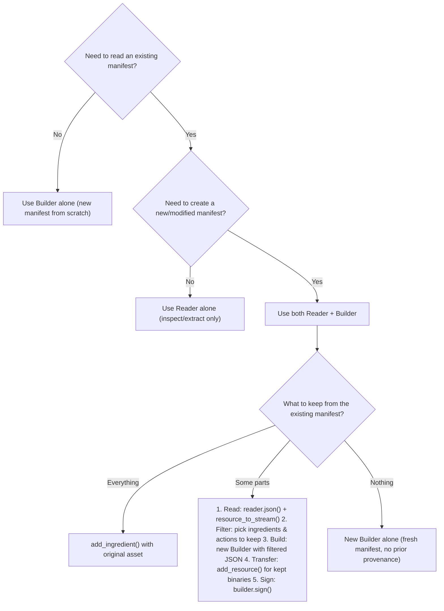

# Frequently-asked questions (FAQs)

## When do I use `Reader` vs. `Builder`?

### Quick reference decision tree



### When to use `Reader`

**Use a `Reader` when the goal is only to inspect or extract data without creating a new manifest.**

- Validating whether an asset has C2PA credentials
- Displaying provenance information to a user
- Extracting thumbnails for display
- Checking trust status and validation results
- Inspecting ingredient chains

```py
reader = Reader("image.jpg", context=ctx)
json_data = reader.json()                    # inspect the manifest
reader.resource_to_stream(thumb_uri, stream) # extract a thumbnail
```

The `Reader` is read-only. It never modifies the source asset.

### When to use a `Builder`

**Use a `Builder` when creating a manifest from scratch on an asset that has no existing C2PA data, or when intentionally starting with a clean slate.**

- Signing a brand-new asset for the first time
- Adding C2PA credentials to an unsigned asset
- Creating a manifest with all content defined from scratch

```py
builder = Builder(manifest_json, context=ctx)
with open("ingredient.jpg", "rb") as ingredient:
    builder.add_ingredient(ingredient_json, "image/jpeg", ingredient)
with open("source.jpg", "rb") as src, open("output.jpg", "w+b") as dst:
    builder.sign(signer, "image/jpeg", src, dst)
```

Every call to the `Builder` constructor or `Builder.from_archive()` creates a new `Builder`. There is no way to modify an existing signed manifest directly.

### When to use both `Reader` and `Builder` together

**Use both when filtering content from an existing manifest into a new one. The `Reader` extracts data, application code filters it, and a new `Builder` receives only the selected parts.**

- Filtering specific ingredients from a manifest
- Dropping specific assertions while keeping others
- Filtering actions (keeping some, removing others)
- Merging ingredients from multiple signed assets or archives
- Re-signing with different settings while keeping some original content

```py
import json

# Read existing (does not modify the asset)
reader = Reader("signed.jpg", context=ctx)
parsed = json.loads(reader.json())

# Filter what to keep (application-specific logic)
kept = filter_manifest(parsed)

# Create a new Builder with only the filtered content
builder = Builder(json.dumps(kept), context=ctx)
# ... transfer resources ...
with open("source.jpg", "rb") as src, open("output.jpg", "w+b") as dst:
    builder.sign(signer, "image/jpeg", src, dst)
```

## How should I add ingredients?

There are two ways: using `add_ingredient()` (or `add_ingredient_file()`) and injecting ingredient JSON directly into the manifest definition.

| Approach | What it does | When to use |
| --- | --- | --- |
| `add_ingredient(json, format, stream)` or `add_ingredient_file(json, path)` | Reads the source (a signed asset, an unsigned file, or a `.c2pa` archive), extracts its manifest store automatically, generates a thumbnail | Adding an ingredient where the library should handle extraction |
| Inject via manifest JSON + `add_resource()` | Accepts the ingredient JSON and all binary resources provided manually | Reconstructing from a reader or merging from multiple readers, where the data has already been extracted |

## When to use archives

There are two distinct archive concepts:

- **Builder archives (working store archives)** (`to_archive()` / `from_archive()`) serialize the full `Builder` state (manifest definition, resources, ingredients) so it can be resumed or signed later, possibly on a different machine or in a different process. The archive is not yet signed. Use builder archives when:
  - Signing must happen on a different machine (e.g., an HSM server)
  - Checkpointing work-in-progress before signing
  - Transmitting a `Builder` state across a network boundary

- **Ingredient archives** contain the manifest store data (`.c2pa` binary) from ingredients that were added to a `Builder`. When a signed asset is added as an ingredient via `add_ingredient()`, the library extracts and stores its manifest store as `manifest_data` within the ingredient record. When the `Builder` is then serialized via `to_archive()`, these ingredient manifest stores are included. Use ingredient archives when:
  - Building an ingredients catalog for pick-and-choose workflows
  - Preserving provenance history from source assets
  - Transferring ingredient data between `Reader` and `Builder`

See also [Working stores](https://opensource.contentauthenticity.org/docs/rust-sdk/docs/working-stores).

Key consideration for builder archives: `from_archive()` creates a new `Builder` with **default** context settings. If specific settings are needed (e.g., thumbnails disabled), pass a `context` to `from_archive()`:

```py
import io

# Preserves the caller's context settings
archive_stream = io.BytesIO(archive_data)
builder = Builder.from_archive(archive_stream, context=ctx)
with open("source.jpg", "rb") as src, open("output.jpg", "w+b") as dst:
    builder.sign(signer, "image/jpeg", src, dst)
```

## Can a manifest be modified in place?

**No.** C2PA manifests are cryptographically signed. Any modification invalidates the signature. The only way to "modify" a manifest is to create a new `Builder` with the desired changes and sign it. This is by design: it ensures the integrity of the provenance chain.

## What happens to the provenance chain when rebuilding a working store?

When creating a new manifest, the chain is preserved once the original asset is added as an ingredient. The ingredient carries the original's manifest data, so validators can trace the full history. If the original is not added as an ingredient, the provenance chain is broken: the new manifest has no link to the original. This might be intentional (starting fresh) or a mistake (losing provenance).
