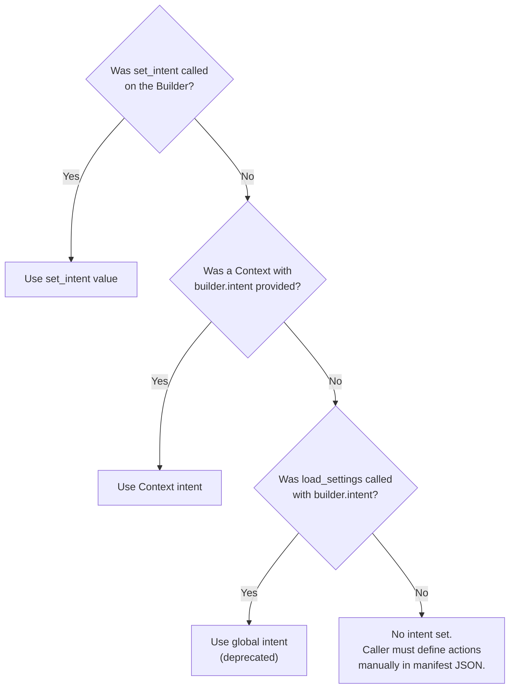
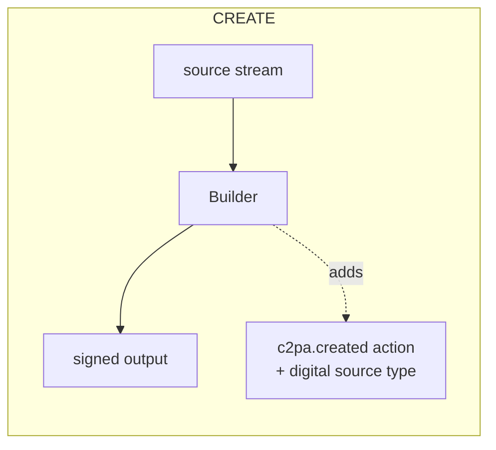
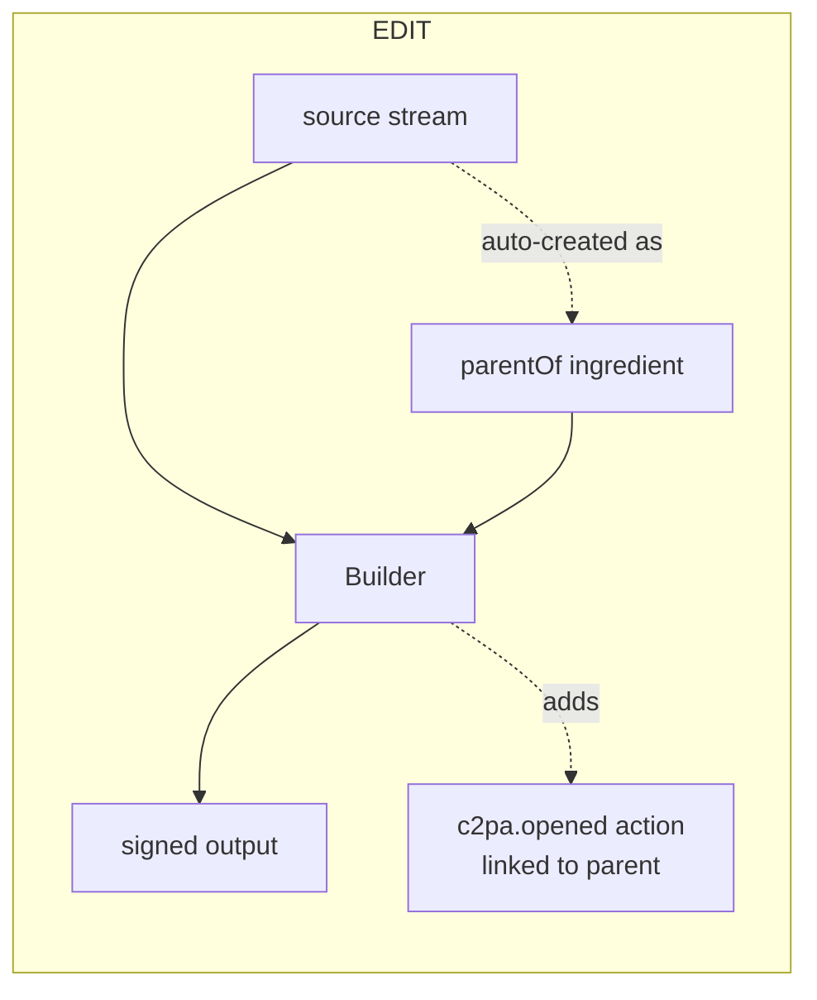
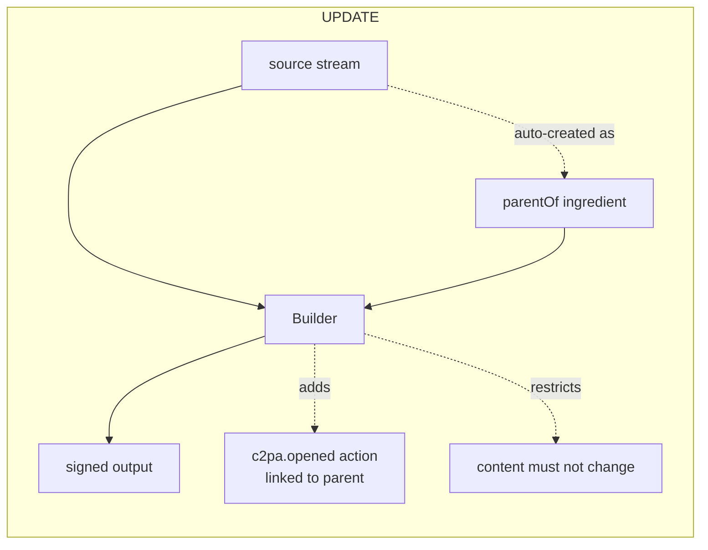
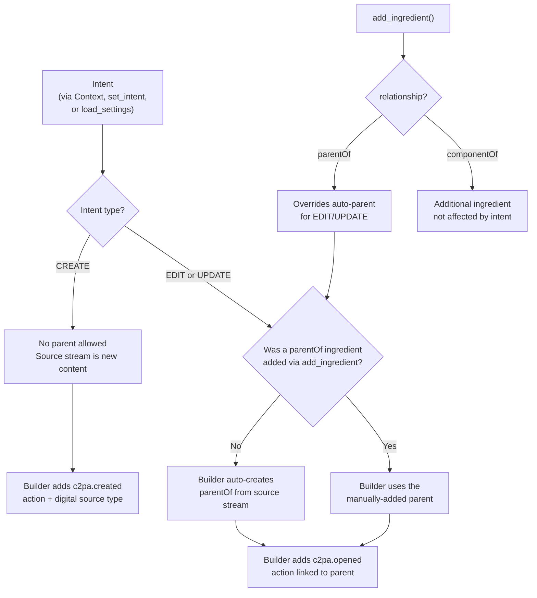
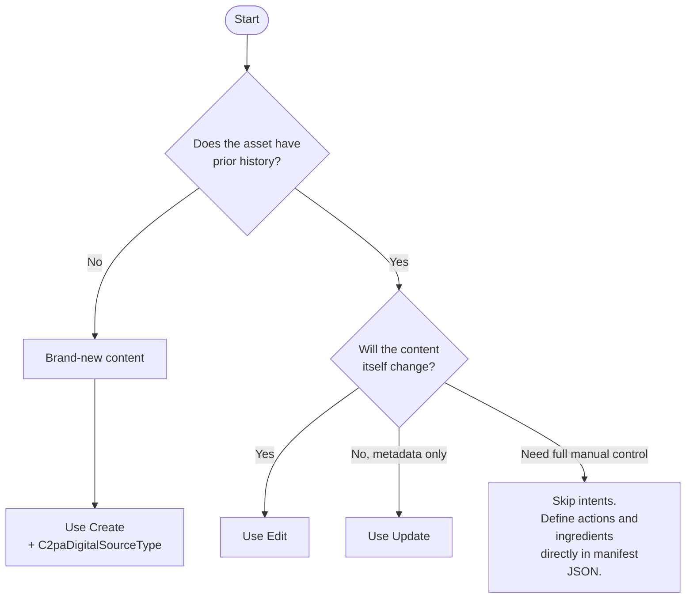

# Using Builder intents

_Intents_ enable validation, add the actions required by the C2PA specification, and help prevent invalid operations when using a `Builder`. Intents are about the operation (create, edit, update) executed on the source asset.

## Why use intents?

Without intents, you have to manually construct the correct manifest structure: adding the required actions (`c2pa.created` or `c2pa.opened` as the first action per the specification), setting digital source types, managing ingredients, and linking actions to ingredients. Getting any of this wrong produces a non-compliant manifest.

With intents, the caller declares *what is being done* and `Builder` handles the rest.

For example, without intents you have to manually wire up actions and make sure ingredients are properly linked to actions. This is especially important for `parentOf` ingredient relationships with the `c2pa.opened` action.

```py
with Builder({
    "assertions": [
        {
            "label": "c2pa.actions",
            "data": {
                "actions": [
                    {
                        "action": "c2pa.created",
                        "digitalSourceType": "http://cv.iptc.org/newscodes/digitalsourcetype/trainedAlgorithmicMedia",
                    }
                ]
            },
        }
    ],
}) as builder:
    with open("source.jpg", "rb") as source, open("output.jpg", "wb") as dest:
        builder.sign(signer, "image/jpeg", source, dest)
```

But with intents, `Builder` generates the actions automatically; for example:

```py
with Builder({}) as builder:
    builder.set_intent(
        C2paBuilderIntent.CREATE,
        C2paDigitalSourceType.TRAINED_ALGORITHMIC_MEDIA,
    )
    with open("source.jpg", "rb") as source, open("output.jpg", "wb") as dest:
        builder.sign(signer, "image/jpeg", source, dest)
```

Both of these code snippets produce the same signed manifest. But with intents, `Builder` validates the setup and fills in the required structure.

## Setting the intent

You can set the intent on a `Builder` instance by:

- [Using Context](#using-context)
- [Using `set_intent` on the `Builder`](#using-set_intent-on-the-builder)

Don't set the intent using the deprecated `load_settings()` function. For existing code, see [Context and settings - Migrating from load_settings](context-settings.md#migrating-from-load_settings).

### Using Context

Pass the intent through a `Context` object when creating a `Builder`. This keeps intent configuration alongside other builder settings such as `claim_generator_info` and `thumbnail`.

```py
from c2pa import Context, Builder

ctx = Context.from_dict({
    "builder": {
        "intent": {"Create": "digitalCapture"},
        "claim_generator_info": {"name": "My App", "version": "0.1.0"},
    }
})

with Builder({}, context=ctx) as builder:
    with open("source.jpg", "rb") as source, open("output.jpg", "wb") as dest:
        builder.sign(signer, "image/jpeg", source, dest)
```

You can reuse the same `Context` across multiple `Builder` instances, ensuring consistent configuration:

```py
ctx = Context.from_dict({
    "builder": {
        "intent": "edit",
        "claim_generator_info": {"name": "Batch Editor"},
    }
})

for path in image_paths:
    with Builder({}, context=ctx) as builder:
        builder.sign_file(path, output_path(path), signer)
```

### Using `set_intent` on the Builder

Call `set_intent` directly on a `Builder` instance for one-off operations or when the intent is determined at runtime. For example:

```py
with Builder({}) as builder:
    builder.set_intent(
        C2paBuilderIntent.CREATE,
        C2paDigitalSourceType.TRAINED_ALGORITHMIC_MEDIA,
    )
    with open("source.jpg", "rb") as source, open("output.jpg", "wb") as dest:
        builder.sign(signer, "image/jpeg", source, dest)
```

### Intent precedence

When an intent is configured in multiple places, the most specific setting takes precedence.
If `set_intent` is called on a `Builder` instance, it takes precedence over all other sources.



## How intents relate to the source stream

The intent operates on the source passed to `sign()`, not on any ingredient added via `add_ingredient()`.

The following diagram shows what happens at sign time for each intent:







For `Edit` and `Update` intents, `Builder` looks at the source stream, and if no `parentOf` ingredient has been added manually, it automatically creates one from that stream (and adds the needed action). The source stream *becomes* the parent ingredient. If a `parentOf` ingredient has already been added manually (via `add_ingredient`), `Builder` uses that one instead and does not automatically create one from the source.

### How intent relates to `add_ingredient`

The `Builder` intent controls what the `Builder` does with the source stream (source asset) at sign time. The `add_ingredient` method adds other ingredients explicitly. These are separate concerns.



## Importing the enums

The `C2paBuilderIntent` and `C2paDigitalSourceType` enums are available from the `c2pa` package:

```py
from c2pa import (
    C2paBuilderIntent,
    C2paDigitalSourceType,
)
```

### Using `set_intent`

Use the `Builder.set_intent` method to specify the intent:

```py
builder.set_intent(intent, digital_source_type=C2paDigitalSourceType.EMPTY)
```

Where:
- `intent` is one of the [intent types](#intent-types).
- `digital_source_type` is one of the [`C2paDigitalSourceType` values](#c2padigitalsourcetype) that describes how the asset was made. Required for the `Create` intent. Defaults to `EMPTY`.

Raises `C2paError` if the intent cannot be set (for example, if a `parentOf` ingredient exists with `Create`).

### Intent types

Intent types can be any `C2paBuilderIntent` value:

| Intent | Operation | Parent ingredient | Auto-generated action |
|--------|-----------|-------------------|-----------------------|
| `CREATE` | Brand-new content | Must NOT have one | `c2pa.created` |
| `EDIT` | Modifying existing content | Auto-created from the source stream if not provided | `c2pa.opened` (linked to parent) |
| `UPDATE` | Metadata-only changes | Auto-created from the source stream if not provided | `c2pa.opened` (linked to parent) |

When configuring intent through `Context` or settings JSON, `Edit` and `Update` are specified as lowercase strings (`"edit"`, `"update"`), and `Create` as an object with the source type: `{"Create": "digitalCapture"}`.

### C2paDigitalSourceType

| Enum value | Description |
|------------|-------------|
| `EMPTY` | No source type specified. The default value. |
| `DIGITAL_CAPTURE` | Captured from a real-world source using a digital device |
| `TRAINED_ALGORITHMIC_MEDIA` | Created by a trained algorithm (for example, generative AI) |
| `DIGITAL_CREATION` | Created digitally (for example, drawing software) |
| `COMPOSITE_WITH_TRAINED_ALGORITHMIC_MEDIA` | Composite that includes trained algorithmic media |
| `ALGORITHMICALLY_ENHANCED` | Enhanced by an algorithm |
| `SCREEN_CAPTURE` | Captured from a screen |
| `VIRTUAL_RECORDING` | Recorded from a virtual environment |
| `COMPOSITE` | Composed from multiple sources |
| `COMPOSITE_CAPTURE` | Composite of captured sources |
| `COMPOSITE_SYNTHETIC` | Composite of synthetic sources |
| `DATA_DRIVEN_MEDIA` | Generated from data |
| `ALGORITHMIC_MEDIA` | Created by an algorithm |
| `HUMAN_EDITS` | Human-edited content |
| `COMPUTATIONAL_CAPTURE` | Captured with computational processing |
| `NEGATIVE_FILM` | Scanned from negative film |
| `POSITIVE_FILM` | Scanned from positive film |
| `PRINT` | Scanned from a print |
| `TRAINED_ALGORITHMIC_DATA` | Data created by a trained algorithm |

## Choosing the right intent



## Create intent

Use the `Create` intent when the asset has no prior history. A `C2paDigitalSourceType` is required to describe how the asset was produced. `Builder` will:

- Add a `c2pa.created` action with the specified digital source type.
- Reject the operation if a `parentOf` ingredient exists.

### Example: New digital creation

Using `Context`:

```py
ctx = Context.from_dict({
    "builder": {"intent": {"Create": "digitalCreation"}}
})

with Builder({}, context=ctx) as builder:
    with open("source.jpg", "rb") as source, open("output.jpg", "wb") as dest:
        builder.sign(signer, "image/jpeg", source, dest)
```

Using `set_intent`:

```py
with Builder({}) as builder:
    builder.set_intent(
        C2paBuilderIntent.CREATE,
        C2paDigitalSourceType.DIGITAL_CREATION,
    )
    with open("source.jpg", "rb") as source, open("output.jpg", "wb") as dest:
        builder.sign(signer, "image/jpeg", source, dest)
```

### Example: Marking AI-generated content

```py
ctx = Context.from_dict({
    "builder": {"intent": {"Create": "trainedAlgorithmicMedia"}}
})

with Builder({}, context=ctx) as builder:
    with open("ai_output.jpg", "rb") as source, open("signed_ai_output.jpg", "wb") as dest:
        builder.sign(signer, "image/jpeg", source, dest)
```

### Example: Create with additional manifest metadata

A `Context` and a manifest definition can be combined. The `Context` handles the intent; the manifest definition provides additional metadata and assertions:

```py
ctx = Context.from_dict({
    "builder": {
        "intent": {"Create": "digitalCapture"},
        "claim_generator_info": {"name": "an_app", "version": "0.1.0"},
    }
})

manifest_def = {
    "title": "My New Image",
    "assertions": [
        {
            "label": "cawg.training-mining",
            "data": {
                "entries": {
                    "cawg.ai_inference": {"use": "notAllowed"},
                    "cawg.ai_generative_training": {"use": "notAllowed"},
                }
            },
        }
    ],
}

with Builder(manifest_def, context=ctx) as builder:
    with open("photo.jpg", "rb") as source, open("signed_photo.jpg", "wb") as dest:
        builder.sign(signer, "image/jpeg", source, dest)
```

## Edit intent

Use the `Edit` intent when an existing asset is modified. With this intent, `Builder`:

1. Checks if a `parentOf` ingredient has already been added. If not, it automatically creates one from the source stream passed to `sign()`.
2. Adds a `c2pa.opened` action linked to the parent ingredient.

No `digital_source_type` parameter is needed.

### Example: Editing an asset

Using `Context`:

```py
ctx = Context.from_dict({"builder": {"intent": "edit"}})

with Builder({}, context=ctx) as builder:
    # The Builder reads "original.jpg" as the parent ingredient,
    # then writes the new manifest into "edited.jpg"
    with open("original.jpg", "rb") as source, open("edited.jpg", "wb") as dest:
        builder.sign(signer, "image/jpeg", source, dest)
```

Using `set_intent`:

```py
with Builder({}) as builder:
    builder.set_intent(C2paBuilderIntent.EDIT)
    with open("original.jpg", "rb") as source, open("edited.jpg", "wb") as dest:
        builder.sign(signer, "image/jpeg", source, dest)
```

The resulting manifest contains one ingredient with `relationship: "parentOf"` pointing to `original.jpg` and a `c2pa.opened` action referencing that ingredient. If the source file already has a C2PA manifest, the ingredient preserves the full provenance chain.

### Example: Editing with a manually-added parent

To control the parent ingredient's metadata (for example, to set a title or use a different source), add it explicitly:

```py
ctx = Context.from_dict({"builder": {"intent": "edit"}})

with Builder({}, context=ctx) as builder:
    with open("original.jpg", "rb") as original:
        builder.add_ingredient(
            {"title": "Original Photo", "relationship": "parentOf"},
            "image/jpeg",
            original,
        )

    with open("canvas.jpg", "rb") as source, open("edited.jpg", "wb") as dest:
        builder.sign(signer, "image/jpeg", source, dest)
```

### Example: Editing with additional component ingredients

A parent ingredient can be combined with component or input ingredients. The intent creates the `c2pa.opened` action for the parent; additional actions can reference components (`componentOf`) or inputs (`inputTo`):

```py
ctx = Context.from_dict({"builder": {"intent": "edit"}})

with Builder({
    "assertions": [
        {
            "label": "c2pa.actions.v2",
            "data": {
                "actions": [
                    {
                        "action": "c2pa.placed",
                        "parameters": {"ingredientIds": ["overlay_label"]},
                    }
                ]
            },
        }
    ],
}, context=ctx) as builder:

    # The Builder auto-creates a parent from the source stream
    # and generates a c2pa.opened action for it.

    # Add a component ingredient manually.
    with open("overlay.png", "rb") as overlay:
        builder.add_ingredient(
            {
                "title": "overlay.png",
                "relationship": "componentOf",
                "label": "overlay_label",
            },
            "image/png",
            overlay,
        )

    with open("original.jpg", "rb") as source, open("composite.jpg", "wb") as dest:
        builder.sign(signer, "image/jpeg", source, dest)
```

## Update intent

Use the `Update` intent for metadata-only changes where the asset content itself is not modified. This is a restricted form of the `Edit` intent that:

- Allows exactly one ingredient (the parent).
- Does not allow changes to the parent's hashed content.
- Produces a more compact manifest than `Edit`.

As with `Edit` intent, `Builder` automatically creates a parent ingredient from the source stream if one is not provided.

### Example: Adding metadata to a signed asset

Using `Context`:

```py
ctx = Context.from_dict({"builder": {"intent": "update"}})

with Builder({}, context=ctx) as builder:
    with open("signed_asset.jpg", "rb") as source, open("updated_asset.jpg", "wb") as dest:
        builder.sign(signer, "image/jpeg", source, dest)
```

Using `set_intent`:

```py
with Builder({}) as builder:
    builder.set_intent(C2paBuilderIntent.UPDATE)

    with open("signed_asset.jpg", "rb") as source, open("updated_asset.jpg", "wb") as dest:
        builder.sign(signer, "image/jpeg", source, dest)
```
