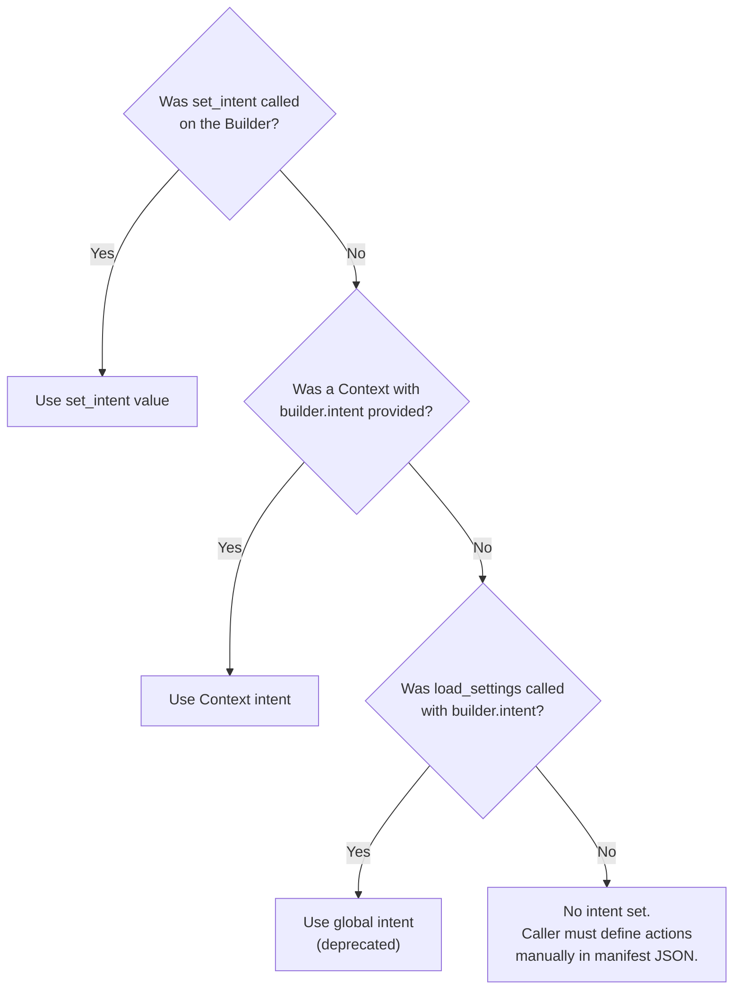
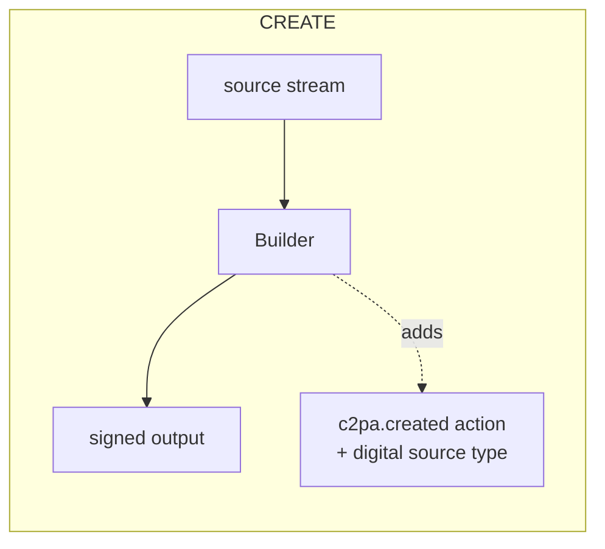
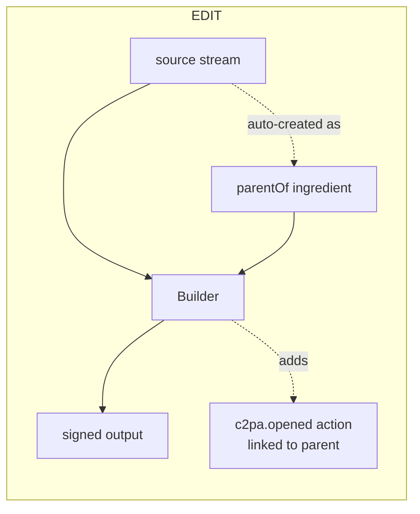
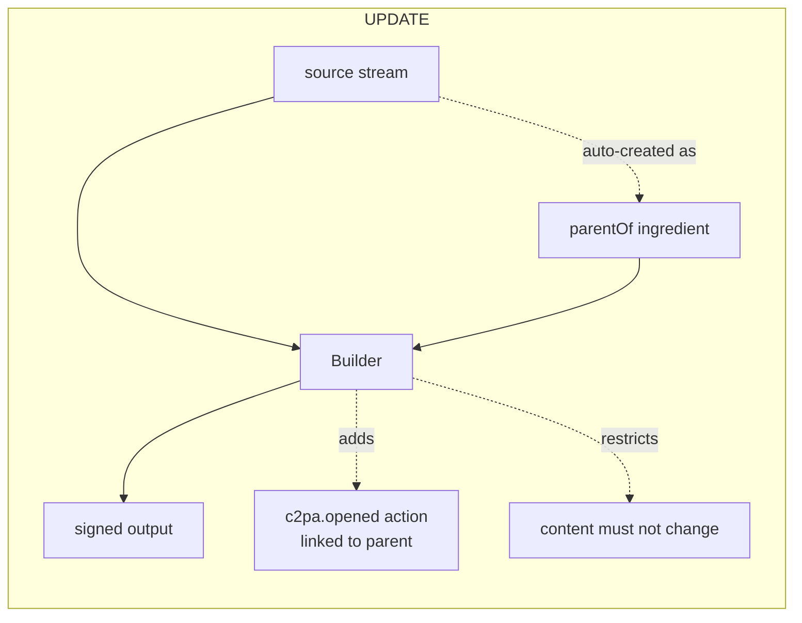
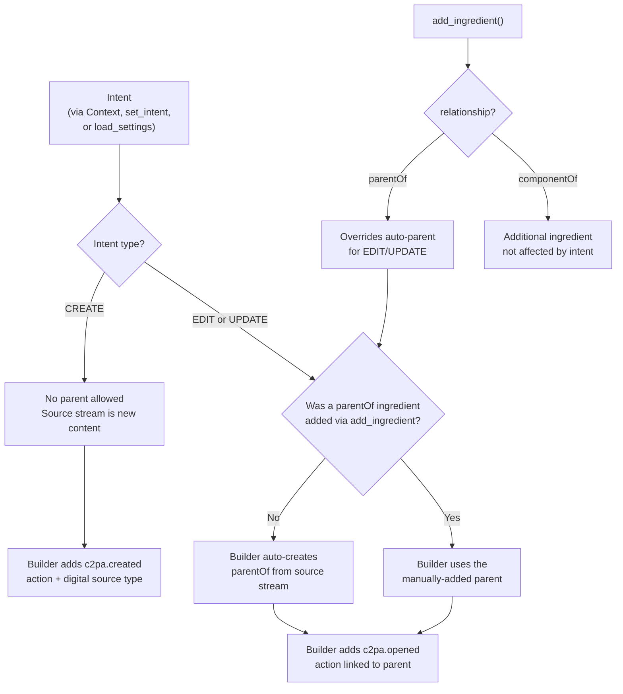
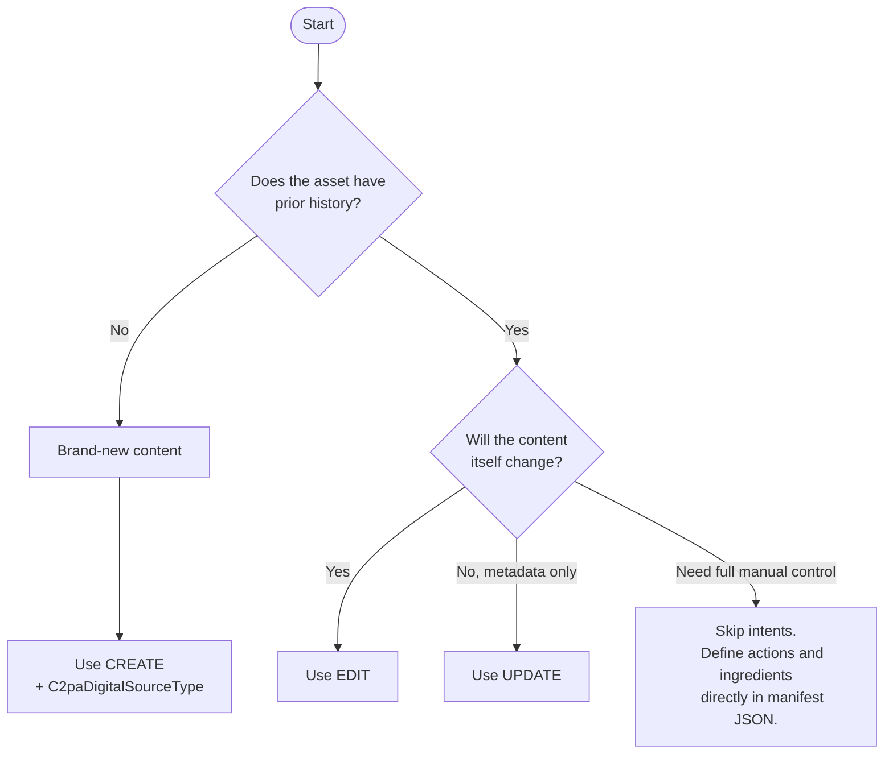

# Using Builder intents

Intents tell the `Builder` what kind of manifest is being created. They enable validation, add required default actions, and help prevent invalid operations.

Intents can be used for any asset type. Intents are about the **operation** (create, edit, update), not the asset type.

## Why use intents?

Without intents, the caller must manually construct the correct manifest structure: adding the right actions (`c2pa.created` or `c2pa.opened`), setting digital source types, managing parent ingredients, and linking actions to ingredients. Getting any of this wrong produces an invalid manifest.

With intents, the caller declares *what is being done* and the Builder handles the rest:

```py
# Without intents: the caller must manually wire everything up
with Builder({
    "assertions": [
        {
            "label": "c2pa.actions",
            "data": {
                "actions": [
                    {
                        "action": "c2pa.created",
                        "digitalSourceType": "http://cv.iptc.org/newscodes/digitalsourcetype/trainedAlgorithmicMedia",
                    }
                ]
            },
        }
    ],
}) as builder:
    with open("source.jpg", "rb") as source, open("output.jpg", "wb") as dest:
        builder.sign(signer, "image/jpeg", source, dest)

# With intents: the Builder generates the actions automatically
with Builder({}) as builder:
    builder.set_intent(
        C2paBuilderIntent.CREATE,
        C2paDigitalSourceType.TRAINED_ALGORITHMIC_MEDIA,
    )
    with open("source.jpg", "rb") as source, open("output.jpg", "wb") as dest:
        builder.sign(signer, "image/jpeg", source, dest)
```

Both produce the same signed manifest, but with intents the Builder validates the setup and fills in the required structure.

## Setting the intent

There are three ways to set the intent on a `Builder`. The intent determines which actions the Builder auto-generates at sign time.

### Using Context (recommended)

Pass the intent through a `Context` object when creating the `Builder`. This is the recommended approach because it keeps intent configuration alongside other builder settings such as `claim_generator_info` and `thumbnail`:

```py
from c2pa import Context, Builder

ctx = Context.from_dict({
    "builder": {
        "intent": {"Create": "digitalCapture"},
        "claim_generator_info": {"name": "My App", "version": "1.0.0"},
    }
})

with Builder({}, context=ctx) as builder:
    with open("source.jpg", "rb") as source, open("output.jpg", "wb") as dest:
        builder.sign(signer, "image/jpeg", source, dest)
```

The same `Context` can be reused across multiple `Builder` instances, ensuring consistent configuration:

```py
ctx = Context.from_dict({
    "builder": {
        "intent": "edit",
        "claim_generator_info": {"name": "Batch Editor"},
    }
})

for path in image_paths:
    with Builder({}, context=ctx) as builder:
        builder.sign_file(path, output_path(path), signer)
```

For more on `Context` and `Settings`, see [Using Context](context.md).

### Using `set_intent` on the Builder

Call `set_intent` directly on a `Builder` instance. This is useful for one-off operations or when the intent needs to be determined at runtime:

```py
with Builder({}) as builder:
    builder.set_intent(
        C2paBuilderIntent.CREATE,
        C2paDigitalSourceType.TRAINED_ALGORITHMIC_MEDIA,
    )
    with open("source.jpg", "rb") as source, open("output.jpg", "wb") as dest:
        builder.sign(signer, "image/jpeg", source, dest)
```

If both a `Context` intent and a `set_intent` call are present, the `set_intent` call takes precedence.

### Using `load_settings` (deprecated)

The global `load_settings` function can configure the intent for all subsequent `Builder` instances. This approach is deprecated in favor of `Context`:

```py
from c2pa import load_settings, Builder

# Deprecated: sets intent globally
load_settings({"builder": {"intent": "edit"}})

with Builder({}) as builder:
    with open("original.jpg", "rb") as source, open("edited.jpg", "wb") as dest:
        builder.sign(signer, "image/jpeg", source, dest)
```

To migrate from `load_settings` to `Context`, see [Migrating from load_settings](context.md#migrating-from-load_settings).

### Intent setting precedence

When an intent is configured in multiple places, the most specific setting wins:



## How intents relate to the source stream

The intent operates on the source stream passed to `sign()`. It does not target a specific ingredient added via `add_ingredient`; it targets the source asset itself.

The following diagram shows what happens at sign time for each intent:







For **EDIT** and **UPDATE**, the Builder looks at the source stream, and if no `parentOf` ingredient has been added manually, it automatically creates one from that stream. The source stream *becomes* the parent ingredient.

If a `parentOf` ingredient has already been added manually (via `add_ingredient`), the Builder uses that one instead and does not auto-create one from the source.

### How intent relates to `add_ingredient`

The intent and manually-added ingredients serve different roles. The intent controls what the Builder does with the source stream at sign time. The `add_ingredient` method adds extra ingredients (parent or component) explicitly.



## Import

```py
from c2pa import (
    Builder,
    Reader,
    Signer,
    Context,
    Settings,
    C2paSignerInfo,
    C2paSigningAlg,
    C2paBuilderIntent,
    C2paDigitalSourceType,
)
```

## Intent types

| Intent   | Operation                  | Parent ingredient                                     | Auto-generated action            |
| -------- | -------------------------- | ----------------------------------------------------- | -------------------------------- |
| `CREATE` | Brand-new content          | Must NOT have one                                     | `c2pa.created`                   |
| `EDIT`   | Modifying existing content | Auto-created from the source stream if not provided   | `c2pa.opened` (linked to parent) |
| `UPDATE` | Metadata-only changes      | Auto-created from the source stream if not provided   | `c2pa.opened` (linked to parent) |

## Choosing the right intent



## CREATE intent

Use `CREATE` when the asset is a brand-new digital creation with no prior history. The source stream is raw content, not a derivative of something else.

A `C2paDigitalSourceType` is required to describe how the asset was produced. The Builder will:

- Add a `c2pa.created` action with the specified digital source type.
- Reject the operation if a `parentOf` ingredient exists (new creations cannot have parents).

### Common digital source types

| Source type | When to use |
|-------------|-------------|
| `DIGITAL_CAPTURE` | Photo or video from a camera/device |
| `DIGITAL_CREATION` | Human-created using non-generative tools (e.g., Photoshop drawing) |
| `TRAINED_ALGORITHMIC_MEDIA` | AI-generated from a trained model |
| `COMPOSITE_SYNTHETIC` | Mix of elements with at least one generative AI element |
| `SCREEN_CAPTURE` | Screen recording or screenshot |
| `ALGORITHMIC_MEDIA` | Algorithm-generated without training data |

See `C2paDigitalSourceType` for the full list.

### Example: New digital creation

Using `Context`:

```py
ctx = Context.from_dict({
    "builder": {"intent": {"Create": "digitalCreation"}}
})

with Builder({}, context=ctx) as builder:
    with open("source.jpg", "rb") as source, open("output.jpg", "wb") as dest:
        builder.sign(signer, "image/jpeg", source, dest)
```

Using `set_intent`:

```py
with Builder({}) as builder:
    builder.set_intent(
        C2paBuilderIntent.CREATE,
        C2paDigitalSourceType.DIGITAL_CREATION,
    )

    with open("source.jpg", "rb") as source, open("output.jpg", "wb") as dest:
        builder.sign(signer, "image/jpeg", source, dest)
```

### Example: Marking AI-generated content

```py
ctx = Context.from_dict({
    "builder": {"intent": {"Create": "trainedAlgorithmicMedia"}}
})

with Builder({}, context=ctx) as builder:
    with open("ai_output.jpg", "rb") as source, open("signed_ai_output.jpg", "wb") as dest:
        builder.sign(signer, "image/jpeg", source, dest)
```

### Example: CREATE with additional manifest metadata

`Context` and a manifest definition can be combined. The context handles the intent, while the manifest definition provides additional metadata and assertions:

```py
ctx = Context.from_dict({
    "builder": {
        "intent": {"Create": "digitalCapture"},
        "claim_generator_info": {"name": "my_app", "version": "1.0.0"},
    }
})

manifest_def = {
    "title": "My New Image",
    "assertions": [
        {
            "label": "cawg.training-mining",
            "data": {
                "entries": {
                    "cawg.ai_inference": {"use": "notAllowed"},
                    "cawg.ai_generative_training": {"use": "notAllowed"},
                }
            },
        }
    ],
}

with Builder(manifest_def, context=ctx) as builder:
    with open("photo.jpg", "rb") as source, open("signed_photo.jpg", "wb") as dest:
        builder.sign(signer, "image/jpeg", source, dest)
```

## EDIT intent

Use `EDIT` when modifying an existing asset. The Builder will:

1. Check if a `parentOf` ingredient has already been added. If not, it **automatically creates one from the source stream** passed to `sign()`.
2. Add a `c2pa.opened` action linked to the parent ingredient.

No `digital_source_type` parameter is needed.

### Example: Editing an asset (auto-parent)

The simplest case: the source stream becomes the parent ingredient automatically.

Using `Context`:

```py
ctx = Context.from_dict({"builder": {"intent": "edit"}})

with Builder({}, context=ctx) as builder:
    with open("original.jpg", "rb") as source, open("edited.jpg", "wb") as dest:
        builder.sign(signer, "image/jpeg", source, dest)
```

Using `set_intent`:

```py
with Builder({}) as builder:
    builder.set_intent(C2paBuilderIntent.EDIT)

    # The Builder reads "original.jpg" as the parent ingredient,
    # then writes the new manifest into "edited.jpg"
    with open("original.jpg", "rb") as source, open("edited.jpg", "wb") as dest:
        builder.sign(signer, "image/jpeg", source, dest)
```

The resulting manifest contains:

- One ingredient with `relationship: "parentOf"` pointing to `original.jpg`.
- A `c2pa.opened` action referencing that ingredient.

If the source file already has a C2PA manifest, the ingredient preserves the full provenance chain.

### Example: Editing with a manually-added parent

To control the parent ingredient (for example, to set a title or use a different source), add it explicitly. The Builder will use that ingredient instead of auto-creating one:

```py
ctx = Context.from_dict({"builder": {"intent": "edit"}})

with Builder({}, context=ctx) as builder:
    with open("original.jpg", "rb") as original:
        builder.add_ingredient(
            {"title": "Original Photo", "relationship": "parentOf"},
            "image/jpeg",
            original,
        )

    with open("canvas.jpg", "rb") as source, open("edited.jpg", "wb") as dest:
        builder.sign(signer, "image/jpeg", source, dest)
```

### Example: Editing with additional component ingredients

A parent ingredient can be combined with component ingredients. The intent creates the `c2pa.opened` action for the parent; additional actions can be added for the components:

```py
ctx = Context.from_dict({"builder": {"intent": "edit"}})

with Builder({
    "assertions": [
        {
            "label": "c2pa.actions.v2",
            "data": {
                "actions": [
                    {
                        "action": "c2pa.placed",
                        "parameters": {"ingredientIds": ["overlay_label"]},
                    }
                ]
            },
        }
    ],
}, context=ctx) as builder:

    # The Builder auto-creates a parent from the source stream
    # and generates a c2pa.opened action for it

    # Add a component ingredient manually
    with open("overlay.png", "rb") as overlay:
        builder.add_ingredient(
            {
                "title": "overlay.png",
                "relationship": "componentOf",
                "label": "overlay_label",
            },
            "image/png",
            overlay,
        )

    with open("original.jpg", "rb") as source, open("composite.jpg", "wb") as dest:
        builder.sign(signer, "image/jpeg", source, dest)
```

## UPDATE intent

Use `UPDATE` for non-editorial changes where the asset content itself is not modified, for example adding or changing metadata. This is a restricted form of `EDIT`:

- Allows exactly one ingredient (the parent).
- Does not allow changes to the parent's hashed content.
- Produces a more compact manifest than `EDIT`.
- Suitable for metadata-only updates.

Like `EDIT`, the Builder auto-creates a parent ingredient from the source stream if one is not provided.

### Example: Adding metadata to a signed asset

Using `Context`:

```py
ctx = Context.from_dict({"builder": {"intent": "update"}})

with Builder({}, context=ctx) as builder:
    with open("signed_asset.jpg", "rb") as source, open("updated_asset.jpg", "wb") as dest:
        builder.sign(signer, "image/jpeg", source, dest)
```

Using `set_intent`:

```py
with Builder({}) as builder:
    builder.set_intent(C2paBuilderIntent.UPDATE)

    with open("signed_asset.jpg", "rb") as source, open("updated_asset.jpg", "wb") as dest:
        builder.sign(signer, "image/jpeg", source, dest)
```

## Intent values in settings

When configuring the intent through `Context` or `load_settings`, the intent is specified as a string or object in the `builder.intent` field:

| Intent | Settings value | With digital source type |
|--------|---------------|--------------------------|
| Create | `{"Create": "<sourceType>"}` | Required. E.g., `{"Create": "digitalCapture"}` |
| Edit   | `"edit"` | Not applicable |
| Update | `"update"` | Not applicable |

Available digital source type values for Create: `"digitalCapture"`, `"digitalCreation"`, `"trainedAlgorithmicMedia"`, `"compositeSynthetic"`, `"screenCapture"`, `"algorithmicMedia"`, and others.

## API reference

### `Builder.set_intent(intent, digital_source_type=C2paDigitalSourceType.EMPTY)`

**Parameters:**

| Parameter | Type | Description |
|-----------|------|-------------|
| `intent` | `C2paBuilderIntent` | The intent: `CREATE`, `EDIT`, or `UPDATE`. |
| `digital_source_type` | `C2paDigitalSourceType` | Required for `CREATE`. Describes how the asset was made. Defaults to `EMPTY`. |

**Raises:** `C2paError` if the intent cannot be set (e.g., a `parentOf` ingredient exists with `CREATE`, or no parent can be found for `EDIT`/`UPDATE`).

## See also

- [Using Context](context.md) for configuring `Builder` and `Reader` with `Context` and `Settings`.
- [Using settings](settings.md) for the full settings schema reference.
- [Usage](usage.md) for reading and signing with `Reader` and `Builder`.
