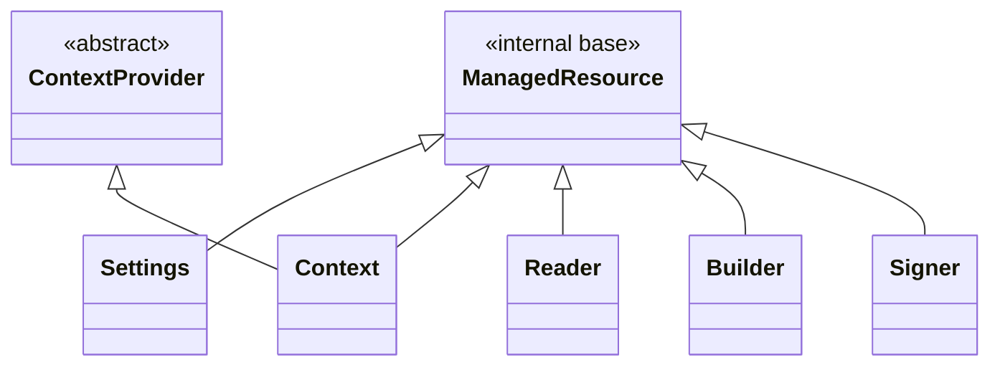
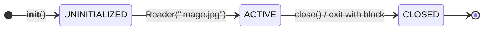
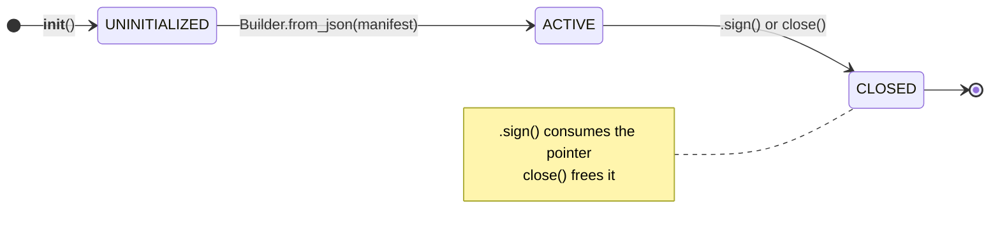
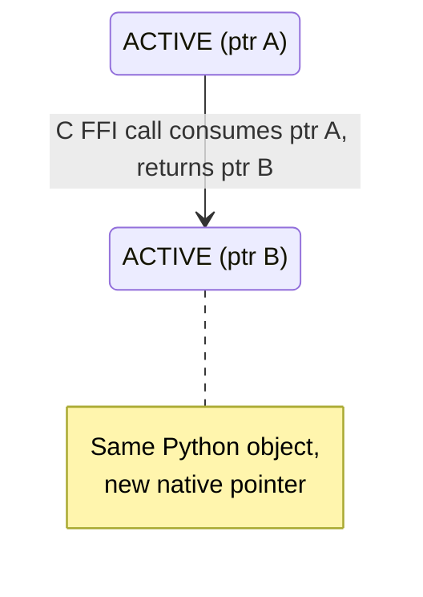

# Native resource management (ManagedResource class)

`ManagedResource` is the internal base class used by the C2PA Python SDK to wrap native (Rust/FFI) pointers. When adding new wrappers around native resources `ManagedResource` should be subclassed and follow the documented lifecycle rules.

## Why `ManagedResource`?

`ManagedResource` is the internal base class responsible for managing native pointers owned by the C2PA Python SDK. It guarantees:

- Native memory is freed exactly once (no double-free).
- Resources are cleaned up deterministically via context managers or explicit `close()`.
- Ownership transfers (e.g. signer to context) are handled so the same pointer is not freed twice (and the objects/classes know which one owns what).
- Cleanup never raises (trade-off to avoid raising errors on clean-up only, but errors are logged).

Developers wrapping new native resources must inherit from `ManagedResource` and follow the documented lifecycle rules.

## Why is native resources management needed?

### Native pointers in a Python wrapper

The C2PA Python SDK is a wrapper around a native Rust library that exposes a C FFI. When the SDK creates a `Reader`, `Builder`, `Signer`, `Context`, or `Settings` object, that object holds a **pointer** to memory allocated on the native side (by the native library).

### How Python's garbage collector works

Python manages its own objects' memory automatically through garbage collection. In CPython (the standard interpreter), this works primarily through reference counting: each object has a counter tracking how many references point to it, and when that counter reaches zero the object is deallocated. A secondary cycle-detecting collector handles the case where objects reference each other in a loop and their counts never reach zero on their own.

### Why garbage collection is not enough for native memory

This system works well for pure Python objects, but native memory sits outside of it entirely. The garbage collector sees the Python wrapper object (e.g. a `Reader` instance) and tracks references to it, but it has no visibility into the native memory that the wrapper's `_handle` attribute points to. Memory allocated by native libraries is invisible to the garbage collector: it does not know the size of that native allocation, cannot tell when it is no longer needed, and will not call the native library's `c2pa_free` function to release it. If the Python wrapper of those native resources is collected without first calling `c2pa_free`, the native memory is never released and leaks.

### Why `__del__` is not reliable enough

Python does offer `__del__` as a hook that runs when an object is collected (finalizer), and `ManagedResource` uses it as a fallback to possibly clean up leftover resources at that point. But `__del__` cannot be relied on as the primary cleanup mechanism: its timing is unpredictable (due to being called when the garbage collection runs, which is non-deterministic itself), it may not run at all during interpreter shutdown, and other Python implementations (PyPy, GraalPy) that do not use reference counting make its behavior even less deterministic.

In CPython, `__del__` runs synchronously when the last reference to an object disappears, which in simple cases happens at a predictable point (e.g. when a local variable goes out of scope). But if the object is part of a reference cycle, its reference count never reaches zero on its own. The cycle collector must discover and break the cycle first, and it runs periodically rather than immediately. An object caught in a cycle might sit in memory for an arbitrary amount of time before `__del__` fires. CPython's cycle collector does not guarantee an order when finalizing groups of objects in a cycle, so `__del__` methods that depend on other objects in the same cycle may find those objects already partially torn down. During interpreter shutdown, the situation is even less reliable: CPython clears module globals and may collect objects in an arbitrary order, and `__del__` methods that reference global state (like the `_lib` handle to the native library) can fail silently because those globals have already been set to `None`. PyPy and GraalPy use tracing garbage collectors (which periodically walk the object graph to find unreachable objects, rather than tracking individual reference counts) instead of reference counting, so `__del__` does not run when the last reference disappears. It runs at some later point when the GC happens to trace that region of the heap, which could be seconds or minutes later, or not at all if the process exits first.

`ManagedResource` is the internal base class that handles managed resources, especially their lifecycle and clean-up. Every class that holds a native pointer should inherit from it.

## Class hierarchy



Notes:

- `Context` inherits from both `ManagedResource` and `ContextProvider` (Python supports multiple inheritance).
- `Settings` inherits from `ManagedResource` only.
- `ContextProvider` is an ABC (abstract base class) that requires two properties: `is_valid` and `execution_context`. The `is_valid` implementation lives on `ManagedResource`, so `Context` satisfies that part of the `ContextProvider` contract without duplicating the property.

> [!NOTE]
> **How `is_valid` resolves across both parents for Context**
>
> Python's MRO (Method Resolution Order) is the order in which Python searches parent classes when looking up a method or property. For `Context(ManagedResource, ContextProvider)`, the MRO is `Context then ManagedResource then ContextProvider then ABC then object (base class)`. When `context.is_valid` is accessed, Python walks the MRO left-to-right and finds `ManagedResource.is_valid` first. Since `ContextProvider.is_valid` is abstract (it declares the requirement but has no implementation), `ManagedResource`'s concrete version both provides the behavior and satisfies the ABC contract.
>
> The MRO is computed using C3 linearization, which enforces two rules: children appear before their parents, and left-to-right order from the class definition is preserved. For `class Context(ManagedResource, ContextProvider)`:
>
> 1. `Context`: the class itself always comes first.
> 2. `ManagedResource` :first listed parent, nothing else requires it to appear later.
> 3. `ContextProvider`: second listed parent, must come after `ManagedResource` to preserve declaration order.
> 4. `ABC`: parent of `ContextProvider`, must come after its child.
> 5. `object`: root of everything (all objects), always last.
>
> Putting `ManagedResource` first in the declaration matters: the concrete `is_valid` implementation is found immediately during lookup, rather than hitting the abstract declaration on `ContextProvider` first.

## Guarantees provided by ManagedResource

`ManagedResource` provides the following guarantees, invariants must be maintained when subclassing the `ManagedResource` class in new implementation/new native resources handlers:

| Guarantee | Description |
| --- | --- |
| **Pointer freed exactly once** | Each native pointer is passed to `c2pa_free` at most once. No leak (zero frees) and no double-free. |
| **Cleanup is idempotent** | Calling `close()` (or exiting a `with` block) multiple times is safe; after the first successful cleanup, further calls do nothing. |
| **Cleanup never raises** | The cleanup path (including `_release()` and `c2pa_free`) is wrapped so that exceptions are caught and logged, never re-raised. The original exception from the `with` block (if any) is never masked. |
| **State transitions are one-way** | Lifecycle moves only from UNINITIALIZED → ACTIVE → CLOSED. A closed resource cannot be reactivated. |
| **Ownership transfer is safe** | When a pointer is transferred elsewhere (e.g. via `_mark_consumed()`), the object stops managing it and does not call `c2pa_free` on it. |
| **Public methods validate lifecycle state** | Every public API calls `_ensure_valid_state()` before use; closed or invalid state yields `C2paError` instead of undefined behavior or crashes. |

## Preventing garbage collection of live references

When a Python object passes a callback or pointer to the native library, that reference must stay alive for as long as the native side might use it. Python's garbage collector has no way to know that native code is still holding a reference to a Python callback.

The SDK solves this by storing these references as instance attributes on the owning object. For example, `Stream` stores its four callback objects (`_read_cb`, `_seek_cb`, `_write_cb`, `_flush_cb`) as instance attributes. As long as the `Stream` object is alive, its callbacks have a nonzero reference count and will not be collected. Similarly, when a `Signer` is consumed by a `Context`, the Context copies the signer's `_callback_cb` to its own `_signer_callback_cb` attribute so the callback survives even though the Signer object is now closed.

During cleanup, `_release()` sets these attributes to `None`, which drops the reference count on the callback objects and allows them to be collected. In the cleanup sequence, `_release()` runs first, then `c2pa_free` frees the native pointer. `_release()` goes first so that subclass-specific resources (open file handles, stream wrappers) are torn down before the native pointer they depend on is freed.

## How native memory is freed

The native Rust library exposes a single C FFI function, `c2pa_free`, that deallocates memory it previously allocated. `ManagedResource` wraps this in a static method:

```python
@staticmethod
def _free_native_ptr(ptr):
    _lib.c2pa_free(ctypes.cast(ptr, ctypes.c_void_p))
```

All native pointers are freed through this single path, regardless of which constructor created them (`c2pa_reader_from_stream`, `c2pa_builder_from_json`, `c2pa_signer_from_info`, etc.). The `ctypes.cast` to `c_void_p` is needed because the C function accepts a generic void pointer regardless of the original type.

`ManagedResource` guarantees that `c2pa_free` is called exactly once per pointer: not zero times (leak), not twice (double-free).

## Lifecycle states

Each `ManagedResource` tracks its state with a `LifecycleState` enum:


- `UNINITIALIZED`: The Python object exists but the native pointer has not been set yet. This is a transient state during construction.
- `ACTIVE`: The native pointer is valid. The object can be used.
- `CLOSED`: The native pointer has been freed (or ownership was transferred). Any further use raises `C2paError`.

The transition from ACTIVE to CLOSED is one-way. Once closed, an object cannot be reactivated.

Every public method calls `_ensure_valid_state()` before doing any work. Besides checking the lifecycle state, this method also calls `_clear_error_state()`, which resets any stale error left over from a previous native library call. Without this, an error from one operation could leak into the next one and produce a misleading error message.

## Ways to clean up

### Context manager (`with` statement)

```python
with Reader("image.jpg") as reader:
    print(reader.json())
# reader is automatically closed here, even if an exception occurs
```

When the `with` block exits, `__exit__` calls `close()`, which frees the native pointer. This is the safest approach because cleanup happens even if the code inside the block raises an exception.

### Explicit `.close()`

```python
reader = Reader("image.jpg")
try:
    print(reader.json())
finally:
    reader.close()
```

Calling `.close()` directly is equivalent to exiting a `with` block. It is idempotent: calling it multiple times is safe and does nothing after the first call.

### Destructor fallback (`__del__`)

If neither of the above is used, `__del__` attempts to free the native pointer when Python garbage-collects the object. As described above, `__del__` timing is unpredictable and it may not run at all, so it is a safety net rather than a primary cleanup mechanism.

## Error handling during cleanup

Cleanup must never raise an exception. A failure during cleanup (for example, the native library crashing on free) should not mask the original exception that caused the `with` block to exit. `ManagedResource` enforces this:

- `close()` delegates to `_cleanup_resources()`, which wraps the entire cleanup sequence in a try/except that catches and silences all exceptions.
- If freeing the native pointer fails, the error is logged via Python's `logging` module but not re-raised.
- The state is set to `CLOSED` as the very first step, before attempting to free anything. If cleanup fails halfway, the object is still marked closed, preventing a second attempt from doing further damage.
- Cleanup is idempotent. Calling `close()` on an already-closed object returns immediately.

## Nesting resources

When multiple native resources are in play at once, they can share a single `with` statement or use nested blocks. Either way, Python cleans them up in reverse order (right to left, or inner to outer).

```python
with open("photo.jpg", "rb") as file, Reader("image/jpeg", file) as reader:
    manifest = reader.json()
# reader is closed first, then file
```

The same can be written with nested blocks if readability is better:

```python
with open("photo.jpg", "rb") as file:
    with Reader("image/jpeg", file) as reader:
        manifest = reader.json()
```

The order matters because resources often depend on each other. In the example above, the `Reader` holds a native pointer that references the file's data through a `Stream` wrapper. If the file handle were closed first, the native library would still hold a pointer into the stream's read callbacks, and any subsequent access (including cleanup) could read freed memory or trigger a segfault. By closing the Reader first, the native pointer is freed while the underlying file is still open and valid. Python's `with` statement guarantees this ordering: resources listed later (or nested deeper) are torn down first.

## Reader lifecycle

A `Reader` wraps a stream (or opens a file), passes it to the native library, and holds the returned pointer. While active, callers can use `.json()`, `.detailed_json()`, `.resource_to_stream()`, and other methods. Each of these checks state via `_ensure_valid_state()` before making the FFI call.



While `ACTIVE`, callers can use `.json()`, `.detailed_json()`, etc. repeatedly without changing state. Calling `.close()` on an already-closed Reader is a no-op. Any other method call on a closed Reader raises `C2paError`.

When the Reader is closed, it first releases its own resources (open file handles, stream wrappers) via `_release()`, then frees the native pointer via `c2pa_free`.

## Builder lifecycle

A `Builder` follows the same pattern as Reader, with one difference: **signing consumes the builder**. The native library takes ownership of the builder's pointer during the sign operation. After signing, the builder is closed and cannot be reused.



While `ACTIVE`, callers can use `.add_ingredient()`, `.add_action()`, etc. repeatedly. `.sign()` consumes the native pointer (ownership transfers to the native library), so the Builder cannot be reused afterward. Closing without signing frees the pointer normally.

After `.sign()`, the builder calls `_mark_consumed()`, which sets the handle to `None` and the state to `CLOSED`. Because the native library now owns the pointer, `ManagedResource` does not call `c2pa_free`. That would double-free memory the native library already manages.

## Ownership transfer

Some operations transfer a native pointer from one object to another. When this happens, the original object must stop managing the pointer (e.g. so it is not freed twice).

`_mark_consumed()` handles this. It sets `_handle = None` and `_lifecycle_state = CLOSED` in one step.

There are two cases where this is relevant:

- When a `Signer` is passed to a `Context`, the Context takes ownership of the Signer's native pointer. The Signer is marked consumed and must not be used again.

- When `Builder.sign()` is called, the native library consumes the Builder's pointer. The Builder marks itself consumed regardless of whether the sign operation succeeds or fails, because in both cases the native library has taken the pointer.

## Consume-and-return

`_mark_consumed()` closes an object permanently. A different pattern is needed when the native library must replace an object's internal state without discarding the Python-side object. This happens with fragmented media: `Reader.with_fragment()` feeds a new BMFF fragment (used in DASH/HLS streaming) into an existing Reader, and the native library must rebuild its internal representation to account for the new data. The native API does this by consuming the old pointer and returning a new one. Creating a fresh `Reader` from scratch would not work because the native library needs the accumulated state from prior fragments.

`Builder.with_archive()` follows the same pattern: it loads an archive into an existing Builder, replacing the manifest definition while preserving the Builder's context and settings.

In both cases the FFI call consumes the current pointer and returns a replacement:



```python
# Reader.with_fragment() internally does:
new_ptr = _lib.c2pa_reader_with_fragment(self._handle, ...)
# self._handle (old pointer) is now invalid
self._handle = new_ptr
```

The object stays `ACTIVE` throughout because the Python-side object is still valid: it has a live native pointer, its public methods still work, and callers may continue using it (e.g. reading the updated manifest or feeding in another fragment). The lifecycle state does not change because from `ManagedResource`'s perspective nothing has closed. Only the underlying native pointer has been swapped. This is different from `_mark_consumed()`, where the object transitions to `CLOSED` and becomes unusable. The old pointer must not be freed by `ManagedResource` because the native library already consumed it as part of the FFI call.

## Subclass-specific cleanup with `_release()`

Each subclass can override `_release()` to clean up its own resources before the native pointer is freed. The base implementation does nothing.

Examples from the codebase:

| Class | What `_release()` cleans up |
| --- | --- |
| Reader | Closes owned file handles and stream wrappers |
| Context | Drops the reference to the signer callback |
| Signer | Drops the reference to the signing callback |
| Settings | (no override, nothing extra to clean up) |
| Builder | (no override, nothing extra to clean up) |

The cleanup order matters: `_release()` runs first (closing streams, dropping callbacks), then `c2pa_free` frees the native pointer. This order prevents the native library from accessing Python objects that no longer exist.

## Why is `Stream` not a `ManagedResource`?

`Stream` wraps a Python stream-like object (file stream or memory stream) so the native library can read from and write to it via callbacks. It does not inherit from `ManagedResource`, and it uses `c2pa_release_stream()` instead of `c2pa_free()` for cleanup.

The reason is that ownership runs in the opposite direction. A `Reader` or `Builder` holds a native resource that Python code calls methods on. A `Stream` holds a native handle that the native library calls *back into* (read, seek, write, flush). The native library needs a different release function to tear down the callback machinery.

`Stream` tracks its own state with `_closed` and `_initialized` flags rather than `LifecycleState`, but it supports the same three cleanup paths: context manager, explicit `.close()`, and `__del__` fallback.

## Implementing a subclass of `ManagedResource`

To wrap a new native resource, inherit from `ManagedResource` and follow these rules:

```python
class NativeResource(ManagedResource):
    def __init__(self, arg):
        super().__init__()

        # 1. Initialize ALL instance attributes before any code
        #    that can raise. If __init__ fails partway through,
        #    __del__ will call _release(), which accesses these
        #    attributes. If they don't exist, _release() raises AttributeError.
        self._my_stream = None
        self._my_cache = None

        # 2. Create the native pointer.
        ptr = _lib.c2pa_my_resource_new(arg)
        _check_ffi_operation_result(ptr, "Failed to create MyResource")

        # 3. Only set _handle and activate AFTER the FFI call
        #    succeeded. If it raised, _lifecycle_state stays
        #    UNINITIALIZED and cleanup won't try to free a
        #    pointer that doesn't exist.
        self._handle = ptr
        self._lifecycle_state = LifecycleState.ACTIVE

    def _release(self):
        # 4. Clean up class-specific resources.
        #    Never let this method raise. Must be idempotent.
        #
        #    Consider defining a simple lifecycle for native resources
        #    so _release() can check whether they are releasable
        #    before attempting cleanup. The if-guard below
        #    verifies the stream exists and has not
        #    already been released. The try/except is a fallback
        #    that silences unexpected errors from .close().
        if self._my_stream:
            try:
                self._my_stream.close()
            except Exception:
                logger.error("Failed to close MyResource stream")
            finally:
                self._my_stream = None

    def do_something(self):
        # 5. Check state at the start of every public method.
        #    This raises C2paError if the resource is closed.
        self._ensure_valid_state()
        return _lib.c2pa_my_resource_do_something(self._handle)
```

### Troubleshooting

- If `self._my_callback = None` is set after the FFI call that can raise, and the call fails, `_release()` will try to access `self._my_callback` and crash with `AttributeError`. Always initialize attributes right after `super().__init__()`.

- If `_lifecycle_state = ACTIVE` is set before the FFI call and the call fails, cleanup will try to free a null or invalid pointer. Activation should happen only after a valid handle exists.

- If `_release()` raises, the exception is silently swallowed by `_cleanup_resources()`. It will not be visible unless logs are checked. Define a lifecycle for managed resources so `_release()` can check whether they need releasing. Wrap the actual release call in try/except as a fallback for unexpected failures.

- `_release()` can be called more than once (via `close()` then `__del__`, or multiple `close()` calls). Make sure it handles being called on an already-cleaned-up object. Setting attributes to `None` after closing them is the standard pattern.

- Calling `c2pa_free` directly is not recommended. `ManagedResource` handles this. If the pointer is freed manually and `ManagedResource` frees it again, the process crashes (double-free).

- If a subclass inherits from both `ManagedResource` and an ABC like `ContextProvider`, and both define a property with the same name (e.g. `is_valid`), Python resolves it using the MRO. The parent listed first in the class definition wins. If the ABC is listed first, Python finds the abstract property before the concrete one and raises `TypeError: Can't instantiate abstract class`. Always list the class with the concrete implementation first (e.g. `class Context(ManagedResource, ContextProvider)`, not `class Context(ContextProvider, ManagedResource)`).

- If two parent classes define the same method or property with different concrete implementations, the MRO silently picks the first one. This can cause subtle bugs where the wrong implementation is used. When combining multiple inheritance with shared property names, verify the MRO with `ClassName.__mro__` or `ClassName.mro()` to confirm the expected resolution order.
