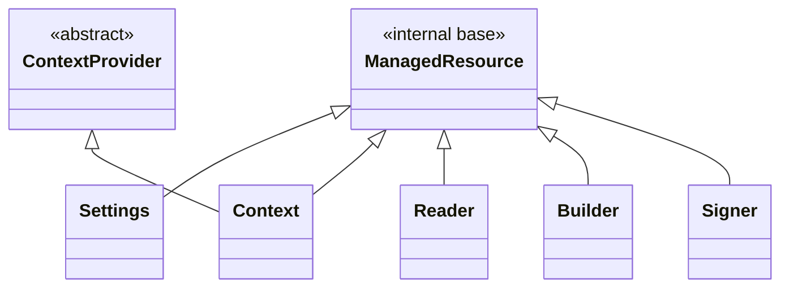
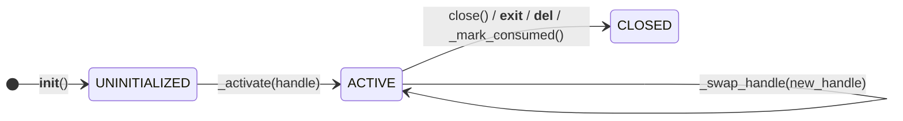
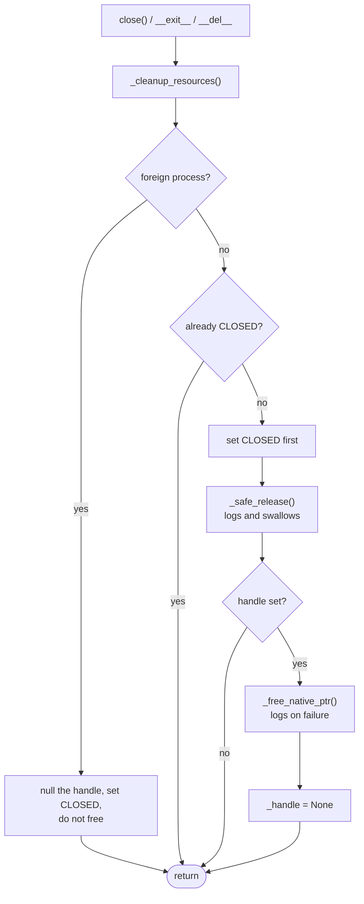
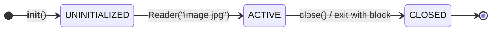
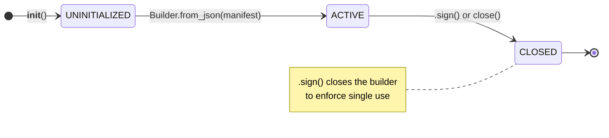
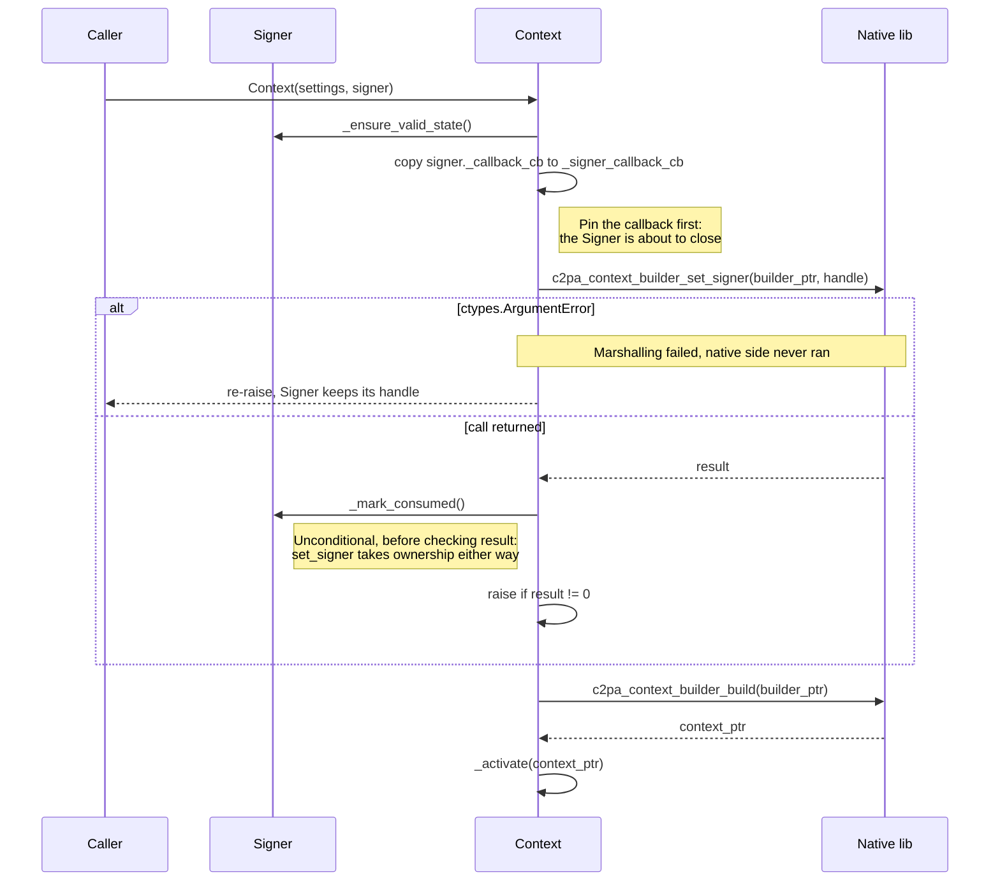
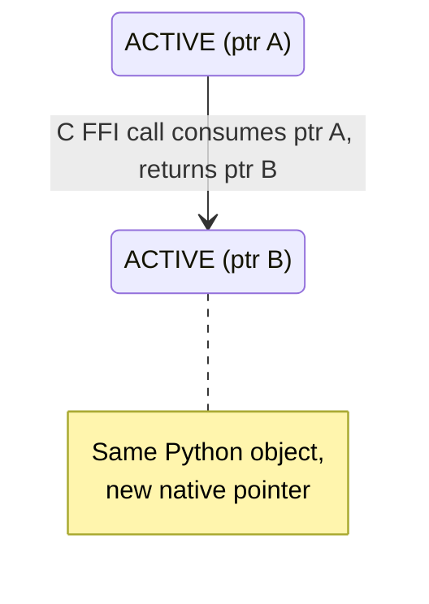
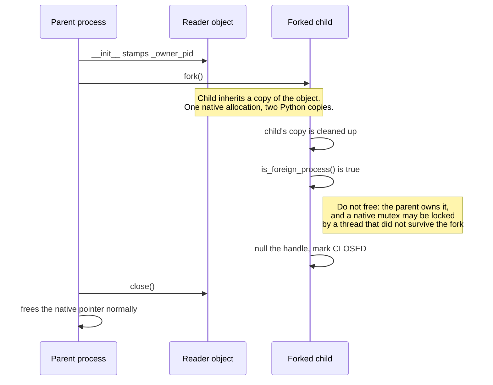

# Native resource management (ManagedResource class)

`ManagedResource` is the internal base class used by the C2PA Python SDK to wrap native (Rust/FFI) pointers. When adding new wrappers around native resources `ManagedResource` should be subclassed and follow the documented lifecycle rules.

> [!NOTE]
> `ManagedResource` and the lifecycle machinery described here are internal to the SDK. In most cases, code that reads and writes C2PA data should use the public wrappers (`Reader`, `Builder`, `Signer`, `Context`, `Settings`).

## Why `ManagedResource`?

`ManagedResource` is the internal base class responsible for managing native pointers owned by the C2PA Python SDK. It guarantees:

- Native memory is freed exactly once (no double-free).
- Resources are cleaned up deterministically via context managers or explicit `close()`.
- Ownership transfers (e.g. signer to context) are handled so the same pointer is not freed twice (and the objects/classes know which one owns what).
- Cleanup never raises (trade-off to avoid raising errors on clean-up only, but errors are logged).

Developers wrapping new native resources must inherit from `ManagedResource` and follow the documented lifecycle rules.

## Why is native resources management needed?

### Native pointers in a Python wrapper

The C2PA Python SDK is a wrapper around a native Rust library that exposes a C FFI. When the SDK creates a `Reader`, `Builder`, `Signer`, `Context`, or `Settings` object, that object holds a **pointer** to memory allocated on the native side (by the native library).

### How Python's garbage collector works

Python manages its own objects' memory automatically through garbage collection. In CPython (the standard interpreter), this works primarily through reference counting: each object has a counter tracking how many references point to it, and when that counter reaches zero the object is deallocated. A secondary cycle-detecting collector handles the case where objects reference each other in a loop and their counts never reach zero on their own.

### Why garbage collection is not enough for native memory

This system works well for pure Python objects, but native memory sits outside of it entirely. The garbage collector sees the Python wrapper object (e.g. a `Reader` instance) and tracks references to it, but it has no visibility into the native memory that the wrapper's `_handle` attribute points to. Memory allocated by native libraries is invisible to the garbage collector: it does not know the size of that native allocation, cannot tell when it is no longer needed, and will not call the native library's `c2pa_free` function to release it. If the Python wrapper of those native resources is collected without first calling `c2pa_free`, the native memory is never released and leaks.

### Why `__del__` is not reliable enough

Python does offer `__del__` as a hook that runs when an object is collected (finalizer), and `ManagedResource` uses it as a fallback to possibly clean up leftover resources at that point. But `__del__` cannot be relied on as the primary cleanup mechanism: its timing is unpredictable (due to being called when the garbage collection runs, which is non-deterministic itself), it may not run at all during interpreter shutdown, and other Python implementations (PyPy, GraalPy) that do not use reference counting make its behavior even less deterministic.

In CPython, `__del__` runs synchronously when the last reference to an object disappears, which in simple cases happens at a predictable point (e.g. when a local variable goes out of scope). But if the object is part of a reference cycle, its reference count never reaches zero on its own. The cycle collector must discover and break the cycle first, and it runs periodically rather than immediately. An object caught in a cycle might sit in memory for an arbitrary amount of time before `__del__` fires. CPython's cycle collector does not guarantee an order when finalizing groups of objects in a cycle, so `__del__` methods that depend on other objects in the same cycle may find those objects already partially torn down. During interpreter shutdown, the situation is even less reliable: CPython clears module globals and may collect objects in an arbitrary order, and `__del__` methods that reference global state (like the `_lib` handle to the native library) can fail silently because those globals have already been set to `None`. PyPy and GraalPy use tracing garbage collectors (which periodically walk the object graph to find unreachable objects, rather than tracking individual reference counts) instead of reference counting, so `__del__` does not run when the last reference disappears. It runs at some later point when the GC happens to trace that region of the heap, which could be seconds or minutes later, or not at all if the process exits first.

`ManagedResource` is the internal base class that handles managed resources, especially their lifecycle and clean-up. Every class that holds a native pointer should inherit from it.

## Class hierarchy



Notes:

- `Context` inherits from both `ManagedResource` and `ContextProvider` (Python supports multiple inheritance).
- `Settings` inherits from `ManagedResource` only.
- `ContextProvider` is an ABC (abstract base class) that requires two properties: `is_valid` and `execution_context`. The `is_valid` implementation lives on `ManagedResource`, so `Context` satisfies that part of the `ContextProvider` contract without duplicating the property.

> [!NOTE]
> **How `is_valid` resolves across both parents for Context**
>
> Python's MRO (Method Resolution Order) is the order in which Python searches parent classes when looking up a method or property. For `Context(ManagedResource, ContextProvider)`, the MRO is `Context then ManagedResource then ContextProvider then ABC then object (base class)`. When `context.is_valid` is accessed, Python walks the MRO left-to-right and finds `ManagedResource.is_valid` first. Since `ContextProvider.is_valid` is abstract (it declares the requirement but has no implementation), `ManagedResource`'s concrete version both provides the behavior and satisfies the ABC contract.
>
> The MRO is computed using C3 linearization, which enforces two rules: children appear before their parents, and left-to-right order from the class definition is preserved. For `class Context(ManagedResource, ContextProvider)`:
>
> 1. `Context`: the class itself always comes first.
> 2. `ManagedResource` :first listed parent, nothing else requires it to appear later.
> 3. `ContextProvider`: second listed parent, must come after `ManagedResource` to preserve declaration order.
> 4. `ABC`: parent of `ContextProvider`, must come after its child.
> 5. `object`: root of everything (all objects), always last.
>
> Putting `ManagedResource` first in the declaration matters: the concrete `is_valid` implementation is found immediately during lookup, rather than hitting the abstract declaration on `ContextProvider` first.

## Guarantees provided by ManagedResource

`ManagedResource` provides the following guarantees, invariants must be maintained when subclassing the `ManagedResource` class in new implementation/new native resources handlers:

| Guarantee | Description |
| --- | --- |
| **Pointer freed exactly once** | Each native pointer is passed to `c2pa_free` at most once. No leak (zero frees) and no double-free. |
| **Cleanup is idempotent** | Calling `close()` (or exiting a `with` block) multiple times is safe; after the first successful cleanup, further calls do nothing. |
| **Cleanup never raises** | The cleanup path is wrapped so that exceptions are caught and logged, never re-raised. `_release()` runs inside `_safe_release()`, which logs and swallows; the `c2pa_free` call has its own handler; and `_cleanup_resources()` wraps both. The original exception from the `with` block (if any) is never masked. |
| **State transitions are one-way** | Lifecycle moves only from UNINITIALIZED to ACTIVE to CLOSED. A closed resource cannot be reactivated. |
| **Transitions go through helper methods** | Subclasses call `_activate()`, `_swap_handle()` or `_mark_consumed()` and never assign `_handle` or `_lifecycle_state` directly. `_activate()` and `_swap_handle()` validate before mutating, so an object cannot end up active with a null handle. |
| **Ownership transfer is safe** | When a pointer is transferred elsewhere (e.g. via `_mark_consumed()`), the object stops managing it and does not call `c2pa_free` on it. |
| **Public methods validate lifecycle state** | Every public API calls `_ensure_valid_state()` before use; closed or invalid state yields `C2paError` instead of undefined behavior or crashes. |

## Preventing garbage collection of live references

When a Python object passes a callback or pointer to the native library, that reference must stay alive for as long as the native side might use it. Python's garbage collector has no way to know that native code is still holding a reference to a Python callback.

The SDK solves this by storing these references as instance attributes on the owning object. For example, `Stream` stores its four callback objects (`_read_cb`, `_seek_cb`, `_write_cb`, `_flush_cb`) as instance attributes. As long as the `Stream` object is alive, its callbacks have a nonzero reference count and will not be collected. Similarly, when a `Signer` is consumed by a `Context`, the Context copies the signer's `_callback_cb` to its own `_signer_callback_cb` attribute so the callback survives even though the Signer object is now closed.

During cleanup, `_release()` sets these attributes to `None`, which drops the reference count on the callback objects and allows them to be collected. In the cleanup sequence, `_release()` runs first, then `c2pa_free` frees the native pointer. `_release()` goes first so that subclass-specific resources (open file handles, stream wrappers) are torn down before the native pointer they depend on is freed.

## How native memory is freed

The native Rust library exposes a single C FFI function, `c2pa_free`, that deallocates memory it previously allocated. `ManagedResource` wraps this in a static method:

```python
@staticmethod
def _free_native_ptr(ptr):
    _lib.c2pa_free(ptr)
```

All native pointers are freed through this single path, regardless of which constructor created them (`c2pa_reader_from_stream`, `c2pa_builder_from_json`, `c2pa_signer_from_info`, etc.). No explicit `ctypes.cast` is needed: `c2pa_free`'s declared argtype is `c_void_p`, so ctypes converts any pointer instance on the way in. Casting explicitly with `ctypes.cast(ptr, c_void_p)` performs the same conversion but leaves a reference cycle behind on every call, which creates additional load on the (Python) garbage collector.

`ManagedResource` guarantees that `c2pa_free` is called exactly once per pointer: not zero times (leak), not twice (double-free).

## Lifecycle states

Each `ManagedResource` tracks its state with a `LifecycleState` enum:



- `UNINITIALIZED`: The Python object exists but the native pointer has not been set yet. This is a transient state during construction.
- `ACTIVE`: The native pointer is valid. The object can be used.
- `CLOSED`: The native pointer has been freed (or ownership was transferred). Any further use raises `C2paError`.

The transition from ACTIVE to CLOSED is one-way. Once closed, an object cannot be reactivated.

Each transition has one method that performs it, and subclasses must go through them rather than assigning `_handle` or `_lifecycle_state` directly:

| Method | Transition | What it enforces |
| --- | --- | --- |
| `_activate(handle)` | UNINITIALIZED to ACTIVE | Rejects a null handle, and refuses to run on an already-activated resource. A rejected activation leaves the object exactly as it was. |
| `_swap_handle(new_handle)` | ACTIVE to ACTIVE | Requires the resource to already be active and the replacement to be non-null. Used when an FFI call consumed the old handle and returned a new one. |
| `_mark_consumed()` | ACTIVE to CLOSED | Drops the handle without freeing it, for when ownership passed to the native side (e.g. `Signer` into `Context`). Runs `_release()` first, so subclass cleanup still happens. Unlike the other two, it validates nothing. |
| `_release_handle()` | ACTIVE to CLOSED | Frees the handle eagerly and closes the object. Same post-state as `_mark_consumed()`. |

Because activation is the only way in, no code path can leave an object ACTIVE while holding a null handle.

Every public method calls `_ensure_valid_state()` before doing any work, which raises `C2paError` unless the resource is ACTIVE with a non-null handle.

## Ways to clean up

### Context manager (`with` statement)

```python
with Reader("image.jpg") as reader:
    print(reader.json())
# reader is automatically closed here, even if an exception occurs
```

When the `with` block exits, `__exit__` calls `close()`, which frees the native pointer. This is the safest approach because cleanup happens even if the code inside the block raises an exception.

### Explicit `.close()`

```python
reader = Reader("image.jpg")
try:
    print(reader.json())
finally:
    reader.close()
```

Calling `.close()` directly is equivalent to exiting a `with` block. It is idempotent: calling it multiple times is safe and does nothing after the first call.

### Destructor fallback (`__del__`)

If neither of the above is used, `__del__` attempts to free the native pointer when Python garbage-collects the object. As described above, `__del__` timing is unpredictable and it may not run at all, so it is a safety net rather than a primary cleanup mechanism.

## Error handling during cleanup

Cleanup must never raise an exception. A failure during cleanup (for example, the native library crashing on free) should not mask the original exception that caused the `with` block to exit. `ManagedResource` enforces this:

- `close()` delegates to `_cleanup_resources()`, which wraps the entire cleanup sequence in a try/except that catches and silences all exceptions.
- `_release()` is never called directly during cleanup. It runs inside `_safe_release()`, which logs any failure with a traceback and returns normally, so a subclass whose `_release()` raises cannot stop the native pointer from being freed afterwards.
- If freeing the native pointer fails, the error is logged via Python's `logging` module but not re-raised.
- The state is set to `CLOSED` as the very first step, before attempting to free anything. If cleanup fails halfway, the object is still marked closed, preventing a second attempt from doing further damage.
- Cleanup is idempotent. Calling `close()` on an already-closed object returns immediately.

All three cleanup entry points converge on the same method, and the exception handling sits at three different levels inside it:



The `foreign process` branch is explained under [Fork safety](#fork-safety) below.

## Nesting resources

When multiple native resources are in play at once, they can share a single `with` statement or use nested blocks. Either way, Python cleans them up in reverse order (right to left, or inner to outer).

```python
with open("photo.jpg", "rb") as file, Reader("image/jpeg", file) as reader:
    manifest = reader.json()
# reader is closed first, then file
```

The same can be written with nested blocks if readability is better:

```python
with open("photo.jpg", "rb") as file:
    with Reader("image/jpeg", file) as reader:
        manifest = reader.json()
```

The order matters because resources often depend on each other. In the example above, the `Reader` holds a native pointer that references the file's data through a `Stream` wrapper. If the file handle were closed first, the native library would still hold a pointer into the stream's read callbacks, and any subsequent access (including cleanup) could read freed memory or trigger a segfault. By closing the Reader first, the native pointer is freed while the underlying file is still open and valid. Python's `with` statement guarantees this ordering: resources listed later (or nested deeper) are torn down first.

## Reader lifecycle

A `Reader` wraps a stream (or opens a file), passes it to the native library, and holds the returned pointer. While active, callers can use `.json()`, `.detailed_json()`, `.resource_to_stream()`, and other methods. Each of these checks state via `_ensure_valid_state()` before making the FFI call.



While `ACTIVE`, callers can use `.json()`, `.detailed_json()`, etc. repeatedly without changing state. Calling `.close()` on an already-closed Reader is a no-op. Any other method call on a closed Reader raises `C2paError`.

When the Reader is closed, it first releases its own resources (open file handles, stream wrappers) via `_release()`, then frees the native pointer via `c2pa_free`.

## Builder lifecycle

A `Builder` follows the same pattern as Reader, with one difference: **signing closes the builder**. A Builder is single-use, so after signing it cannot be reused.



While `ACTIVE`, callers can use `.add_ingredient()`, `.add_action()`, etc. repeatedly. `.sign()` closes the Builder when it returns, on both the success and the failure path. Closing without signing frees the pointer the same way.

The native sign call borrows the builder's pointer rather than taking ownership of it, so `Builder` never calls `_mark_consumed()` and the pointer is freed normally through `c2pa_free`. The close enforces single use; it is not a memory-management requirement.

## Ownership transfer

Some operations transfer a native pointer from one object to another. When this happens, the original object must stop managing the pointer (e.g. so it is not freed twice).

`_mark_consumed()` handles this. It sets `_handle = None` and `_lifecycle_state = CLOSED` in one step.

In the SDK this happens in one place: passing a `Signer` to a `Context`. The Context takes ownership of the Signer's native pointer, and the Signer must not be used again directly after that.

The order of operations matters, because `c2pa_context_builder_set_signer` takes ownership on its error path as well as on success:



Details in that sequence that are easy to get wrong:

- The callback is copied to the Context *before* the transfer. `_mark_consumed()` runs `_release()`, so consuming the Signer drops its reference to the callback; a Context that copied it afterwards would be pointing at a callback nothing keeps alive.
- `_mark_consumed()` runs before the result is checked, not after. A failed `set_signer` has still taken the pointer, so waiting for a successful result would leak it.
- `ctypes.ArgumentError` is the exception. It means ctypes could not marshal the arguments, so the native function never ran and never saw the pointer. The Signer still owns its handle and is left untouched.

Both `c2pa_context_builder_set_signer` and `c2pa_context_builder_build` consume what they are given, so the `builder_ptr` is freed by the error handler only when the build was never reached.

### Adopting a handle the SDK already owns

Ownership can also arrive from the other direction: a native call returns a pointer that needs a Python wrapper around it. `_wrap_native_handle()` is the classmethod for that. It builds an instance with `object.__new__`, runs `ManagedResource.__init__` on it (which sets the lifecycle fields and stamps the owning process ID), runs `_init_attrs()` for the subclass attribute defaults, and calls `_activate()` with the handle.

It deliberately skips `__init__`, because `__init__` would try to create a *new* native resource. That is why attribute defaults belong in `_init_attrs()`: it is the only initialization step this path runs.

Ownership transfers only if the call returns. If `_wrap_native_handle()` raises, no wrapper exists to free the pointer, so the caller still owns it and must free it.

## Consume-and-swap

`_mark_consumed()` closes an object permanently. A different pattern is needed when the native library must replace an object's internal state without discarding the Python-side object. This happens with fragmented media: `Reader.with_fragment()` feeds a new BMFF fragment (used in DASH/HLS streaming) into an existing Reader, and the native library must rebuild its internal representation to account for the new data. The native API does this by consuming the old pointer and returning a new one. Creating a fresh `Reader` from scratch would not work because the native library needs the accumulated state from prior fragments.

`Builder.with_archive()` follows the same pattern: it loads an archive into an existing Builder, replacing the manifest definition while preserving the Builder's context and settings.

In both cases the FFI call consumes the current pointer and returns a replacement:



On success the object stays `ACTIVE` because the Python-side object is still valid: it has a live native pointer, its public methods still work, and callers may continue using it (e.g. reading the updated manifest or feeding in another fragment). The lifecycle state does not change because from `ManagedResource`'s perspective nothing has closed. Only the underlying native pointer has been swapped. This is different from `_mark_consumed()`, where the object transitions to `CLOSED` and becomes unusable. On the success path the old pointer must not be freed by `ManagedResource` because the native library already consumed it as part of the FFI call. The failure path is different and is covered by the triage below.

### `_consume_and_swap()`

Every call of this shape goes through one helper, which takes the FFI call as a callable and handles the outcomes:

```python
# Reader.with_fragment() internally does:
self._consume_and_swap(
    lambda handle: _lib.c2pa_reader_with_fragment(handle, format_bytes, stream),
    Reader._ERROR_MESSAGES['reader_error'])
```

The call is passed as a lambda because the helper supplies the handle and, on success, replaces it via `_swap_handle()`.

The helper exists because a null return can be ambiguous. The native function validates the borrowed pointer first, then takes ownership, then does the work, so a null result can mean either "rejected your pointer, never took it" or "took your pointer, then failed". The native error message is what tells them apart:

| Native error | Who owns the handle | What the helper does |
| --- | --- | --- |
| `UntrackedPointer:` or `WrongPointerType:` | Still ours: rejected before ownership moved | Handle kept, resource stays `ACTIVE`, typed error raised. Normal cleanup frees it later. |
| Any other error | Taken, then the operation failed | `_mark_consumed()`: the native side already dropped the value, so nothing is freed here; resource goes `CLOSED`, error typed from the native message. |
| No error at all | Unknown (no released path reaches here) | `_release_handle()` guarded free, the caller's message is raised with `"Unknown error"` filled in. |

This triage relies on the native error still being readable after the call returns. Reading an error copies the message out and frees the copy, but leaves the native slot set until the next error overwrites it, and the SDK does not clear it before these calls.

#### Why a non-tag error does not free

The binding targets one native contract, the released C FFI (`c2pa-v0.90.0`). Its consuming calls reject a borrowed pointer up front with a `_PRE_CONSUME_ERROR_TAGS` tag (handle retained), or take ownership and, on any later failure, drop the value themselves. So a non-tag error means the value is already gone: `_mark_consumed()` is exact, and a `c2pa_free` there would be a guarded no-op that only dirties the sticky error slot and risks racing a recycled address in another thread. `_release_handle()` stays only where ownership is genuinely unknown — an async exception mid-call, or the no-error fallthrough no released path produces — where the guarded free is the right default (a real free if the handle is ours, a `-1` no-op if not). The native-side details are not visible from this repo (the library is a prebuilt binary), so treat the contract above as the assumed native behaviour this code is written against.

### Adopting the handle before giving it away

`Reader._init_from_context` and `Builder._init_from_context` both create a native object, immediately `_activate()` it, and only then make the consuming call. Reduced to its shape:

```python
self._activate(reader_ptr)

self._consume_and_swap(
    lambda handle: _lib.c2pa_reader_with_stream(
        handle, format_bytes, self._own_stream._stream,
    ),
    Reader._ERROR_MESSAGES['reader_error'])
```

Activating a handle that is about to be handed to the native library looks backwards, and there are two reasons for it. `_consume_and_swap` needs an active resource to read the handle from and swap the result into. It also puts the intermediate pointer under normal cleanup before anything can go wrong with it: whichever way the consuming call goes, `close()` and `__del__` will free the pointer if the native side did not take it. The alternative, holding the pointer in a local variable across the call, means every failure path has to decide for itself whether to free it.

## Subclass-specific cleanup with `_release()`

Each subclass can override `_release()` to clean up its own resources before the native pointer is freed. The base implementation does nothing.

Examples from the codebase:

| Class | What `_release()` cleans up |
| --- | --- |
| Reader | Drops the manifest caches, closes owned file handles and stream wrappers, and drops the reference to the Context |
| Builder | Drops the reference to the Context |
| Context | Drops the reference to the signer callback. `has_signer` is left as it was: it records how the Context was configured, and stays readable after close. |
| Signer | Drops the reference to the signing callback |
| Settings | (no override, nothing extra to clean up) |

The cleanup order matters: `_release()` runs first (closing streams, dropping callbacks), then `c2pa_free` frees the native pointer. This order prevents the native library from accessing Python objects that no longer exist.

### Dropping a Context reference

`Reader` and `Builder` both keep a `_context` attribute that is written once and never read. It is not dead code: it is what keeps the Context alive while the native handle depends on it. Without that reference, `Reader("image/jpeg", stream, context=Context())` would let the Context become collectable as soon as the constructor returned, even though the reader is still using it.

Clearing it in `_release()` is the other half of that. A closed Reader has no further use for the Context, and holding the reference would keep alive an object nothing can reach through the Reader's public API.

Dropping the reference before the native pointer is freed is safe because the native side does not depend on the Python object staying alive. `Reader::from_shared_context` clones the underlying `Arc`, so the native reader holds its own count on the context and does not care whether Python still points at it.

## Fork safety

`fork()` copies the calling process, including every Python object holding a native pointer. The child gets its own copy of the wrapper object, but there is still only one native allocation, and the parent owns it.

If the child's copy were cleaned up normally, two things would go wrong. The obvious one is a double-free: the child frees a pointer the parent is still using. The subtler one is a deadlock. `fork()` only carries over the calling thread, so a native mutex held by any other thread at the moment of the fork stays locked forever in the child. Calling into the native library to free anything can block on that mutex and never return.

So the SDK does not free native memory in a process that did not allocate it. `ManagedResource.__init__` stamps the creating process ID onto the object (`record_owner_pid`), and `is_foreign_process()` compares it against the current PID during cleanup:



Both `_cleanup_resources()` and `_mark_consumed()` take this branch. Neither simply skips the work: they null the handle and mark the object `CLOSED` so the child cannot go on to use it or try to free it later. Mutating the child's copy has no effect on the parent's, which is untouched and still valid.

The memory the child skips is not lost for good. A child that calls `exec()` replaces its address space; a child that exits has its memory reclaimed by the OS. Even a long-lived child (a `multiprocessing` worker using the fork start method) retains at most the objects it inherited at fork time, which is a bounded, one-off amount rather than a growing leak. Anything the child allocates itself carries the child's own PID and is freed normally.

> [!NOTE]
> `is_foreign_process()` returns `False` when no owner PID was ever recorded, so an object that somehow missed the stamp is cleaned up as before rather than leaking silently.

## Why is `Stream` not a `ManagedResource`?

`Stream` wraps a Python stream-like object (file stream or memory stream) so the native library can read from and write to it via callbacks. It does not inherit from `ManagedResource`, and it uses `c2pa_release_stream()` instead of `c2pa_free()` for cleanup.

The reason is that ownership runs in the opposite direction. A `Reader` or `Builder` holds a native resource that Python code calls methods on. A `Stream` holds a native handle that the native library calls *back into* (read, seek, write, flush). The native library needs a different release function to tear down the callback machinery.

`Stream` tracks its own state with `_closed` and `_initialized` flags rather than `LifecycleState`, but it supports the same three cleanup paths: context manager, explicit `.close()`, and `__del__` fallback.

## Implementing a subclass of `ManagedResource`

To wrap a new native resource, inherit from `ManagedResource` and follow these rules:

```python
class NativeResource(ManagedResource):
    def _init_attrs(self):
        # 1. Declare ALL instance attributes here, not in __init__.
        #    _wrap_native_handle() builds instances around an existing
        #    handle without running __init__, and calls this instead.
        #    An attribute set only in __init__ would be missing there.
        #    This also runs before anything that can raise, so a
        #    half-constructed object still has what _release() reads.
        super()._init_attrs()
        self._my_stream = None
        self._my_cache = None

    def __init__(self, arg):
        super().__init__()
        self._init_attrs()

        # 2. Create the native pointer. Pass the error message as a
        #    template: _check_ffi_operation_result fills in the native
        #    error, or "Unknown error" when there is none.
        handle = _lib.c2pa_my_resource_new(arg)
        _check_ffi_operation_result(handle, "Failed to create MyResource: {}")

        # 3. Take ownership only after the FFI call succeeded.
        #    _activate() rejects a null handle and refuses to run twice,
        #    so the object is never ACTIVE without a live pointer.
        #    Never assign self._handle or self._lifecycle_state directly.
        self._activate(handle)

    def _release(self):
        # 4. Clean up class-specific resources.
        #    Never let this method raise. Must be idempotent.
        #
        #    Consider defining a simple lifecycle for native resources
        #    so _release() can check whether they are releasable
        #    before attempting cleanup. The if-guard below
        #    verifies the stream exists and has not
        #    already been released. The try/except is a fallback
        #    that silences unexpected errors from .close().
        if self._my_stream:
            try:
                self._my_stream.close()
            except Exception:
                logger.error("Failed to close MyResource stream")
            finally:
                self._my_stream = None

    def do_something(self):
        # 5. Check state at the start of every public method.
        #    This raises C2paError if the resource is closed.
        self._ensure_valid_state()
        return _lib.c2pa_my_resource_do_something(self._handle)
```

### Troubleshooting

- If an attribute is set only in `__init__`, an instance built by `_wrap_native_handle()` will not have it, because that path never runs `__init__`. The failure shows up later as an `AttributeError` from whichever method reads the attribute, often `_release()` during cleanup. Declare attributes in `_init_attrs()` and call it from `__init__`.

- If `_init_attrs()` is called after an FFI call that can raise, and the call fails, `_release()` will access attributes that do not exist yet and crash with `AttributeError`. Call it immediately after `super().__init__()`, before anything that can fail.

- Assigning `self._handle` or `self._lifecycle_state` directly bypasses the checks that make the lifecycle safe. `_activate()` refuses a null handle and refuses to run on an already-active object; `_swap_handle()` requires the resource to be active and the replacement non-null. Assigning the fields yourself gives up both, and the resulting bugs (an ACTIVE object with a null handle, or a silently discarded pointer) surface far from their cause.

- If `_release()` raises, the exception is silently swallowed by `_cleanup_resources()`. It will not be visible unless logs are checked. Define a lifecycle for managed resources so `_release()` can check whether they need releasing. Wrap the actual release call in try/except as a fallback for unexpected failures.

- `_release()` can be called more than once (via `close()` then `__del__`, or multiple `close()` calls). Make sure it handles being called on an already-cleaned-up object. Setting attributes to `None` after closing them is the standard pattern.

- Calling `c2pa_free` directly is not recommended. `ManagedResource` handles this. A redundant free of an already-released pointer is not a crash: the native pointer registry rejects an untracked address without touching memory and returns `-1`. `ManagedResource` relies on this guard so the unknown-ownership failure paths can free eagerly without risking a double-free. Still, do not free manually — the lifecycle owns the pointer and bypassing it defeats the state checks.

- If a subclass inherits from both `ManagedResource` and an ABC like `ContextProvider`, and both define a property with the same name (e.g. `is_valid`), Python resolves it using the MRO. The parent listed first in the class definition wins. If the ABC is listed first, Python finds the abstract property before the concrete one and raises `TypeError: Can't instantiate abstract class`. Always list the class with the concrete implementation first (e.g. `class Context(ManagedResource, ContextProvider)`, not `class Context(ContextProvider, ManagedResource)`).

- If two parent classes define the same method or property with different concrete implementations, the MRO silently picks the first one. This can cause subtle bugs where the wrong implementation is used. When combining multiple inheritance with shared property names, verify the MRO with `ClassName.__mro__` or `ClassName.mro()` to confirm the expected resolution order.
