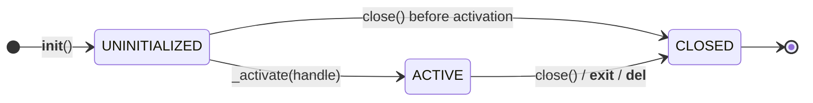
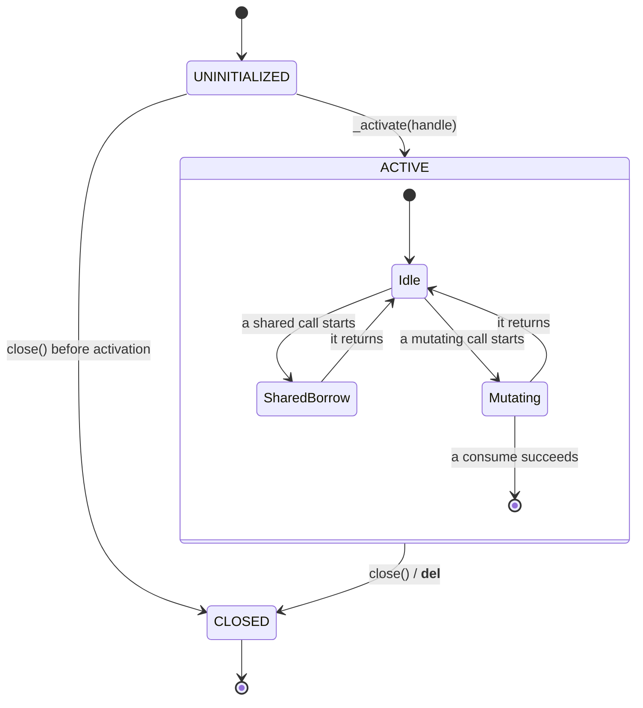
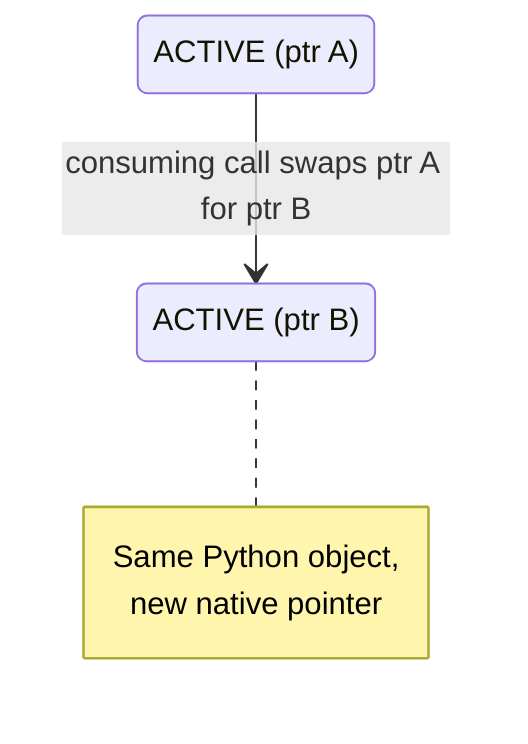
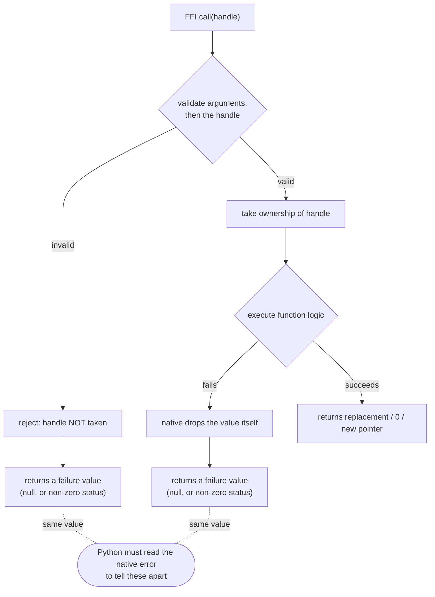
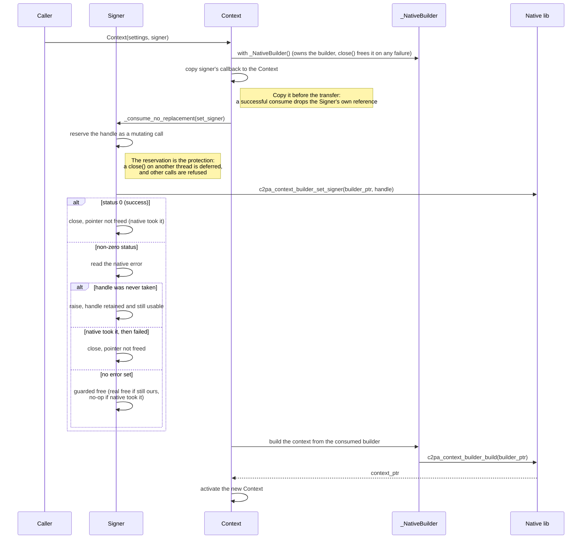
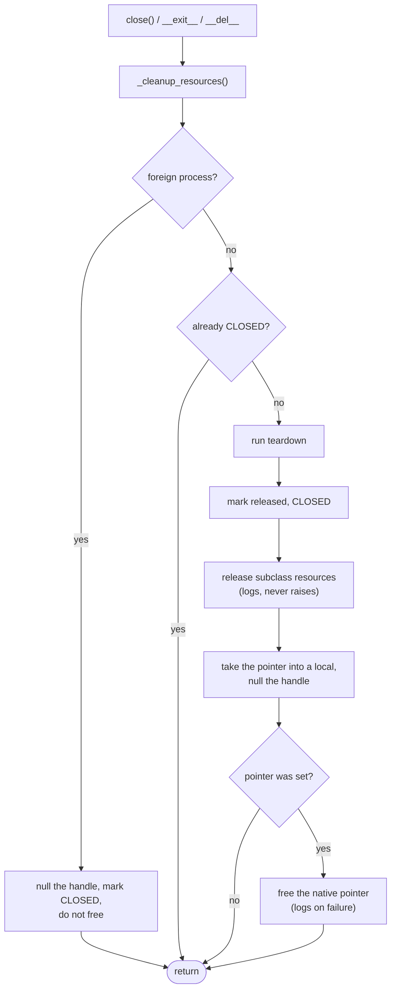
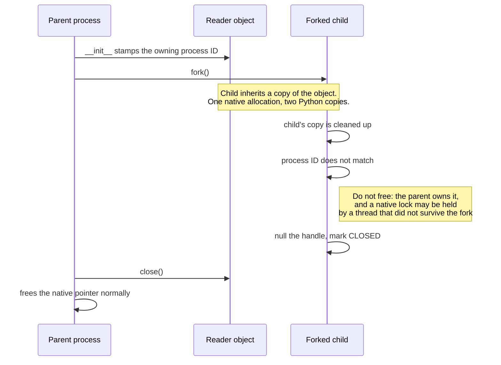
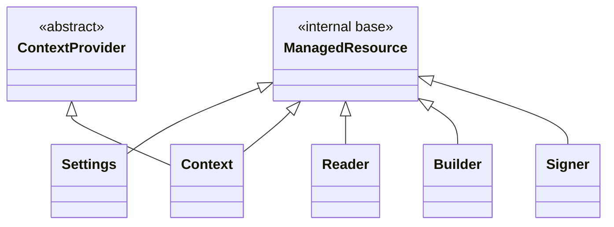

# Native resource management

`ManagedResource` is the internal base class the C2PA Python SDK uses to wrap native (Rust/C FFI) pointers. `Reader`, `Builder`, `Signer`, `Context`, and `Settings` all subclass it.

A `Reader`, for example, holds a pointer to memory the native library allocated. Python's garbage collector tracks the `Reader` object, but has no visibility into that native memory, so it can never free it. `ManagedResource` closes that gap: it frees the native pointer once, however the object stops being used.

## Vocabulary

A **native pointer** is an address that says where a piece of memory lives. The C2PA SDK wraps a Rust library, the "native" library, which allocates (native) memory Python cannot see.

A **handle** is a native pointer a `ManagedResource` object holds at a time, stored in its `_handle` attribute.

**Ownership** answers one question: who must free native memory (the handle), exactly one time. Freeing it zero times leaks memory. Freeing it twice corrupts the allocator and can crash the process.

A pointer is **consumed** when a native call takes ownership of it, often returning a replacement pointer in its place (updating the handle). Once consumed, Python must never free the original.

## Garbage collection

Python's garbage collector works by reference counting: each object counts how many references point to it, and reaching zero frees the object. This works for pure Python objects, but a `Reader`'s native pointer sits outside that system. The collector sees the `Reader` wrapper and tracks references to it, but does not know the `_handle` attribute points at memory of its own (allocated by the native library), and the garbage collector never calls the native free function.

### About the finalizer hook `__del__`

`__del__`, Python's finalizer hook, could free the native pointer whenever an object is collected, and `ManagedResource` uses it too. But the timing is unpredictable: garbage collection is non-deterministic, an object caught in a reference cycle waits for a separate cycle collector to run, and during interpreter shutdown Python may collect objects in any order, so a `__del__` that reads global state can find it already gone. Every class that holds a native pointer should inherit from `ManagedResource` rather than rely on `__del__` alone.

## Releasing memory

`ManagedResource` gives every object three ways to release its native pointer: a `with` statement, an explicit `close()`, or, as a fallback, the destructor.

### `with` statement

```python
with Reader("image.jpg") as reader:
    print(reader.json())
# reader is automatically closed here.
```

On exit, `__exit__` calls `close()`, freeing the native pointer even if the block raised.

### Explicit close

```python
reader = Reader("image.jpg")
try:
    print(reader.json())
finally:
    reader.close()
```

Calling `close()` directly is equivalent to exiting a `with` block. `close()` is idempotent: a second call does nothing.

### Destructor

Without `with` or `.close()`, `__del__` attempts the free when Python garbage-collects the object (and it can't e known in advance when the garbage collector will run, and when it will release those resources).

### Nesting

Multiple resources can share one `with` statement or nest in separate `with` blocks. They are cleaned up in reverse order: right to left (when sharing one statement), or inner to outer (when statements are nested).

```python
with open("photo.jpg", "rb") as file, Reader("image/jpeg", file) as reader:
    manifest = reader.json()
# reader is closed first, then file
```

`with` guarantees a release order: whatever is listed later, or nested deeper, is torn down first.

## Lifecycle states

Every `ManagedResource` has 3 states:


```mermaid
stateDiagram-v2
    direction LR
    [*] --> UNINITIALIZED : __init__()
    UNINITIALIZED --> ACTIVE : _activate(handle)
    UNINITIALIZED --> CLOSED : close() before activation
    ACTIVE --> CLOSED : close() / __exit__ / __del__
    CLOSED --> [*]
```

- `UNINITIALIZED`: the (Python) object exists but has no native pointer (handle) yet. This is transient, lasting only for the duration of construction.
- `ACTIVE`: the native pointer is valid, and the object can be used.
- `CLOSED`: the native pointer has been freed, or ownership of it has moved elsewhere. Any further use raises `C2paError`.

Once `CLOSED`, an object never becomes `ACTIVE` again. A construction that fails before activation can also close directly from `UNINITIALIZED`, since there is nothing to free, only a state to record.

## Close during a call

A native call takes several steps in sequence: check the object is usable, hand the pointer to native code, let the code run. Two threads sharing one object can interleave those steps:

1. Thread A calls `reader.json()`. It checks the Reader is usable, then enters the native call.
2. While that call is still running, thread B calls `reader.close()`, which frees the native pointer.
3. Thread A's native code, still running, reads through the pointer it was given, now freed (which crashes).

A Python object has no owning thread: it belongs to whoever holds a reference to it, and nothing about creating an object or passing it to another thread, in a closure or an argument, hands exclusive access to that thread. Both threads above hold a plain reference to the same object instance. Python lets either one call any method on it at any time.

The interleaving in step 2 could be possible because the CPython interpreter switches between threads between bytecode instructions, and a native call spans many of them. Calling a method by itself does not stop thread B from calling `close()` on the same object while that call runs, so thread B's `close()` can land at any point during thread A's call, including partway through. The `ManagedResource` class has functionalities to avoid that.

Depending on what the allocator has done with that freed memory, this crashes the process or returns another object's bytes, corrupting state far from the code responsible.

Any two threads sharing a reference to the same `Reader`, `Builder`, `Signer`, or `Context` can hit this race, so [Lifecycle states](#lifecycle-states) alone is not the whole model. A resource also needs a way to say "a call is using me right now, don't free me out from under it," which is what in-flight tracking adds next.

## In-flight calls

Alongside its lifecycle state, every `ManagedResource` counts calls currently running against it. This is separate from the `ACTIVE`/`CLOSED` state: a resource can be `ACTIVE` and idle, or `ACTIVE` with one or more calls in flight.

A call in flight can be either:

- **Shared**: several threads can run this kind of call on the same object at once. Reading a manifest with `.json()` is shared: nothing stops two threads from reading the same data at the same time.
- **Mutating**: only one thread may run this kind of call at a time, and no shared call may start while it runs, because a concurrent read could see a half-updated result or a pointer being replaced out from under it.

A `close()` arriving while any call, shared or mutating, is in flight does not free the pointer immediately. It marks the resource so no new caller can start using it, and defers the free until all in-flight calls have returned. For instance, thread B's `close()` takes effect at once from its own point of view, but the memory thread A is reading stays valid until thread A's call returns.

## Lifecycle overview

Lifecycle state and in-flight calls work together to manage a native resource. A resource is always in one lifecycle state, `UNINITIALIZED`, `ACTIVE`, or `CLOSED`. Independently, while it is `ACTIVE`, zero or more calls may be in flight on it right now, and if any of them is mutating, no other call may start. Together, this is the full picture every guard in `ManagedResource` checks before letting a call through:


```mermaid
stateDiagram-v2
    [*] --> UNINITIALIZED
    UNINITIALIZED --> ACTIVE: _activate(handle)
    UNINITIALIZED --> CLOSED: close() before activation

    state ACTIVE {
        [*] --> Idle
        Idle --> SharedBorrow: a shared call starts
        SharedBorrow --> Idle: it returns
        Idle --> Mutating: a mutating call starts
        Mutating --> Idle: it returns
        Mutating --> [*]: a consume succeeds
    }

    ACTIVE --> CLOSED: close() / __del__
    CLOSED --> [*]
```

The `Mutating --> [*]` exit inside `ACTIVE` is a consuming call: one that hands the pointer to native and gets a replacement or a closed resource back, covered in [Consuming](#consuming).

| State | `is_valid` | What a caller sees |
| --- | --- | --- |
| `UNINITIALIZED` | False | `C2paError`: "not properly initialized" |
| `ACTIVE`, idle | True | normal operation |
| `ACTIVE`, shared call(s) in flight | True | normal operation; more shared calls may join |
| `ACTIVE`, a mutating call in flight | **False** | `C2paError`: "running a mutating operation" |
| `CLOSED` | False | `C2paError`: "is closed" |

`is_valid` defines if a call would be accepted right now. It is `ACTIVE`, holding a handle, and no mutating call in flight. It is a lock-free snapshot, so a passing check does not keep the handle alive. Only a guarded call does that.

A `Reader`'s read methods, `.json()`, `.detailed_json()`, `.resource_to_stream()`, are shared. A `Builder`'s `.sign()` is mutating, and ends by consuming the Builder: signing closes it, so a `Builder` is single-use (see [Consuming](#consuming)).

## Crashes

Usually, native memory bug terminates the process, and the operating system reports it as a signal, since the failure happens outside anything Python's exception machinery watches.

SIGSEGV, segmentation fault, comes from the hardware: the CPU traps on a read or write to memory the process is not allowed to touch, and the kernel delivers SIGSEGV. This fires when a pointer no longer points at accessible memory, for instance freed memory the allocator has unmapped. Freeing memory does not always unmap it. Allocators often keep the pages and reuse them for a later allocation, so reading through a freed pointer can succeed, returning another object's bytes and corrupting state far from the code responsible. SIGSEGV happens when the pages are gone.

SIGABRT, abort, comes from software: a program calls `abort()` on itself after detecting a broken invariant. Allocators do this when `free()` is handed a pointer it never issued, the same pointer twice, or a heap whose bookkeeping a stray write has damaged.

In every case, the process terminates from inside native code. No exception, no `finally` block, no traceback can be run by the Python code.

## Locking

Each `ManagedResource` holds a reentrant lock, `_op_lock`, and the in-flight counters from [The full picture](#the-full-picture). Together they enforce that rule: a mutating call excludes every other call, and a `close()` arriving mid-call is deferred rather than applied immediately.

`_op_lock` is a `threading.RLock`, reentrant, rather than a plain `Lock`. A finalizer can run at any point, including inside a method that already holds the lock on that thread, so `__del__` calling back into locked code must not deadlock against itself. And a consuming call tears the handle down from inside a region it already holds the lock in, so it needs to reacquire rather than block.

The lock is never held across a native call that drives a stream callback, since that callback can call back into this API on the same thread, and holding the lock there would deadlock against that reentry. Those calls increment an in-flight counter under the lock, release the lock, run the native call, then decrement the counter, which is the mechanism the [state diagram](#the-full-picture) describes as "a call in flight."

This is why the interpreter's Global Interpreter Lock, the GIL, does not make this safe on its own. CPython executes one bytecode instruction at a time under the GIL, so simple operations cannot corrupt a built-in container. But a foreign function call through ctypes releases the GIL for its duration, so another thread runs while native code runs, and a `close()` can land inside that window. `_op_lock` and the in-flight counters avoids this case.

The native library keeps its own bookkeeping for the pointers it hands out. That bookkeeping guards the pointer itself. It can't guard what Python does with the pointer.

A callback is Python code the native library calls partway through a call, to read a stream or sign a message. It belongs to Python, so the native library keeps no bookkeeping for it. If Python frees that callback's object while the call runs, the next invocation reaches memory Python gave up. `_op_lock` and the in-flight counters keep that memory alive for the call.

Using a handle takes two steps: check it, then act on it. Native bookkeeping guards only the second step. A second thread can free the same address between the first thread's check and its use, a gap of machine instructions. The address can even be reissued to another object before that use runs, so a passed check now points at memory belonging to something else. Holding `_op_lock` across both steps closes that gap.

### Lock ordering

Two threads acquiring the same pair of locks in opposite orders can deadlock, each waiting on what the other holds. The SDK avoids this with one fixed order, from outermost to innermost: a method-specific lock (where a method serializes itself against other calls to itself), then the lock of the object a method is called on, then the lock of any object it borrows for the call. A borrowed object's lock is always taken inside the operating object's lock, never the reverse, and a lock held across a native call must be one no callback path acquires.

### Borrowing vs consuming

A shared call, a **borrow**, passes the handle to native and gets it back unchanged. A mutating call that ends by consuming the handle hands ownership to native, which frees the original pointer during the call. A borrow validates the pointer once on entry, then holds it for the whole call without checking again, so a consume starting midway through a borrow would free memory the borrow is reading.

`ManagedResource` prevents this by refusing to start a consume while a borrow is in flight, and by reserving the handle as a mutating call for the whole duration of the consume, the same reservation any other mutating call makes. Every entry point checks the in-flight counters under `_op_lock` before it starts, so a call that would otherwise race a consume is refused instead with "running a mutating operation," and the resource's lifecycle state never changes until the consume is fully classified as a success or a failure. `Reader.with_fragment()` also serializes itself against other calls to itself with a lock of its own.

## Double frees

Freeing the same native pointer twice corrupts the allocator's bookkeeping. A detecting allocator stops the process. An allocator that misses it lets the damage surface later, somewhere unrelated to the code responsible.

| Risk | Mitigated by |
| --- | --- |
| Freeing a pointer a consuming call already took | The consumed pointer is abandoned rather than freed; the native error message says whether ownership actually moved (see [Consuming](#consuming)). |
| A forked child process freeing a pointer its parent owns | A process-ID stamp on every object; cleanup in a process that did not allocate the pointer marks it closed without freeing (see [Fork safety](#fork-safety)). |
| Two threads racing a `close()` against an in-flight call on the same object | `_op_lock` and the in-flight counters (see [Locking](#locking)): a `close()` mid-call is deferred, not applied. |

Sharing one `ManagedResource` instance across threads needs these guards. Nothing here protects two threads racing on distinct objects that happen to share an allocator, since that is the allocator's own concurrency guarantee, not this layer's.

## Consuming

Consuming a handle is a mutating call that hands the pointer to native, which takes ownership and either returns a replacement pointer or frees the original. Python must never free a pointer it handed to a consuming call, whichever way the call ends, since the address may belong to a different object by the time it returns.

There are two shapes a consuming call takes.

**Consume-and-swap** replaces the object's internal state without discarding the Python-side wrapper. `Reader.with_fragment()` does this, feeding a new BMFF fragment into an existing Reader so the native library can rebuild its internal representation from prior fragments plus the new one, since a fresh `Reader` would lose that accumulated state. `Builder.with_archive()` does the same, loading an archive into an existing Builder while keeping its context and settings.


```mermaid
stateDiagram-v2
    state "ACTIVE (ptr A)" as A
    state "ACTIVE (ptr B)" as B

    A --> B : consuming call swaps ptr A for ptr B
    note right of B
        Same Python object,
        new native pointer
    end note
```

On success the object stays `ACTIVE`: the lifecycle state never changes, only the pointer underneath it, and callers keep using the same object.

**Consume-and-close** takes the pointer and leaves the Python object nothing to wrap. Signing a `Builder`, or handing a `Signer` to a `Context`, both end this way: the object goes `CLOSED`, but without freeing the pointer, since native still owns it.

A consuming FFI call can fail two different ways that return the identical value to Python, a null pointer or a non-zero status: it can reject the pointer before taking ownership, or take ownership and then drop the value on a later failure. Which one happened decides whether Python still owns the pointer.


```mermaid
flowchart TD
    CALL["FFI call(handle)"] --> V{"validate arguments,<br/>then the handle"}
    V -->|invalid| R["reject: handle NOT taken"] --> F1["returns a failure value<br/>(null, or non-zero status)"]
    V -->|valid| TAKE["take ownership of handle"]
    TAKE --> WORK{"execute function logic"}
    WORK -->|fails| DROP["native drops the value itself"] --> F2["returns a failure value<br/>(null, or non-zero status)"]
    WORK -->|succeeds| OK["returns replacement / 0 / new pointer"]

    F1 -.same value.- AMB(["Python must read the native error<br/>to tell these apart"])
    F2 -.same value.- AMB
```

The native error message tells the two apart. A set of rejection tags means the handle was never taken, so Python keeps and later frees it normally. Any other error means native took it and dropped it, so Python's cleanup runs without freeing anything. If no error was set, ownership is unknown, and Python falls back to a **guarded free**: the native pointer registry rejects a free of an address it no longer tracks, returning `-1` rather than crashing, so this is harmless whether or not native still holds it.

The one case a guarded free is not used is once ownership is known to have moved: there, the free is skipped rather than issued and left for the registry to reject. A freed address can be reused by an unrelated allocation, and an unnecessary free landing after that reuse would destroy the wrong object. Skipping a free that provides no value avoids that window.

Three helpers share this triage, differing only in what a successful call returns:

| Helper | On success | Result |
| --- | --- | --- |
| `_consume_and_swap()` | a replacement pointer | installs the replacement; resource stays `ACTIVE` |
| `_consume_no_replacement()` | a status code | `CLOSED`, pointer not freed |
| `_consume_into()` | a *different* object's pointer | `CLOSED`; the new pointer is handed to the caller to own |

`_consume_no_replacement()` is how a `Signer` is fed to a `Context`, and `_consume_into()` is how that same `Context` returns its newly built native pointer.

### Signer to context

The transfer of a `Signer` into a `Context` shows the whole protocol in one place: the reservation that protects the handle during the call, and the triage that decides ownership afterward.


```mermaid
sequenceDiagram
    participant C as Caller
    participant S as Signer
    participant X as Context
    participant B as _NativeBuilder
    participant N as Native lib

    C->>X: Context(settings, signer)
    X->>B: with _NativeBuilder() (owns the builder, close() frees it on any failure)
    X->>X: copy signer's callback to the Context
    Note right of X: Copy it before the transfer:<br/>a successful consume drops the Signer's own reference
    X->>S: _consume_no_replacement(set_signer)
    S->>S: reserve the handle as a mutating call
    Note right of S: The reservation is the protection:<br/>a close() on another thread is deferred,<br/>and other calls are refused
    S->>N: c2pa_context_builder_set_signer(builder_ptr, handle)

    alt status 0 (success)
        S->>S: close, pointer not freed (native took it)
    else non-zero status
        S->>S: read the native error
        alt handle was never taken
            S->>S: raise, handle retained and still usable
        else native took it, then failed
            S->>S: close, pointer not freed
        else no error set
            S->>S: guarded free (real free if still ours,<br/>no-op if native took it)
        end
    end

    X->>B: build the context from the consumed builder
    B->>N: c2pa_context_builder_build(builder_ptr)
    N-->>X: context_ptr
    X->>X: activate the new Context
```

A few details in that sequence matter beyond what the diagram shows. The transfer is not wrapped in a shared-call reservation; it uses the mutating reservation described in [Borrowing vs consuming](#borrowing-vs-consuming), which defers a racing `signer.close()` until the transfer is classified. `set_signer` does not always take the pointer, so the triage reads the native error before deciding whether the Signer closed. The temporary native builder used to construct the Context is itself a small `ManagedResource`, held inside a `with` block, so any failure along the way frees it through the same `close()` path rather than a bespoke handler.

### Adopting a handle

Ownership can also arrive from the other direction: a native call returns a pointer that needs a Python wrapper around it, with no `__init__` call, since `__init__` would try to create a new native resource rather than wrap an existing one. `_wrap_native_handle()` handles this: it builds a bare instance, sets its lifecycle bookkeeping, runs `_init_attrs()` for subclass defaults, and activates the handle. Ownership transfers once that call returns; if it raises, no wrapper exists, and the caller still owns the pointer and must free it itself.

`Reader._init_from_context` and `Builder._init_from_context` both do something that looks backward: they create a native object and activate it before making the consuming call that will feed it data. This is deliberate. A consuming call needs an active resource to read the handle from and swap the result into, and activating first puts the intermediate pointer under normal cleanup right away: whichever way the consuming call goes, `close()` and `__del__` free it correctly. Holding the raw pointer in a local variable instead would leave every failure path to decide for itself whether to free it.

## Guarantees

`is_valid`, defined in [The full picture](#the-full-picture), is a lock-free snapshot: it does not itself keep the handle alive, only a guarded call does that. `Context` implements the abstract `ContextProvider.is_valid` by inheriting the concrete one from `ManagedResource`, which Python's method resolution order finds first as long as `ManagedResource` is listed before `ContextProvider` in the class definition (`class Context(ManagedResource, ContextProvider)`). Listing them the other way around would leave the abstract declaration in front and raise `TypeError` at class definition time.

Every subclass gets these guarantees from `ManagedResource`, and must not break them:

| Guarantee | What it means |
| --- | --- |
| Freed exactly once | Every native pointer reaches `c2pa_free` at most once: no leak, no double-free. |
| Cleanup is idempotent | Calling `close()`, or exiting a `with` block, more than once does nothing after the first time. |
| Cleanup never raises | An ordinary exception during cleanup is caught and logged, never re-raised, so it cannot mask an exception the `with` block itself raised. An interpreter shutdown signal is the one exception to this: it is allowed to interrupt cleanup, since the process is already going away. |
| State transitions are one-way | Lifecycle only ever moves `UNINITIALIZED` to `ACTIVE` to `CLOSED`. Nothing reactivates a closed resource. |
| Public methods check state first | Every method that uses the handle validates it before the native call, raising `C2paError` on anything but a usable `ACTIVE` resource rather than risking undefined behavior. |

## Keeping references alive

When a Python object passes a callback or a pointer to the native library, that reference must stay alive as long as native code might use it, and the garbage collector has no way to know that: it only sees Python references.

The SDK keeps these references as plain instance attributes on the owning object. A `Stream` stores its four callback objects this way, so they stay referenced as long as the `Stream` is alive (see [Reference cycles](#reference-cycles) for how those callbacks avoid keeping the `Stream` alive in return). A `Signer` consumed by a `Context` has its callback copied to an attribute on the `Context`, so the callback survives the `Signer` object closing.

`_release()` sets these attributes to `None` during cleanup, letting them be collected, and it runs before the native pointer is freed, so anything the pointer depends on, an open file, a stream wrapper, is torn down first. This is `ManagedResource`'s ordering; `Stream` releases in the reverse order for reasons covered in [`Stream` cleanup](#stream-cleanup).

## Freeing memory

The native library exposes one C function, `c2pa_free`, that deallocates memory it previously allocated. Every native pointer, whatever kind of object created it, is freed through this one path:

```python
@staticmethod
def _free_native_ptr(ptr):
    return _lib.c2pa_free(ptr)
```

It returns `0` when the pointer was freed, and `-1` when the registry rejected an already-consumed or untracked address, the same `-1` a guarded free relies on. `ManagedResource` guarantees this is called once per pointer.

## Cleanup errors

Cleanup must not let an ordinary exception mask the exception that caused a `with` block to exit in the first place. `ManagedResource` enforces this at every level:

- `close()` delegates to `_cleanup_resources()`, which wraps the whole sequence in a try/except that catches and logs `Exception` rather than re-raising it.
- `_release()` runs inside a wrapper that logs any exception it raises and continues, so a subclass's `_release()` failing cannot stop the native pointer from being freed afterward.
- A failed free of the native pointer is logged, not re-raised.
- The object is marked `CLOSED` before `_release()` runs or anything is freed, so a cleanup that fails partway still leaves the object closed, and a second attempt does not repeat the damage.
- `close()` on an already-closed object returns immediately.

These handlers catch `Exception`, not `BaseException`. The interpreter's own unwinding signals, a cancellation or a shutdown in progress, are `BaseException`, so they pass through untouched and the remaining free may not run. This is deliberate: such a signal means the process is going away, address space and native allocations included, so holding cleanup open to finish a free that is about to become irrelevant would only delay the shutdown the caller asked for.

All three cleanup entry points converge on one method:


```mermaid
flowchart TD
    E["close() / __exit__ / __del__"] --> CR["_cleanup_resources()"]
    CR --> FP{"foreign process?"}
    FP -->|yes| N["null the handle, mark CLOSED,<br/>do not free"] --> DONE([return])
    FP -->|no| ST{"already CLOSED?"}
    ST -->|yes| DONE
    ST -->|no| TD["run teardown"]
    TD --> SET["mark released, CLOSED"]
    SET --> REL["release subclass resources<br/>(logs, never raises)"]
    REL --> NULL["take the pointer into a local,<br/>null the handle"]
    NULL --> H{"pointer was set?"}
    H -->|no| DONE
    H -->|yes| FREE["free the native pointer<br/>(logs on failure)"] --> DONE
```

The "foreign process" branch is explained in [Fork safety](#fork-safety), next.

## Fork safety

`fork()` copies the calling process, including every Python object holding a native pointer, but the underlying native allocation is not duplicated: there is still only one, and the parent owns it.

If a forked child cleaned up its copy of that object normally, two things would go wrong. It would free a pointer the parent is using, a double-free. And more subtly, `fork()` only carries over the thread that called it, so if another thread held a native lock at fork time, that lock stays held forever in the child, and calling into native code to free anything can then block on it forever.

So the SDK never frees native memory in a process that did not allocate it. Every object is stamped with its creating process's ID at construction, and cleanup compares that stamp against the current process before doing anything:


```mermaid
sequenceDiagram
    participant P as Parent process
    participant O as Reader object
    participant F as Forked child

    P->>O: __init__ stamps the owning process ID
    P->>F: fork()
    Note over O,F: Child inherits a copy of the object.<br/>One native allocation, two Python copies.

    F->>F: child's copy is cleaned up
    F->>F: process ID does not match
    Note right of F: Do not free: the parent owns it,<br/>and a native lock may be held<br/>by a thread that did not survive the fork
    F->>F: null the handle, mark CLOSED

    P->>O: close()
    P->>P: frees the native pointer normally
```

The child's copy is not just skipped, it is nulled and marked `CLOSED`, so nothing in the child can go on to use or free it. This never touches the parent's copy, which stays valid.

The memory a child skips freeing is not lost for good: a child that calls `exec()` replaces its address space, and a child that exits has its memory reclaimed by the operating system. Even a long-lived forked worker retains at most the objects it inherited at fork time, a bounded amount rather than a growing leak, since anything it allocates carries its own process ID and is freed normally.

## Class hierarchy


```mermaid
classDiagram
    class ManagedResource {
        <<internal base>>
    }

    class ContextProvider {
        <<abstract>>
    }

    ManagedResource <|-- Settings
    ManagedResource <|-- Context
    ManagedResource <|-- Reader
    ManagedResource <|-- Builder
    ManagedResource <|-- Signer

    ContextProvider <|-- Context
```

`Context` inherits from both `ManagedResource` and `ContextProvider`. Python's multiple inheritance allows this. `ContextProvider` is an abstract base class requiring `is_valid` and `execution_context`; `Context` satisfies `is_valid` by inheriting the concrete version from `ManagedResource`, as long as `ManagedResource` is listed first in the class definition, `class Context(ManagedResource, ContextProvider)`. Listed the other way, Python's method resolution order would find the abstract declaration first and refuse to let `Context` be instantiated at all.

## Streams

Bytes reach the native library through a `Stream`, which wraps a Python file or memory stream so the native library can read and write it via callbacks. It does not inherit from `ManagedResource`, and uses a separate release function instead of `_free_native_ptr`.

### Not a `ManagedResource`

A `Reader` or `Builder` holds a resource that Python code calls methods on. A `Stream` holds a resource the native library calls back into instead, for read, seek, write, and flush. Ownership means something different for a resource that receives calls rather than makes them, so `Stream` gets its own release path instead of the shared one.

`Stream` tracks its state with two flags, `_closed` and `_initialized`, rather than the `LifecycleState` machinery from [Lifecycle states](#lifecycle-states), but supports the same three cleanup paths: context manager, explicit `.close()`, `__del__` fallback.

### Reentrant callbacks

A `Stream` registers four ctypes callbacks. Reading from the stream runs one of them, running caller-supplied Python, and the same reentrancy hazard applies as anywhere else in this doc: a native call driving one of these callbacks cannot hold a lock across the call, since the callback may call back into this API on the same thread.

Each callback checks the stream's own state before touching the underlying Python object, and reports an error rather than reading through it if the stream has been torn down.

### `Stream` cleanup

`Stream` holds its own reentrant lock, `_close_lock`, serializing `close()`, `__del__`, and a `close()` from another thread against each other, for the same reason `_op_lock` is reentrant: a callback attribute set to `None` inside the locked region can drop the last reference to an object whose own finalizer then needs the same lock.

Cleanup runs in the direction of dependency: whatever can invoke or reach the other side is torn down first. This reverses the order `ManagedResource` uses, because a `Stream`'s callbacks are invoked by native code rather than the other way around: `Stream` releases the native handle first, guaranteeing no callback can fire again, then drops the callback objects. `ManagedResource` instead runs subclass cleanup first, since its native pointer depends on those resources staying valid until then.

`close()` performs both steps. `__del__` performs the release, leaving the callback attributes in place, but this leaks nothing: `__del__` runs when the `Stream` is being collected, taking those attributes down with it.

`Stream` never closes the Python object it wraps. The caller that opened a file owns that file. A `Reader` that opened the file itself tracks it separately and closes it during its own cleanup.

### Reference cycles

Each ctypes callback closes over the `Stream` it belongs to. Captured directly, that would be a reference cycle, the `Stream` holding the callback and the callback holding the `Stream`, so nothing in the loop would reach a zero reference count on its own, leaving cleanup to the slower cycle collector. The callbacks capture a weak reference instead, resolved fresh on each call, so the `Stream`'s reference count can reach zero and its cleanup stays on the deterministic path.

### `Reader.with_fragment()`

A `with_fragment()` call does two things: the FFI call consumes the Reader's current handle and returns a replacement, and the Reader updates its own Python-side fields, the `Stream` wrappers it owns and its manifest caches, to describe that new handle. Those two steps have to run as one unit, since two threads interleaving them could close a stream the native reader is still reading through, or leave stale wrappers describing a handle another thread already replaced.

`Reader._fragment_lock` covers both steps, and `with_fragment()` is the only method that takes it. The guard spans the native call, so it cannot block waiting for the lock, since that call drives caller-supplied callbacks that could re-enter this API and deadlock. A second thread finding the lock held is refused at once instead, leaving the Reader untouched: no stream built, no handle consumed, so the call succeeds once the other thread returns. This means one thread feeds fragments to a Reader at a time, and the caller must serialize those calls itself. The refusal messages are stable enough for callers to match on:

- `Reader is already processing a fragment on another thread`: another thread is already inside `with_fragment()` on this Reader.
- `Reader is in use by another operation and cannot be consumed`: some other native call is in flight on this Reader.
- `Reader is running a mutating operation`: what a read method on another thread sees while `with_fragment()` runs, per [The full picture](#the-full-picture).

`resource_to_stream()`, by contrast, is a shared call: the underlying SDK method only reads, so other read methods on the same Reader run concurrently with it, a `close()` arriving meanwhile is deferred until it returns, and `with_fragment()` is refused until it returns, the same as any other mutating call.

#### Cache invalidation

A `Reader` caches its manifest data, keyed to the handle it was read from. A successful `with_fragment()` swap invalidates that cache, and both the invalidation and every cache read in `json()` happen under the resource's lock, so a reader never observes a half-updated cache. The handle swap runs as a shared-style in-flight call rather than under that lock (native calls never hold it, per [Locking](#locking)), so there is a window between the new handle landing and the old cache being cleared. A `json()` on another thread that acquires the lock inside that window finds the stale cache populated and returns it without consulting the handle, serving a manifest for the fragment just replaced. `_fragment_lock` does not close this window, since it only serializes `with_fragment()` against itself; a caller sharing one Reader across threads for both fragment-feeding and reading needs to serialize those two together itself.

## Which method

Writing a new `ManagedResource` subclass, each situation maps to one call:

| Situation | Call this |
| --- | --- |
| Creating a brand-new native object from an FFI constructor | `_create_and_activate(ffi_call, error_message)` |
| An FFI call consumes the current handle and returns a replacement for the same object | `_consume_and_swap(ffi_call, error_message)` |
| An FFI call consumes the current handle to configure or feed another object, returning only a status code | `_consume_no_replacement(ffi_call, error_message)` |
| An FFI call consumes the current handle and returns a *different* object's pointer, for that object to own | `_consume_into(ffi_call, error_message)` |
| A call fails and it is unclear whether native took the handle first | `_release_handle()` |
| A Python instance needs to wrap a handle a native call already returned, without creating a new one | `_wrap_native_handle(handle)` (classmethod) |
| Ordinary teardown (`close()`, `__del__`) | Neither. These already route through the shared cleanup path. Nothing outside `ManagedResource` itself tears an object down directly. |

## Subclassing

To wrap a new native resource, inherit from `ManagedResource` and follow these rules:

```python
class NativeResource(ManagedResource):
    def _init_attrs(self):
        # 1. Declare ALL instance attributes here, not in __init__.
        #    _wrap_native_handle() builds instances around an existing
        #    handle without running __init__, and calls this instead.
        #    An attribute set only in __init__ would be missing there.
        #    This also runs before anything that can raise, so a
        #    half-constructed object still has what _release() reads.
        super()._init_attrs()
        self._my_stream = None
        self._my_cache = None

    def __init__(self, arg):
        super().__init__()
        self._init_attrs()

        # 2. Create the native pointer, validate it, and take ownership.
        #    _create_and_activate() runs the FFI call, checks the result
        #    with _check_ffi_operation_result (which fills in the native
        #    error, or "Unknown error" when there is none), then _activate()s
        #    it. If any step fails the pointer is freed, so a rejected
        #    creation leaks nothing. The object is never ACTIVE without a
        #    live pointer. Never assign self._handle or self._lifecycle_state
        #    directly.
        self._create_and_activate(
            lambda: _lib.c2pa_my_resource_new(arg),
            "Failed to create MyResource: {}")

    def _release(self):
        # 3. Clean up class-specific resources.
        #    Never let this method raise. Must be idempotent.
        #
        #    Consider defining a simple lifecycle for native resources
        #    so _release() can check whether they are releasable
        #    before attempting cleanup. The if-guard below
        #    verifies the stream exists and has not
        #    already been released. The try/except is a fallback
        #    that silences unexpected errors from .close().
        if self._my_stream:
            try:
                self._my_stream.close()
            except Exception:
                logger.error("Failed to close MyResource stream")
            finally:
                self._my_stream = None

    def do_something(self):
        # 4. Check state at the start of every public method.
        #    This raises C2paError if the resource is closed.
        self._ensure_valid_state()
        return _lib.c2pa_my_resource_do_something(self._handle)
```

### Troubleshooting

- An attribute set only in `__init__` is missing on an instance built by `_wrap_native_handle()`, since that path never runs `__init__`. The failure shows up later as an `AttributeError` from whichever method reads the attribute, often `_release()` during cleanup. Attributes belong in `_init_attrs()`, which each subclass `__init__` calls and `_wrap_native_handle()` calls in its place.
- Calling `_init_attrs()` after an FFI call that can raise leaves `_release()` reading attributes that do not exist yet when that call fails, crashing with `AttributeError`. It belongs right after `super().__init__()`, before anything that can fail.
- Assigning `self._handle` or `self._lifecycle_state` directly bypasses the checks that make the lifecycle safe: `_activate()` refuses a null handle and an already-active object, and `_consume_and_swap()` requires an active resource and a non-null replacement. Direct assignment gives up both, and the resulting bugs, an `ACTIVE` object with a null handle or a silently discarded pointer, surface far from their cause.
- A `_release()` that raises has its exception silently swallowed, visible only in the logs. Guard it so it can check whether there is anything left to release, with a try/except as the fallback for unexpected failures.
- `_release()` can be called more than once, via `close()` then `__del__`, or multiple `close()` calls, so it must handle running on an already-cleaned-up object. The standard pattern sets attributes to `None` after closing them.
- Call `c2pa_free` through `ManagedResource`, not directly, so the lifecycle's state checks stay in effect. A redundant free is not itself a crash, the registry rejects an untracked address safely, but a manual free bypasses everything this doc describes.
- Multiple inheritance ordering matters for shared property names, covered in [Class hierarchy](#class-hierarchy). `ClassName.__mro__` confirms the resolution order when in doubt.
