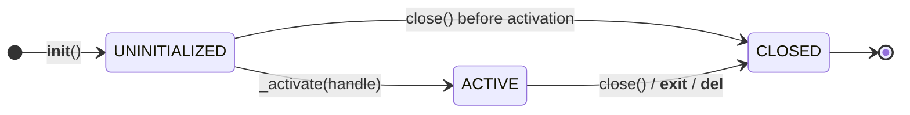
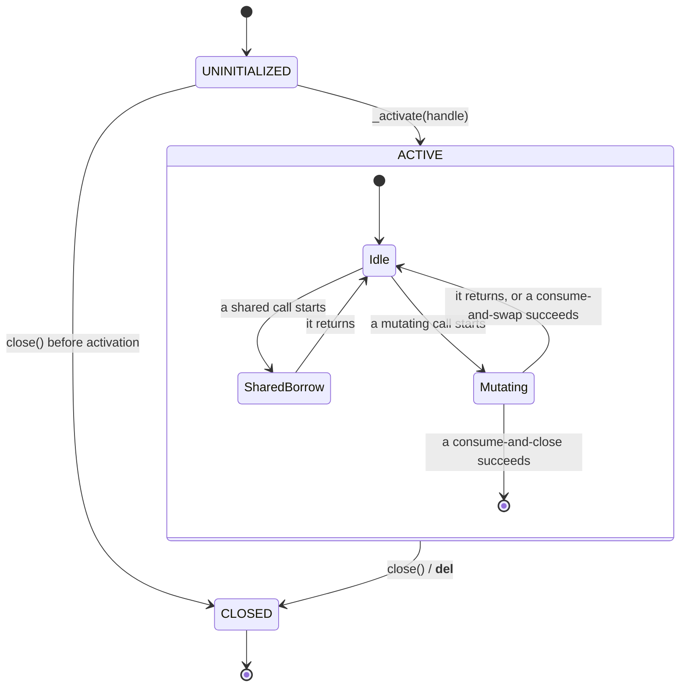
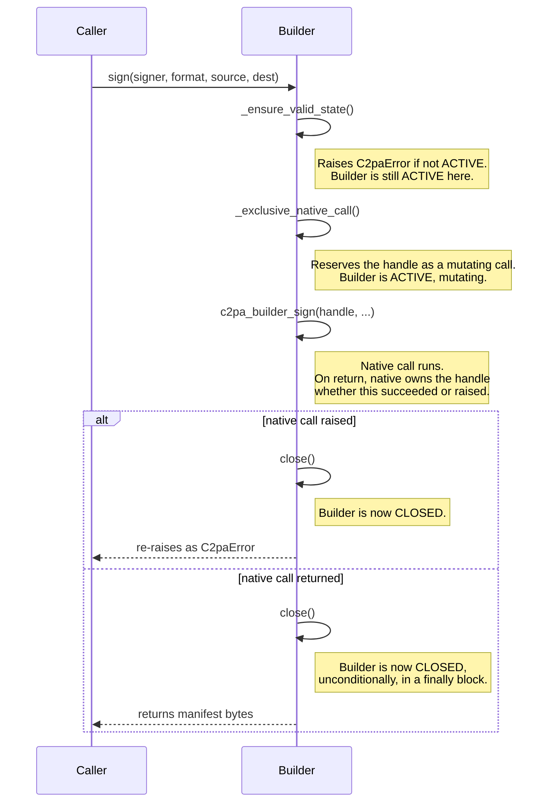
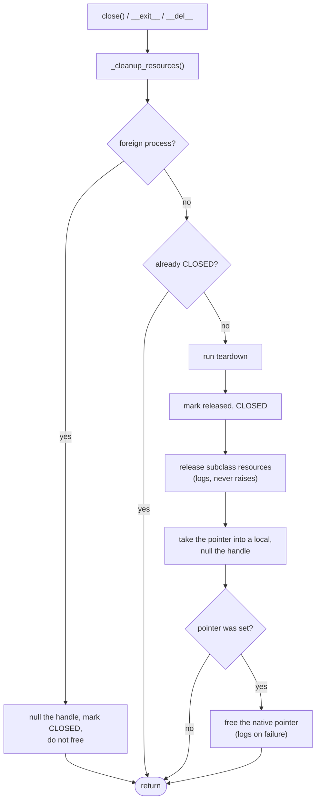
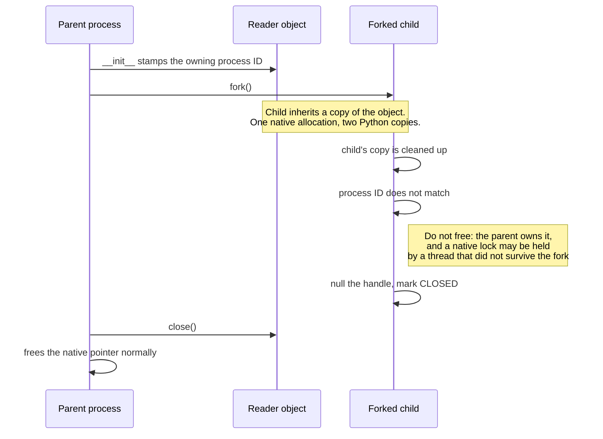
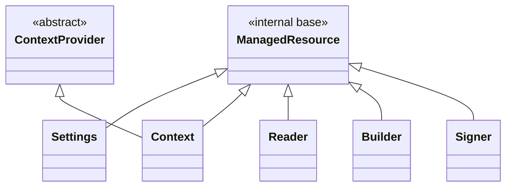

# Native resource management

`ManagedResource` is the internal base class the C2PA Python SDK uses to wrap native (Rust/C FFI) pointers. `Reader`, `Builder`, `Signer`, `Context`, and `Settings` all subclass it.

A `Reader`, for example, holds a pointer to memory the native library allocated. Python's garbage collector tracks the `Reader` object, but has no visibility into that native memory, so it can never free it. `ManagedResource` closes that gap: it frees the native pointer once, however the object stops being used.

## Vocabulary

A **native pointer** is an address that says where a piece of memory lives. The C2PA SDK wraps a Rust library, the "native" library, which allocates (native) memory Python cannot see.

A **handle** is a native pointer a `ManagedResource` object holds at a time, stored in its `_handle` attribute.

**Ownership** answers one question: who must free native memory (the handle), exactly one time. Freeing it zero times leaks memory. Freeing it twice corrupts the allocator and can crash the process.

A pointer is **consumed** when a native call takes ownership of it, often returning a replacement pointer in its place (updating the handle). Once consumed, Python must never free the original.

## Garbage collection

Python's garbage collector works by reference counting: each object counts how many references point to it, and reaching zero frees the object. This works for pure Python objects, but a `Reader`'s native pointer sits outside that system. The collector sees the `Reader` wrapper and tracks references to it, but does not know the `_handle` attribute points at memory of its own (allocated by the native library), and the garbage collector never calls the native free function.

### About the finalizer hook `__del__`

`__del__`, Python's finalizer hook, could free the native pointer whenever an object is collected, and `ManagedResource` uses it too. But the timing is unpredictable: garbage collection is non-deterministic, an object caught in a reference cycle waits for a separate cycle collector to run, and during interpreter shutdown Python may collect objects in any order, so a `__del__` that reads global state can find it already gone. Every class that holds a native pointer should inherit from `ManagedResource` rather than rely on `__del__` alone.

## Releasing memory

`ManagedResource` gives every object three ways to release its native pointer: a `with` statement, an explicit `close()`, or, as a fallback, the destructor.

### `with` statement

```python
with Reader("image.jpg") as reader:
    print(reader.json())
# reader is automatically closed here.
```

On exit, `__exit__` calls `close()`, freeing the native pointer even if the block raised.

### Explicit close

```python
reader = Reader("image.jpg")
try:
    print(reader.json())
finally:
    reader.close()
```

Calling `close()` directly is equivalent to exiting a `with` block. `close()` is idempotent: a second call does nothing.

### Destructor

Without `with` or `.close()`, `__del__` attempts the free when Python garbage-collects the object. When that happens is not predictable.

### Nesting

Multiple resources can share one `with` statement or nest in separate `with` blocks. They are cleaned up in reverse order: right to left (when sharing one statement), or inner to outer (when statements are nested).

```python
with open("photo.jpg", "rb") as file, Reader("image/jpeg", file) as reader:
    manifest = reader.json()
# reader is closed first, then file
```

`with` guarantees a release order: whatever is listed later, or nested deeper, is torn down first.

## Lifecycle states

Every `ManagedResource` has 3 states:


```mermaid
stateDiagram-v2
    direction LR
    [*] --> UNINITIALIZED : __init__()
    UNINITIALIZED --> ACTIVE : _activate(handle)
    UNINITIALIZED --> CLOSED : close() before activation
    ACTIVE --> CLOSED : close() / __exit__ / __del__
    CLOSED --> [*]
```

- `UNINITIALIZED`: the (Python) object exists but has no native pointer (handle) yet. This is transient, lasting only for the duration of construction.
- `ACTIVE`: the native pointer is valid, and the object can be used.
- `CLOSED`: the native pointer has been freed, or ownership of it has moved elsewhere. Any further use raises `C2paError`.

Once `CLOSED`, an object never becomes `ACTIVE` again. A construction that fails before activation can also close directly from `UNINITIALIZED`, since there is nothing to free, only a state to record.

## Closing during a (native) call

A native call checks the object is usable, then hands the pointer to native code. Two threads sharing one object can interleave those steps:

1. Thread A calls `reader.json()`, checks the Reader is usable, enters the native call.
2. Thread B calls `reader.close()` while that call is still running, freeing the pointer.
3. Thread A's native code reads through the now-freed pointer. Crash.

A thread pool with a timeout can hit this too:

```python
with Reader("image.jpg") as reader:
    future = thread_pool.submit(reader.json)
    try:
        future.result(timeout=2.0)
    except TimeoutError:
        pass
# the `with` block exits here, calling reader.close(),
# whether or not the pool thread's reader.json() finished
```

`future.result(timeout=...)` gives up waiting but does not stop the pool thread, so `reader.json()` can still be mid-call when the `with` block's `close()` runs on the timeout path. Same race as thread A and B, reached through a timeout instead of a hand-rolled thread.

A Python object has no owning thread. Any reference holder can call any method on it at any time, from any thread.

The interpreter switches threads between bytecode instructions, and a native call spans many of them, so thread B's `close()` can land at any point during thread A's call. `ManagedResource` guards against that.

Depending on what the allocator did with the freed memory, this crashes the process or returns another object's bytes, corrupting state far from the code responsible.

Any two threads sharing a `Reader`, `Builder`, `Signer`, or `Context` reference can hit this, so [Lifecycle states](#lifecycle-states) alone is not the whole model. A resource needs a way to say "a call is using me, don't free me out from under it," which in-flight tracking adds next.

## In-flight calls

Alongside its lifecycle state, every `ManagedResource` counts calls currently running against it. This is separate from the `ACTIVE`/`CLOSED` state: a resource can be `ACTIVE` and idle, or `ACTIVE` with one or more calls in flight.

A call in flight can be either:

- **Shared**: several threads can run this kind of call on the same object at once. Reading a manifest with `.json()` is shared: nothing stops two threads from reading the same data at the same time.
- **Mutating**: only one thread may run this kind of call at a time, and no shared call may start while it runs, because a concurrent read could see a half-updated result or a pointer being replaced out from under it.

A `close()` arriving while any call, shared or mutating, is in flight does not free the pointer immediately. It marks the resource so no new caller can start using it, and defers the free until all in-flight calls have returned. For instance, thread B's `close()` takes effect at once from its own point of view, but the memory thread A is reading stays valid until thread A's call returns.

## Lifecycle overview

Lifecycle state and in-flight calls work together to manage a native resource. A resource is always in one lifecycle state, `UNINITIALIZED`, `ACTIVE`, or `CLOSED`. Independently, while it is `ACTIVE`, zero or more calls may be in flight on it right now, and if any of them is mutating, no other call may start. Together, this is the full picture every guard in `ManagedResource` checks before letting a call through:


```mermaid
stateDiagram-v2
    [*] --> UNINITIALIZED
    UNINITIALIZED --> ACTIVE: _activate(handle)
    UNINITIALIZED --> CLOSED: close() before activation

    state ACTIVE {
        [*] --> Idle
        Idle --> SharedBorrow: a shared call starts
        SharedBorrow --> Idle: it returns
        Idle --> Mutating: a mutating call starts
        Mutating --> Idle: it returns, or a consume-and-swap succeeds
        Mutating --> [*]: a consume-and-close succeeds
    }

    ACTIVE --> CLOSED: close() / __del__
    CLOSED --> [*]
```

`Mutating` is entered by any mutating call, but the two ways out differ by what kind of call it was. An ordinary mutating call, or a consume-and-swap, returns to `Idle`: the resource stays `ACTIVE`, either unchanged or holding a new pointer. Only a consume-and-close exits `ACTIVE` into `CLOSED`, since that is the one kind of consuming call that leaves nothing to wrap. Both consuming shapes are covered in [Consuming](#consuming).

| State | `is_valid` | What a caller sees |
| --- | --- | --- |
| `UNINITIALIZED` | False | `C2paError`: "not properly initialized" |
| `ACTIVE`, idle | True | normal operation |
| `ACTIVE`, shared call(s) in flight | True | normal operation; more shared calls may join |
| `ACTIVE`, a mutating call in flight | **False** | `C2paError`: "running a mutating operation" |
| `CLOSED` | False | `C2paError`: "is closed" |

`is_valid` defines if a call would be accepted right now. It is `ACTIVE`, holding a handle, and no mutating call in flight. It is a lock-free snapshot, so a passing check does not keep the handle alive. Only a guarded call does that.

A `Reader`'s read methods, `.json()`, `.detailed_json()`, `.resource_to_stream()`, are shared. A `Builder`'s `.sign()` is mutating, and ends by consuming the Builder: signing closes it, so a `Builder` is single-use (see [Consuming](#consuming)).

## Crashes

Usually, native memory bug terminates the process, and the operating system reports it as a signal, since the failure happens outside anything Python's exception machinery watches.

SIGSEGV, segmentation fault, comes from the hardware: the CPU traps on a read or write to memory the process is not allowed to touch, and the kernel delivers SIGSEGV. This fires when a pointer no longer points at accessible memory, for instance freed memory the allocator has unmapped. Freeing memory does not always unmap it. Allocators often keep the pages and reuse them for a later allocation, so reading through a freed pointer can succeed, returning another object's bytes and corrupting state far from the code responsible. SIGSEGV happens when the pages are gone.

SIGABRT, abort, comes from software: a program calls `abort()` on itself after detecting a broken invariant. Allocators do this when `free()` is handed a pointer it never issued, the same pointer twice, or a heap whose bookkeeping a stray write has damaged.

In every case, the process terminates from inside native code. No exception, no `finally` block, no traceback can be run by the Python code.

## Locking

Freeing the same native pointer twice corrupts the allocator's bookkeeping. A detecting allocator stops the process. An allocator that misses it lets the damage surface later, somewhere unrelated to the code responsible. Two threads racing a `close()` against an in-flight call on the same object is one way this happens: without a guard, thread B's `close()` could free the pointer while thread A's call is still reading through it, and if thread A's own cleanup runs afterward, that same pointer gets freed a second time.

Each `ManagedResource` holds a reentrant lock, `_op_lock`, and the in-flight counters from [Lifecycle overview](#lifecycle-overview). Together they guard against that: a mutating call excludes every other call, and a `close()` arriving mid-call is deferred rather than applied immediately.

`_op_lock` is a `threading.RLock`: a finalizer can run at any point, including inside a method already holding the lock on that thread, and a consuming call tears the handle down from inside a region it already holds the lock in.

The lock is never held across a native call that drives a stream callback, since that callback can call back into this API on the same thread. Those calls increment an in-flight counter, release the lock, run the native call, then decrement the counter, the mechanism the [state diagram](#lifecycle-overview) calls "a call in flight."

The GIL does not make this safe on its own: a foreign function call through ctypes releases it for the call's duration, so another thread runs while native code runs, and a `close()` can land inside that window. Free-threaded Python builds do not change this either, since `ctypes` runs with no GIL protection whether or not the GIL exists elsewhere in the process; a native call already ran with the GIL released.

The native library's own pointer bookkeeping guards the pointer, not what Python does with it. A callback belongs to Python, so the native library tracks nothing for it: if Python frees the callback's object while the call runs, the next invocation reaches memory Python gave up. `_op_lock` and the in-flight counters keep it alive for the call.

Using a handle takes two steps: check it, then act on it. Native bookkeeping guards only the second. A second thread can free the same address, or have it reissued to another object, in the gap between them. Holding `_op_lock` across both steps closes that gap.

### Lock ordering

Two threads acquiring the same lock pair in opposite orders can deadlock. This SDK fixes the order, outermost to innermost: a method-specific lock, then the lock of the object the method is called on, then the lock of any object it borrows. A lock held across a native call must be one no callback path acquires.

### Borrowing vs consuming

A shared call, a **borrow**, passes the handle to native and gets it back unchanged, validated once on entry and never rechecked. A consuming call hands ownership to native, which frees the original pointer, so a consume starting midway through a borrow would free memory the borrow is reading.

`ManagedResource` refuses to start a consume while a borrow is in flight, and reserves the handle as a mutating call for the whole duration of the consume. Every entry point checks the in-flight counters before starting, so a racing call is refused with "running a mutating operation" instead. `Reader.with_fragment()` also serializes against other calls to itself with a lock of its own.

## Consuming

Consuming a handle hands the pointer to native, which takes ownership and either returns a replacement pointer or frees the original. Python never frees a pointer handed to a consuming call, whichever way the call ends; freeing it would double-free, so the consumed pointer is abandoned instead.

Two shapes:

**Consume-and-swap** replaces the object's internal state without discarding the wrapper. `Reader.with_fragment()` feeds a new BMFF fragment into an existing Reader so native can rebuild its representation from prior fragments plus the new one. `Builder.with_archive()` loads an archive into an existing Builder the same way, keeping its context and settings. On success the object stays `ACTIVE`, only the pointer underneath changes.

**Consume-and-close** takes the pointer and leaves nothing to wrap. Signing a `Builder`, or handing a `Signer` to a `Context`, both end this way: the object goes `CLOSED` without freeing the pointer, since native still owns it.

### Example: signing a Builder

`Builder.sign()` is a consume-and-close call:

```python
builder = Builder(manifest_json)
builder.sign(signer, "image/jpeg", source, dest)
# builder is now CLOSED: sign() consumed its handle
```

`sign()` hands the handle to `c2pa_builder_sign`, which takes ownership and writes the signed asset. No replacement pointer, so `ManagedResource` marks the Builder `CLOSED` without freeing anything: native already owns it. This is why a `Builder` is single-use; calling `sign()` again raises `C2paError`.

Each call below is a real `ManagedResource` method, in the order `sign()` calls them:


```mermaid
sequenceDiagram
    participant C as Caller
    participant B as Builder

    C->>B: sign(signer, format, source, dest)
    B->>B: _ensure_valid_state()
    Note right of B: Raises C2paError if not ACTIVE.<br/>Builder is still ACTIVE here.

    B->>B: _exclusive_native_call()
    Note right of B: Reserves the handle as a mutating call.<br/>Builder is ACTIVE, mutating.

    B->>B: c2pa_builder_sign(handle, ...)
    Note right of B: Native call runs.<br/>On return, native owns the handle<br/>whether this succeeded or raised.

    alt native call raised
        B->>B: close()
        Note right of B: Builder is now CLOSED.
        B-->>C: re-raises as C2paError
    else native call returned
        B->>B: close()
        Note right of B: Builder is now CLOSED,<br/>unconditionally, in a finally block.
        B-->>C: returns manifest bytes
    end
```

`close()` runs either way, so the Builder is always `CLOSED` once `sign()` returns or raises. `close()` never frees the pointer here: native already took it in `_exclusive_native_call()`'s reservation.

### Adopting a handle

A native call can return a pointer needing a Python wrapper with no `__init__` call, since `__init__` would create a new resource rather than wrap an existing one. `_wrap_native_handle()` builds a bare instance, sets lifecycle bookkeeping, runs `_init_attrs()`, and activates the handle. Ownership transfers once that call returns; if it raises, the caller still owns the pointer and must free it.

`Reader._init_from_context` and `Builder._init_from_context` activate a native object before the consuming call that feeds it data. Activating first puts the intermediate pointer under normal cleanup right away, so `close()` and `__del__` free it correctly whichever way the consuming call goes. A raw pointer in a local variable would leave failure paths to decide that themselves.

## Object usability checks

`is_valid`, defined in [Lifecycle overview](#lifecycle-overview), is a lock-free snapshot that does not keep the handle alive. `Context` implements the abstract `ContextProvider.is_valid` by inheriting the concrete one from `ManagedResource`, found first by method resolution order as long as `ManagedResource` is listed before `ContextProvider` (`class Context(ManagedResource, ContextProvider)`). Reversed, the abstract declaration comes first and raises `TypeError` at class definition time.

Every subclass gets these guarantees from `ManagedResource`, and must not break them:

| Guarantee | What it means |
| --- | --- |
| Freed exactly once | Every native pointer reaches `c2pa_free` at most once: no leak, no double-free. |
| Cleanup is idempotent | Calling `close()`, or exiting a `with` block, more than once does nothing after the first time. |
| Cleanup never raises | An ordinary exception during cleanup is caught and logged, never re-raised, so it cannot mask an exception the `with` block itself raised. An interpreter shutdown signal is the one exception to this: it is allowed to interrupt cleanup, since the process is already going away. |
| State transitions are one-way | Lifecycle only ever moves `UNINITIALIZED` to `ACTIVE` to `CLOSED`. Nothing reactivates a closed resource. |
| Public methods check state first | Every method that uses the handle validates it before the native call, raising `C2paError` on anything but a usable `ACTIVE` resource rather than risking undefined behavior. |

## Keeping references alive

A callback or pointer passed to the native library must stay alive as long as native code might use it, but the garbage collector only sees Python references and has no way to know that.

This SDK keeps such references as plain instance attributes on the owning object. A `Stream` stores its four callback objects this way (see [Reference cycles](#reference-cycles) for how they avoid keeping the `Stream` alive in return). A `Signer` consumed by a `Context` has its callback copied onto the `Context`, so it survives the `Signer` closing.

`_release()` nulls these attributes during cleanup, before the native pointer is freed, so anything the pointer depends on is torn down first. `Stream` releases in the reverse order, covered in [`Stream` cleanup](#stream-cleanup).

## Freeing memory

The native library exposes one C function, `c2pa_free`, that deallocates memory it previously allocated. Every native pointer, whatever kind of object created it, is freed through this one path:

```python
@staticmethod
def _free_native_ptr(ptr):
    return _lib.c2pa_free(ptr)
```

It returns `0` when the pointer was freed, and `-1` when the registry rejected an already-consumed or untracked address. `ManagedResource` guarantees this is called once per pointer.

## Cleanup errors

Cleanup must not let an ordinary exception mask the exception that caused a `with` block to exit in the first place. `ManagedResource` enforces this at every level:

- `close()` delegates to `_cleanup_resources()`, which wraps the whole sequence in a try/except that catches and logs `Exception` rather than re-raising it.
- `_release()` runs inside a wrapper that logs any exception it raises and continues, so a subclass's `_release()` failing cannot stop the native pointer from being freed afterward.
- A failed free of the native pointer is logged, not re-raised.
- The object is marked `CLOSED` before `_release()` runs or anything is freed, so a cleanup that fails partway still leaves the object closed, and a second attempt does not repeat the damage.
- `close()` on an already-closed object returns immediately.

These handlers catch `Exception`, not `BaseException`. An interpreter unwinding signal (cancellation, shutdown) passes through untouched, and the remaining free may not run: the process is going away regardless, so holding cleanup open would only delay the shutdown.

All three cleanup entry points converge on one method:


```mermaid
flowchart TD
    E["close() / __exit__ / __del__"] --> CR["_cleanup_resources()"]
    CR --> FP{"foreign process?"}
    FP -->|yes| N["null the handle, mark CLOSED,<br/>do not free"] --> DONE([return])
    FP -->|no| ST{"already CLOSED?"}
    ST -->|yes| DONE
    ST -->|no| TD["run teardown"]
    TD --> SET["mark released, CLOSED"]
    SET --> REL["release subclass resources<br/>(logs, never raises)"]
    REL --> NULL["take the pointer into a local,<br/>null the handle"]
    NULL --> H{"pointer was set?"}
    H -->|no| DONE
    H -->|yes| FREE["free the native pointer<br/>(logs on failure)"] --> DONE
```

## Fork safety

`fork()` copies the calling process, including every Python object holding a native pointer, but the underlying native allocation is not duplicated: there is still only one, and the parent owns it.

A forked child cleaning up its copy normally would double-free a pointer the parent is using. Worse, `fork()` copies only the calling thread: any lock another thread held at fork time comes over still locked, with no thread left to release it. If that lock is one the native library uses internally, freeing anything in the child can then block forever.

So this SDK never frees native memory in a process that did not allocate it. Every object is stamped with its creating process's ID at construction; cleanup compares that stamp against the current process first:


```mermaid
sequenceDiagram
    participant P as Parent process
    participant O as Reader object
    participant F as Forked child

    P->>O: __init__ stamps the owning process ID
    P->>F: fork()
    Note over O,F: Child inherits a copy of the object.<br/>One native allocation, two Python copies.

    F->>F: child's copy is cleaned up
    F->>F: process ID does not match
    Note right of F: Do not free: the parent owns it,<br/>and a native lock may be held<br/>by a thread that did not survive the fork
    F->>F: null the handle, mark CLOSED

    P->>O: close()
    P->>P: frees the native pointer normally
```

The child's copy is nulled and marked `CLOSED` rather than just skipped, so nothing in the child can use or free it. The parent's copy is untouched.

Nothing here leaks for good: `exec()` replaces the child's address space, and exit reclaims its memory. A long-lived forked worker retains at most the objects inherited at fork time, a bounded amount, since anything it allocates itself carries its own process ID and frees normally.

> [!NOTE]
> It is recommended to instantiate objects in the using process. Objects created before `fork()` report closed in the created child, to avoid memory corruption.

## Class hierarchy


```mermaid
classDiagram
    class ManagedResource {
        <<internal base>>
    }

    class ContextProvider {
        <<abstract>>
    }

    ManagedResource <|-- Settings
    ManagedResource <|-- Context
    ManagedResource <|-- Reader
    ManagedResource <|-- Builder
    ManagedResource <|-- Signer

    ContextProvider <|-- Context
```

`Context` inherits from both `ManagedResource` and `ContextProvider`. `ContextProvider` requires `is_valid` and `execution_context`; `Context` satisfies `is_valid` by inheriting the concrete version from `ManagedResource`, as long as it is listed first: `class Context(ManagedResource, ContextProvider)`. Reversed, method resolution order finds the abstract declaration first and refuses to instantiate `Context` at all.

## Streams

Bytes reach the native library through a `Stream`, which wraps a Python file or memory stream so the native library can read and write it via callbacks. It does not inherit from `ManagedResource`, and uses a separate release function instead of `_free_native_ptr`.

### Not a `ManagedResource`

A `Reader` or `Builder` holds a resource Python calls into. A `Stream` holds one native calls back into, for read, seek, write, flush. That difference is why `Stream` gets its own release path.

`Stream` tracks its state with two flags, `_closed` and `_initialized`, rather than the `LifecycleState` machinery from [Lifecycle states](#lifecycle-states), but supports the same three cleanup paths: context manager, explicit `.close()`, `__del__` fallback.

### Reentrant callbacks

A `Stream` registers four ctypes callbacks. Each runs caller-supplied Python, so the same reentrancy hazard applies: a native call driving one cannot hold a lock across it, since the callback may call back into this API on the same thread.

Each callback checks the stream's own state before touching the underlying Python object, and reports an error rather than reading through it if the stream has been torn down.

### `Stream` cleanup

`Stream` holds its own reentrant lock, `_close_lock`, serializing `close()` and `__del__` against each other, same reason `_op_lock` is reentrant: nulling a callback attribute inside the locked region can drop the last reference to an object whose finalizer needs the same lock.

`Stream` releases the native handle first, guaranteeing no callback can fire again, then drops the callback objects, the reverse of `ManagedResource`'s order, since here callbacks are invoked by native code rather than the reverse.

`close()` performs both steps. `__del__` performs only the release, leaving the callback attributes in place; nothing leaks, since `__del__` runs while the `Stream` itself is being collected.

`Stream` never closes the Python object it wraps. The caller that opened a file owns that file. A `Reader` that opened the file itself tracks it separately and closes it during its own cleanup.

### Reference cycles

Each ctypes callback closes over its `Stream`. Captured directly, that's a reference cycle, leaving cleanup to the slower cycle collector. The callbacks capture a weak reference instead, resolved fresh each call, so the `Stream`'s reference count can reach zero on the deterministic path.

## Methods to use with a `ManagedResource`

Writing a new `ManagedResource` subclass, each situation maps to one call:

| Situation | Call this |
| --- | --- |
| Creating a brand-new native object from an FFI constructor | `_create_and_activate(ffi_call, error_message)` |
| An FFI call consumes the current handle and returns a replacement for the same object | `_consume_and_swap(ffi_call, error_message)` |
| An FFI call consumes the current handle to configure or feed another object, returning only a status code | `_consume_no_replacement(ffi_call, error_message)` |
| An FFI call consumes the current handle and returns a *different* object's pointer, for that object to own | `_consume_into(ffi_call, error_message)` |
| A call fails and it is unclear whether native took the handle first | `_release_handle()` |
| A Python instance needs to wrap a handle a native call already returned, without creating a new one | `_wrap_native_handle(handle)` (classmethod) |
| Ordinary teardown (`close()`, `__del__`) | Neither. These already route through the shared cleanup path. Nothing outside `ManagedResource` itself tears an object down directly. |

## Subclassing

To wrap a new native resource, inherit from `ManagedResource` and follow these rules:

```python
class NativeResource(ManagedResource):
    def _init_attrs(self):
        # 1. Declare ALL instance attributes here, not in __init__.
        #    _wrap_native_handle() builds instances around an existing
        #    handle without running __init__, and calls this instead.
        #    An attribute set only in __init__ would be missing there.
        #    This also runs before anything that can raise, so a
        #    half-constructed object still has what _release() reads.
        super()._init_attrs()
        self._my_stream = None
        self._my_cache = None

    def __init__(self, arg):
        super().__init__()
        self._init_attrs()

        # 2. Create the native pointer, validate it, and take ownership.
        #    _create_and_activate() runs the FFI call, checks the result
        #    with _check_ffi_operation_result (which fills in the native
        #    error, or "Unknown error" when there is none), then _activate()s
        #    it. If any step fails the pointer is freed, so a rejected
        #    creation leaks nothing. The object is never ACTIVE without a
        #    live pointer. Never assign self._handle or self._lifecycle_state
        #    directly.
        self._create_and_activate(
            lambda: _lib.c2pa_my_resource_new(arg),
            "Failed to create MyResource: {}")

    def _release(self):
        # 3. Clean up class-specific resources. Never raise; be idempotent.
        #    The if-guard checks the stream exists and is not yet released.
        #    The try/except silences unexpected errors from .close().
        if self._my_stream:
            try:
                self._my_stream.close()
            except Exception:
                logger.error("Failed to close MyResource stream")
            finally:
                self._my_stream = None

    def do_something(self):
        # 4. Check state at the start of every public method.
        #    This raises C2paError if the resource is closed.
        self._ensure_valid_state()
        return _lib.c2pa_my_resource_do_something(self._handle)
```

### Troubleshooting

- An attribute set only in `__init__` is missing on an instance `_wrap_native_handle()` built, since that path skips `__init__`. Put attributes in `_init_attrs()` instead.
- `_init_attrs()` called after an FFI call that can raise leaves `_release()` reading attributes that don't exist yet on failure. Call it right after `super().__init__()`.
- Assigning `self._handle` or `self._lifecycle_state` directly skips `_activate()`'s and `_consume_and_swap()`'s checks, so bugs surface far from their cause.
- A raising `_release()` has its exception swallowed, visible only in logs.
- `_release()` runs more than once (`close()` then `__del__`, or repeated `close()`), so it must handle an already-cleaned-up object. Set attributes to `None` after closing them.
- Free through `ManagedResource`, not `c2pa_free` directly, so lifecycle checks stay in effect.
- Multiple inheritance ordering matters for shared property names; see [Class hierarchy](#class-hierarchy). `ClassName.__mro__` confirms it.
