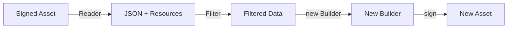
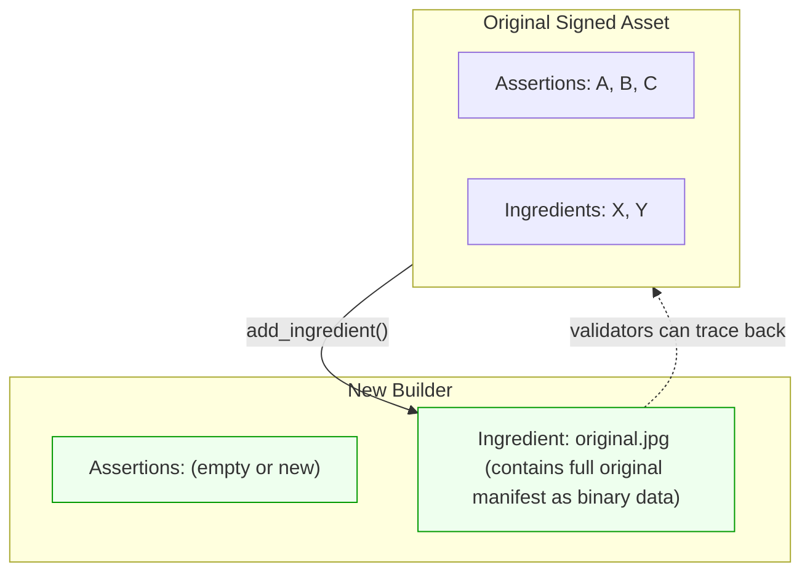
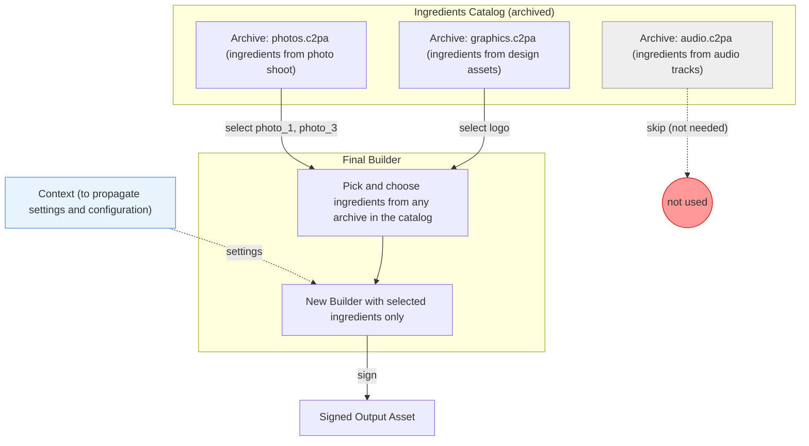
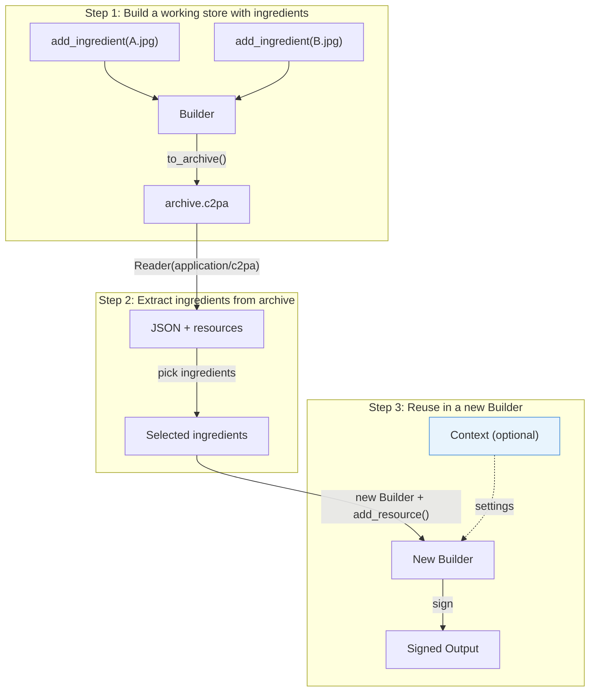

# Selective manifest construction

You can use `Builder` and `Reader` together to selectively construct manifests&mdash;keeping only the parts you need and omitting the rest. This is useful when you don't want to include all ingredients in a working store (for example, when some ingredient assets are not visible).

This process is best described as *filtering* or *rebuilding* a working store:

1. Read an existing manifest.
2. Choose which elements to retain.
3. Build a new manifest containing only those elements.

A manifest is a signed data structure attached to an asset that records provenance and which source assets (ingredients) contributed to it. It contains assertions (statements about the asset), ingredients (references to other assets), and references to binary resources (such as thumbnails).

Since both `Reader` and `Builder` are **read-only** by design (neither has a `remove()` method), to exclude content you must **read what exists, filter to keep what you need, and create a new** `Builder` **with only that information**. This produces a new `Builder` instance—a "rebuild."

> [!IMPORTANT]
> This process always creates a new `Builder`. The original signed asset and its manifest are never modified, neither is the starting working store. The `Reader` extracts data without side effects, and the `Builder` constructs a new manifest based on extracted data.

## Core concepts



The fundamental workflow is:

1. **Read** the existing manifest with `Reader` to get JSON and binary resources
2. **Identify and filter** the parts to keep (parse the JSON, select and gather elements)
3. **Create a new `Builder`** with only the selected parts based on the applied filtering rules
4. **Sign** the new `Builder` into the output asset

## Reading an existing manifest

Use `Reader` with a `Context` to extract the manifest store JSON and any binary resources (thumbnails, manifest data). The source asset is never modified. The context is used for trust configuration (which certificates are trusted when validating signatures) and verification settings. See [Configuring `Reader`](context-settings.md#with-reader) and [Trust configuration](context-settings.md#trust) for details.

```py
ctx = Context.from_dict({
    "trust": {
        "user_anchors": "-----BEGIN CERTIFICATE-----\nMIICEzCCA...\n-----END CERTIFICATE-----",
    },
    "verify": {
        "verify_trust": True
    }
})

with open("signed_asset.jpg", "rb") as source:
    with Reader("image/jpeg", source, context=ctx) as reader:
        manifest_store = json.loads(reader.json())
        active_label = manifest_store["active_manifest"]
        manifest = manifest_store["manifests"][active_label]
```

### Extracting binary resources

The JSON returned by `reader.json()` contains only string identifiers (JUMBF URIs) for binary data like thumbnails and ingredient manifest stores. Extract the actual binary content by using `resource_to_stream()`:

```py
# Extract a thumbnail to an in-memory stream
thumb_stream = io.BytesIO()
reader.resource_to_stream(thumbnail_id, thumb_stream)

# Or extract to a file
with open("thumbnail.jpg", "wb") as f:
    reader.resource_to_stream(thumbnail_id, f)
```

## Filtering into a new Builder

> [!NOTE]
> All examples on this page use `Context` with `Reader` and `Builder`. For `Reader`, the context provides trust configuration and verification settings: `Reader(format, source, context=ctx)`. For `Builder`, the context provides custom settings (thumbnails, claim generator, intent): `Builder(manifest_json, context=ctx)`. When a signer is configured in the context, `builder.sign()` is called without a signer instance. See [Context and settings](context-settings.md) for details.

Each example below creates a **new `Builder`** from filtered data. The original asset and its manifest store are never modified.

When transferring ingredients from a `Reader` to a new `Builder`, you must transfer both the JSON metadata and the associated binary resources (thumbnails, manifest data). The JSON contains identifiers that reference those resources; the same identifiers must be used when calling `builder.add_resource()`.

### Transferring binary resources

Since ingredients reference binary data (thumbnails, manifest stores), you need to copy those resources from the `Reader` to the new `Builder`. This helper function encapsulates the pattern:

```py
def transfer_ingredient_resources(reader, builder, ingredients):
    """Copy binary resources for a list of ingredients from reader to builder."""
    for ingredient in ingredients:
        for key in ("thumbnail", "manifest_data"):
            if key in ingredient:
                uri = ingredient[key]["identifier"]
                buf = io.BytesIO()
                reader.resource_to_stream(uri, buf)
                buf.seek(0)
                builder.add_resource(uri, buf)
```

This function is used throughout the examples below.

### Keep only specific ingredients

```py
ctx = Context.from_dict({
    "builder": {"claim_generator_info": {"name": "an-application", "version": "0.1.0"}},
    "signer": signer,
})

with open("signed_asset.jpg", "rb") as source:
    with Reader("image/jpeg", source, context=ctx) as reader:
        manifest_store = json.loads(reader.json())
        active = manifest_store["manifests"][manifest_store["active_manifest"]]

        # Filter: keep only ingredients with a specific relationship
        kept = [
            ing for ing in active["ingredients"]
            if ing["relationship"] == "parentOf"
        ]

        # Create a new Builder with only the kept ingredients
        with Builder({
            "claim_generator_info": [{"name": "an-application", "version": "0.1.0"}],
            "ingredients": kept,
        }, context=ctx) as new_builder:
            transfer_ingredient_resources(reader, new_builder, kept)

            source.seek(0)
            with open("output.jpg", "wb") as dest:
                # In this example, the Signer is on the context.
                # A Signer can also be passed as first argument to
                # configure a dedicated Signer explicitly.
                new_builder.sign("image/jpeg", source, dest)
```

### Keep only specific assertions

```py
ctx = Context.from_dict({
    "builder": {"claim_generator_info": {"name": "an-application", "version": "0.1.0"}},
    "signer": signer,
})

with open("signed_asset.jpg", "rb") as source:
    with Reader("image/jpeg", source, context=ctx) as reader:
        manifest_store = json.loads(reader.json())
        active = manifest_store["manifests"][manifest_store["active_manifest"]]

        # Keep training-mining assertions, filter out everything else
        kept = [
            a for a in active["assertions"]
            if a["label"] == "cawg.training-mining"
        ]

        with Builder({
            "claim_generator_info": [{"name": "an-application", "version": "0.1.0"}],
            "assertions": kept,
        }, context=ctx) as new_builder:
            source.seek(0)
            with open("output.jpg", "wb") as dest:
                # In this example, the Signer is on the context.
                # A Signer can also be passed as first argument to
                # configure a dedicated Signer explicitly.
                new_builder.sign("image/jpeg", source, dest)
```

### Start fresh and preserve provenance

Sometimes all existing assertions and ingredients may need to be discarded but the provenance chain should be maintained nevertheless. This is done by creating a new `Builder` with a new manifest definition and adding the original signed asset as an ingredient using `add_ingredient()`.

The function `add_ingredient()` does not copy the original's assertions into the new manifest. Instead, it stores the original's entire manifest store as opaque binary data inside the ingredient record. This means:

- The new manifest has its own, independent set of assertions.
- The original's full manifest is preserved inside the ingredient, so validators can inspect the full provenance history.
- The provenance chain is unbroken: anyone reading the new asset can follow the ingredient link back to the original.




```py
ctx = Context.from_dict({
    "builder": {"claim_generator_info": {"name": "an-application", "version": "0.1.0"}},
    "signer": signer,
})

with Builder({
    "claim_generator_info": [{"name": "an-application", "version": "0.1.0"}],
    "assertions": [],
}, context=ctx) as new_builder:
    # Add the original as an ingredient to preserve provenance chain.
    # add_ingredient() stores the original's manifest as binary data inside
    # the ingredient, but does NOT copy the original's assertions.
    with open("original_signed.jpg", "rb") as original:
        new_builder.add_ingredient(
            {"title": "original.jpg", "relationship": "parentOf"},
            "image/jpeg",
            original,
        )

    with open("source.jpg", "rb") as source, open("output.jpg", "wb") as dest:
        # In this example, the Signer is on the context.
        # A Signer can also be passed as first argument to
        # configure a Signer explicitly.
        new_builder.sign("image/jpeg", source, dest)
```

## Adding actions to a working store

Actions record what was done to an asset (e.g., color adjustments, cropping, placing content). Use `builder.add_action()` to add them to a working store.

```py
builder.add_action({
    "action": "c2pa.color_adjustments",
    "parameters": {"name": "brightnesscontrast"},
})

builder.add_action({
    "action": "c2pa.filtered",
    "parameters": {"name": "A filter"},
    "description": "Filtering applied",
})
```

### Action JSON fields


| Field | Required | Description |
| --- | --- | --- |
| `action` | Yes | Action identifier, e.g. `"c2pa.created"`, `"c2pa.opened"`, `"c2pa.placed"`, `"c2pa.color_adjustments"`, `"c2pa.filtered"` |
| `parameters` | No | Free-form object with action-specific data (including `ingredientIds` for linking ingredients, for instance) |
| `description` | No | Human-readable description of what happened |
| `digitalSourceType` | Sometimes, depending on action | URI describing the digital source type (typically for `c2pa.created`) |


### Linking actions to ingredients

When an action involves a specific ingredient, the ingredient is linked to the action using `ingredientIds` (in the action's `parameters`), referencing a matching key in the ingredient.

#### How `ingredientIds` resolution works

The SDK matches each value in `ingredientIds` against ingredients using this priority:

1. `label` on the ingredient (primary): if set and non-empty, this is used as the linking key.
2. `instance_id` on the ingredient (fallback): used when `label` is absent or empty.

#### Linking with `label`

The `label` field on an ingredient is the **primary** linking key. Set a `label` on the ingredient and reference it in the action's `ingredientIds`. The label can be any string: it acts as a linking key between the ingredient and the action.

```py
ctx = Context.from_dict({
    "builder": {"claim_generator_info": {"name": "an-application", "version": "0.1.0"}},
    "signer": signer,
})

manifest_json = {
    "claim_generator_info": [{"name": "an-application", "version": "0.1.0"}],
    "assertions": [
        {
            "label": "c2pa.actions.v2",
            "data": {
                "actions": [
                    {
                        "action": "c2pa.created",
                        "digitalSourceType": "http://cv.iptc.org/newscodes/digitalsourcetype/digitalCreation",
                    },
                    {
                        "action": "c2pa.placed",
                        "parameters": {
                            "ingredientIds": ["c2pa.ingredient.v3"]
                        },
                    },
                ]
            },
        }
    ],
}

with Builder(manifest_json, context=ctx) as builder:
    # The label on the ingredient matches the value in ingredientIds
    with open("photo.jpg", "rb") as photo:
        builder.add_ingredient(
            {
                "title": "photo.jpg",
                "format": "image/jpeg",
                "relationship": "componentOf",
                "label": "c2pa.ingredient.v3",
            },
            "image/jpeg",
            photo,
        )

    with open("source.jpg", "rb") as source, open("output.jpg", "wb") as dest:
        # In this example, the Signer is on the context.
        # A Signer can also be passed as first argument to
        # configure a dedicated Signer explicitly.
        builder.sign("image/jpeg", source, dest)
```

##### Linking multiple ingredients

When linking multiple ingredients, each ingredient needs a unique label.

> [!NOTE]
> The labels used for linking in the working store may not be the exact labels that appear in the signed manifest. They are indicators for the SDK to know which ingredient to link with which action. The SDK assigns final labels during signing.

```py
ctx = Context.from_dict({
    "builder": {"claim_generator_info": {"name": "an-application", "version": "0.1.0"}},
    "signer": signer,
})

manifest_json = {
    "claim_generator_info": [{"name": "an-application", "version": "0.1.0"}],
    "assertions": [
        {
            "label": "c2pa.actions.v2",
            "data": {
                "actions": [
                    {
                        "action": "c2pa.opened",
                        "digitalSourceType": "http://cv.iptc.org/newscodes/digitalsourcetype/digitalCreation",
                        "parameters": {
                            "ingredientIds": ["c2pa.ingredient.v3_1"]
                        },
                    },
                    {
                        "action": "c2pa.placed",
                        "parameters": {
                            "ingredientIds": ["c2pa.ingredient.v3_2"]
                        },
                    },
                ]
            },
        }
    ],
}

with Builder(manifest_json, context=ctx) as builder:
    # parentOf ingredient linked to c2pa.opened
    with open("original.jpg", "rb") as original:
        builder.add_ingredient(
            {
                "title": "original.jpg",
                "format": "image/jpeg",
                "relationship": "parentOf",
                "label": "c2pa.ingredient.v3_1",
            },
            "image/jpeg",
            original,
        )

    # componentOf ingredient linked to c2pa.placed
    with open("overlay.jpg", "rb") as overlay:
        builder.add_ingredient(
            {
                "title": "overlay.jpg",
                "format": "image/jpeg",
                "relationship": "componentOf",
                "label": "c2pa.ingredient.v3_2",
            },
            "image/jpeg",
            overlay,
        )

    with open("source.jpg", "rb") as source, open("output.jpg", "wb") as dest:
        # In this example, the Signer is on the context.
        # A Signer can also be passed as first argument to
        # configure a dedicated Signer explicitly.
        builder.sign("image/jpeg", source, dest)
```

#### Linking with `instance_id`

When no `label` is set on an ingredient, the SDK matches `ingredientIds` against `instance_id`.

```py
ctx = Context.from_dict({
    "builder": {"claim_generator_info": {"name": "an-application", "version": "0.1.0"}},
    "signer": signer,
})

# instance_id is used as the linking identifier and must be unique
instance_id = "xmp:iid:939a4c48-0dff-44ec-8f95-61f52b11618f"

manifest_json = {
    "claim_generator_info": [{"name": "an-application", "version": "0.1.0"}],
    "assertions": [
        {
            "label": "c2pa.actions",
            "data": {
                "actions": [
                    {
                        "action": "c2pa.opened",
                        "parameters": {
                            "ingredientIds": [instance_id]
                        },
                    }
                ]
            },
        }
    ],
}

with Builder(manifest_json, context=ctx) as builder:
    # No label set: instance_id is used as the linking key
    with open("source_photo.jpg", "rb") as photo:
        builder.add_ingredient(
            {
                "title": "source_photo.jpg",
                "relationship": "parentOf",
                "instance_id": instance_id,
            },
            "image/jpeg",
            photo,
        )

    with open("source.jpg", "rb") as source, open("output.jpg", "wb") as dest:
        # In this example, the Signer is on the context.
        # A Signer can also be passed as first argument to
        # configure a dedicated Signer explicitly.
        builder.sign("image/jpeg", source, dest)
```

> [!NOTE]
> The `instance_id` can be read back from the ingredient JSON after signing.

#### Reading linked ingredients

After signing, `ingredientIds` is gone. The action's `parameters.ingredients[]` contains hashed JUMBF URIs pointing to ingredient assertions. To match an action to its ingredient, extract the label from the URL:

```py
ctx = Context.from_dict({"verify": {"verify_trust": True}})

with open("signed_asset.jpg", "rb") as signed:
    with Reader("image/jpeg", signed, context=ctx) as reader:
        manifest_store = json.loads(reader.json())
        active_label = manifest_store["active_manifest"]
        manifest = manifest_store["manifests"][active_label]

        # Build a map: label -> ingredient
        label_to_ingredient = {
            ing["label"]: ing for ing in manifest["ingredients"]
        }

        # Match each action to its ingredients by extracting labels from URLs
        for assertion in manifest["assertions"]:
            if assertion["label"] != "c2pa.actions.v2":
                continue
            for action in assertion["data"]["actions"]:
                for ref in action.get("parameters", {}).get("ingredients", []):
                    label = ref["url"].rsplit("/", 1)[-1]
                    matched = label_to_ingredient.get(label)
                    # matched is the ingredient linked to this action
```

#### When to use `label` vs `instance_id`

| Property | `label` | `instance_id` |
| --- | --- | --- |
| **Who controls it** | Caller (any string) | Caller (any string, or from XMP metadata) |
| **Priority for linking** | Primary: checked first | Fallback: used when label is absent/empty |
| **When to use** | JSON-defined manifests where the caller controls the ingredient definition | Programmatic workflows using XMP-based IDs |
| **Survives signing** | SDK may reassign the actual assertion label | Unchanged |
| **Stable across rebuilds** | The caller controls the build-time value; the post-signing label may change | Yes, always the same set value |


**Use `label`** when defining manifests in JSON.
**Use `instance_id`** when working programmatically with ingredients whose identity comes from other sources, or when a stable identifier that persists unchanged across rebuilds is needed.

## Working with archives

A `Builder` represents a **working store**: a manifest that is being assembled but has not yet been signed. Archives serialize this working store (definition + resources) to a `.c2pa` binary format, allowing to save, transfer, or resume the work later. For more background on working stores and archives, see [Working stores and archives](working-stores.md).

There are two distinct types of archives, sharing the same binary format but being conceptually different: builder archives (working store archives) and ingredient archives.

### Builder archives vs. ingredient archives

A **builder archive** (also called a working store archive) is a serialized snapshot of a `Builder`. It contains the manifest definition, all resources, and any ingredients that were added. It is created by `builder.to_archive()` and restored with `Builder.from_archive()` to create a new builder instance from an archive, or `builder.with_archive()` to load a working store from a builder archive into an existing builder instance.

An **ingredient archive** contains the manifest store from an asset that was added as an ingredient.

The key difference: a builder archive is a work-in-progress (unsigned). An ingredient archive carries the provenance history of a source asset for reuse as an ingredient in other working stores.

### The ingredients catalog pattern

An **ingredients catalog** is a collection of archived ingredients that can be selected when constructing a final manifest. Each archive holds ingredients; at build time the caller selects only the ones needed.




```py
ctx = Context.from_dict({
    "builder": {
        "thumbnail": {"enabled": False},
        "claim_generator_info": {"name": "an-application", "version": "0.1.0"}
    },
    "signer": signer,
})

archive_stream.seek(0)
with Reader("application/c2pa", archive_stream, context=ctx) as reader:
    manifest_store = json.loads(reader.json())
    active = manifest_store["manifests"][manifest_store["active_manifest"]]

    selected = [
        ing for ing in active["ingredients"]
        if ing["title"] in {"photo_1.jpg", "logo.png"}
    ]

    with Builder({
        "claim_generator_info": [{"name": "an-application", "version": "0.1.0"}],
        "ingredients": selected,
    }, context=ctx) as new_builder:
        transfer_ingredient_resources(reader, new_builder, selected)

        with open("source.jpg", "rb") as source, open("output.jpg", "wb") as dest:
            # In this example, the Signer is on the context.
            # A Signer can also be passed as first argument to
            # configure a dedicated Signer explicitly.
            new_builder.sign("image/jpeg", source, dest)
```

### Identifying ingredients in archives

When building an ingredient archive, you can set `instance_id` on the ingredient to give it a stable, caller-controlled identifier. This field survives archiving and signing unchanged, so it can be used to look up a specific ingredient from a catalog archive. The `description` and `informational_URI` fields also survive and can carry additional metadata about the ingredient's origin.

`instance_id` is only for identification and catalog lookups. It cannot be used as a linking key in `ingredientIds` when linking ingredient archives to actions — use `label` for that (see [Linking an archived ingredient to an action](#linking-an-archived-ingredient-to-an-action)).

```py
# Set instance_id when adding the ingredient to the archive builder.
builder = Builder.from_json(manifest_json)
with open("photo-A.jpg", "rb") as f:
    builder.add_ingredient(
        {
            "title": "photo-A.jpg",
            "relationship": "componentOf",
            "instance_id": "catalog:photo-A",
        },
        "image/jpeg",
        f,
    )

archive = io.BytesIO()
builder.to_archive(archive)
```

Later, when reading the archive, select ingredients by their `instance_id`:

```py
archive.seek(0)
reader = Reader("application/c2pa", archive)
manifest_data = json.loads(reader.json())
active = manifest_data["active_manifest"]
ingredients = manifest_data["manifests"][active]["ingredients"]

for ing in ingredients:
    if ing.get("instance_id") == "catalog:photo-A":
        # Do something with the found ingredient...
        pass
```

### Overriding ingredient properties

When adding an ingredient from an archive or from a file, the JSON passed to `add_ingredient()` can override properties like `title` and `relationship`. This is useful when reusing archived ingredients in a different context:

```py
with open("signed_asset.jpg", "rb") as signed:
    builder.add_ingredient(
        {
            "title": "my-custom-title.jpg",
            "relationship": "parentOf",
            "instance_id": "my-tracking-id:asset-example-id",
        },
        "image/jpeg",
        signed,
    )
```

The `title`, `relationship`, and `instance_id` fields in the provided JSON take priority. The library fills in the rest (thumbnail, manifest_data, format) from the source. This works with signed assets, `.c2pa` archives, or unsigned files.

### Using custom vendor parameters in actions

The C2PA specification allows **vendor-namespaced parameters** on actions using reverse domain notation. These parameters survive signing and can be read back, useful for tagging actions with IDs that support filtering.

```py
manifest_json = {
    "claim_generator_info": [{"name": "an-application", "version": "0.1.0"}],
    "assertions": [
        {
            "label": "c2pa.actions.v2",
            "data": {
                "actions": [
                    {
                        "action": "c2pa.created",
                        "digitalSourceType": "http://cv.iptc.org/newscodes/digitalsourcetype/compositeCapture",
                        "parameters": {
                            "com.mycompany.tool": "my-editor",
                            "com.mycompany.session_id": "session-abc-123",
                        },
                    },
                    {
                        "action": "c2pa.placed",
                        "description": "Placed an image",
                        "parameters": {
                            "com.mycompany.layer_id": "layer-42",
                            "ingredientIds": ["c2pa.ingredient.v3"],
                        },
                    },
                ]
            },
        }
    ],
}
```

After signing, these custom parameters appear alongside the standard fields:

```json
{
    "action": "c2pa.placed",
    "parameters": {
        "com.mycompany.layer_id": "layer-42",
        "ingredients": [{"url": "self#jumbf=c2pa.assertions/c2pa.ingredient.v3"}]
    }
}
```

Custom vendor parameters can be used to filter actions. For example, to find all actions related to a specific layer:

```py
layer_actions = [
    action for action in actions
    if action.get("parameters", {}).get("com.mycompany.layer_id") == "layer-42"
]
```

> [!NOTE]
> Vendor parameters must use reverse domain notation with period-separated components (for example, `com.mycompany.tool`, `net.example.session_id`). Some namespaces (for example, `c2pa` or `cawg`) may be reserved.

### Extracting ingredients from a working store

An example workflow is to build up a working store with multiple ingredients, archive it, and then later extract specific ingredients from that archive to use in a new working store.




**Step 1:** Build a working store and archive it:

```py
ctx = Context.from_dict({
    "builder": {"claim_generator_info": {"name": "an-application", "version": "0.1.0"}},
})

with Builder({
    "claim_generator_info": [{"name": "an-application", "version": "0.1.0"}],
}, context=ctx) as builder:
    # Add ingredients to the working store
    with open("A.jpg", "rb") as ing_a:
        builder.add_ingredient(
            {"title": "A.jpg", "relationship": "componentOf"},
            "image/jpeg",
            ing_a,
        )

    with open("B.jpg", "rb") as ing_b:
        builder.add_ingredient(
            {"title": "B.jpg", "relationship": "componentOf"},
            "image/jpeg",
            ing_b,
        )

    # Save the working store as an archive
    archive_stream = io.BytesIO()
    builder.to_archive(archive_stream)
```

> [!NOTE]
> When restoring from an archive, `with_archive()` preserves context settings while `from_archive()` does not. See [Working with archives](working-stores.md#working-with-archives) for the full comparison.

**Step 2:** Read the archive and extract ingredients:

```py
archive_stream.seek(0)
with Reader("application/c2pa", archive_stream, context=ctx) as reader:
    manifest_store = json.loads(reader.json())
    active = manifest_store["manifests"][manifest_store["active_manifest"]]
    ingredients = active["ingredients"]
```

**Step 3:** Create a new Builder with the extracted ingredients:

```py
    sign_ctx = Context.from_dict({
        "builder": {
            "thumbnail": {"enabled": False},
            "claim_generator_info": {"name": "an-application", "version": "0.1.0"}
        },
        "signer": signer,
    })

    selected = [ing for ing in ingredients if ing["title"] == "A.jpg"]

    with Builder({
        "claim_generator_info": [{"name": "an-application", "version": "0.1.0"}],
        "ingredients": selected,
    }, context=sign_ctx) as new_builder:
        transfer_ingredient_resources(reader, new_builder, selected)

        with open("source.jpg", "rb") as source, open("output.jpg", "wb") as dest:
            # In this example, the Signer is on the context.
            # A Signer can also be passed as first argument to
            # configure a dedicated Signer explicitly.
            new_builder.sign("image/jpeg", source, dest)
```

### Reading ingredient details from an ingredient archive

An ingredient archive is a serialized `Builder` containing exactly one ingredient (see [Builder archives vs. ingredient archives](#builder-archives-vs-ingredient-archives)). Reading it with `Reader` allows the caller to inspect the ingredient before deciding whether to use it: its thumbnail, whether it carries provenance (e.g. an active manifest), validation status, relationship, etc.

```py
# Open the ingredient archive.
with open("ingredient_archive.c2pa", "rb") as archive_file:
    reader = Reader("application/c2pa", archive_file, context=ctx)
    parsed = json.loads(reader.json())
    active = parsed["active_manifest"]
    manifest = parsed["manifests"][active]

    # An ingredient archive has exactly one ingredient.
    ingredient = manifest["ingredients"][0]

    # Relationship e.g. "parentOf", "componentOf", "inputTo".
    relationship = ingredient["relationship"]

    # Instance ID (optional, can be set by caller).
    instance_id = ingredient.get("instance_id")

    # Active manifest:
    # When present, the ingredient had content credentials itself.
    if "active_manifest" in ingredient:
        ing_manifest_label = ingredient["active_manifest"]
        ing_manifest = parsed["manifests"][ing_manifest_label]
        # ing_manifest contains the ingredient's own assertions, actions, etc.

    # Validation status.
    # The top-level "validation_status" array covers the entire manifest store,
    # including this ingredient's manifest.
    if "validation_status" in parsed:
        for status in parsed["validation_status"]:
            print(f"{status['code']}: {status['explanation']}")

    # Thumbnail
    if "thumbnail" in ingredient:
        thumb_id = ingredient["thumbnail"]["identifier"]
        with open("thumbnail.jpg", "wb") as thumb_file:
            reader.resource_to_stream(thumb_id, thumb_file)

    reader.close()
```

#### Linking an archived ingredient to an action

After reading the ingredient details from an ingredient archive, the ingredient can be added to a new `Builder` and linked to an action. You must assign a `label` in the `add_ingredient()` call on the signing builder and use that label as the linking key in `ingredientIds`. Labels baked into the archive ingredient are not carried through, and `instance_id` does not work as a linking key for ingredient archives.

Labels are only used as build-time linking keys. The SDK may reassign the actual label in the signed manifest.

Assign a `label` in the `add_ingredient()` call and reference that same label in `ingredientIds` to link an ingredient to an action.

```py
ctx = Context.from_dict({
    "builder": {"claim_generator_info": {"name": "an-application", "version": "0.1.0"}},
    "signer": signer,
})

# Read the ingredient archive.
with open("ingredient_archive.c2pa", "rb") as archive_file:
    reader = Reader("application/c2pa", archive_file, context=ctx)
    parsed = json.loads(reader.json())
    active = parsed["active_manifest"]
    ingredient = parsed["manifests"][active]["ingredients"][0]

    # Use a label as the linking key.
    # Any label can be used, as long as it uniquely identifies the link.
    manifest_json = {
        "claim_generator_info": [{"name": "an-application", "version": "0.1.0"}],
        "assertions": [
            {
                "label": "c2pa.actions.v2",
                "data": {
                    "actions": [
                        {
                            "action": "c2pa.opened",
                            "parameters": {
                                "ingredientIds": ["archived-ingredient"]
                            },
                        }
                    ]
                },
            }
        ],
    }

    with Builder(manifest_json, context=ctx) as builder:
        # The label on the ingredient must match the entry in ingredientIds on the action.
        archive_file.seek(0)
        builder.add_ingredient(
            {
                "title": ingredient["title"],
                "relationship": "parentOf",
                "label": "archived-ingredient",
            },
            "application/c2pa",
            archive_file,
        )

        with open("source.jpg", "rb") as source, open("output.jpg", "w+b") as dest:
            builder.sign("image/jpeg", source, dest)

    reader.close()
```

### Merging multiple working stores

> [!NOTE]
> The `Builder` construction and signing in the merge workflow also support `Context`. The caller can pass `context=ctx` to `Builder()` and call `sign()` without a signer argument when the context has one. See [Context and settings](context-settings.md) for details.

In some cases it is necessary to merge ingredients from multiple working stores (builder archives) into a single `Builder`. This should be a **fallback strategy**. The recommended practice is to maintain a single active working store and add ingredients incrementally (archived ingredient catalogs help with this). Merging is available when multiple working stores must be consolidated.

When merging from multiple sources, resource identifier URIs can collide. Rename identifiers with a unique suffix when needed. Use two passes: (1) collect ingredients with collision handling, build the manifest, create the builder; (2) re-read each archive and transfer resources (use original ID for `resource_to_stream()`, renamed ID for `add_resource()` when collisions occurred).

```py
ctx = Context.from_dict({
    "builder": {"claim_generator_info": {"name": "an-application", "version": "0.1.0"}},
    "signer": signer,
})

used_ids: set[str] = set()
suffix_counter = 0
all_ingredients = []
archive_ingredient_counts = []

# Pass 1: Collect ingredients, renaming IDs on collision
for archive_stream in archives:
    archive_stream.seek(0)
    with Reader("application/c2pa", archive_stream, context=ctx) as reader:
        manifest_store = json.loads(reader.json())
        active = manifest_store["manifests"][manifest_store["active_manifest"]]
        ingredients = active["ingredients"]

        for ingredient in ingredients:
            for key in ("thumbnail", "manifest_data"):
                if key not in ingredient:
                    continue
                uri = ingredient[key]["identifier"]
                if uri in used_ids:
                    suffix_counter += 1
                    ingredient[key]["identifier"] = f"{uri}__{suffix_counter}"
                used_ids.add(ingredient[key]["identifier"])
            all_ingredients.append(ingredient)

        archive_ingredient_counts.append(len(ingredients))

with Builder({
    "claim_generator_info": [{"name": "an-application", "version": "0.1.0"}],
    "ingredients": all_ingredients,
}, context=ctx) as builder:
    # Pass 2: Transfer resources (match by ingredient index)
    offset = 0
    for archive_stream, count in zip(archives, archive_ingredient_counts):
        archive_stream.seek(0)
        with Reader("application/c2pa", archive_stream, context=ctx) as reader:
            manifest_store = json.loads(reader.json())
            active = manifest_store["manifests"][manifest_store["active_manifest"]]
            originals = active["ingredients"]

            for original, merged in zip(originals, all_ingredients[offset:offset + count]):
                for key in ("thumbnail", "manifest_data"):
                    if key not in original:
                        continue
                    buf = io.BytesIO()
                    reader.resource_to_stream(original[key]["identifier"], buf)
                    buf.seek(0)
                    builder.add_resource(merged[key]["identifier"], buf)

            offset += count

    with open("source.jpg", "rb") as source, open("output.jpg", "wb") as dest:
        # In this example, the Signer is on the context.
        # A Signer can also be passed as first argument to
        # configure a dedicated Signer explicitly.
        builder.sign("image/jpeg", source, dest)
```

## Controlling manifest embedding

By default, `sign()` embeds the manifest directly inside the output asset file.

### Not embedding a manifest store into an asset

Use `set_no_embed()` so the signed asset contains no embedded manifest store. The manifest store bytes are returned from `sign()` and can be stored separately (e.g. as a sidecar file).

```py
ctx = Context.from_dict({
    "builder": {"claim_generator_info": {"name": "an-application", "version": "0.1.0"}},
    "signer": signer,
})
builder = Builder(manifest_json, context=ctx)
builder.set_no_embed()
builder.set_remote_url("<<URI/URL to remote storage of manifest bytes>>")

with open("source.jpg", "rb") as source, open("output.jpg", "w+b") as dest:
    manifest_bytes = builder.sign("image/jpeg", source, dest)
    # manifest_bytes contains the full manifest store.
    # Upload manifest_bytes to the remote URL.
    # The output asset has no embedded manifest.
```

### Checking manifest location on a Reader

After opening an asset with `Reader`, use `is_embedded()` to check whether the manifest is embedded in the asset or stored remotely. If the manifest is remote, `get_remote_url()` returns the URL it was fetched from (or the URL set via `set_remote_url()` at signing time).

```py
reader = Reader("output.jpg", context=ctx)

if reader.is_embedded():
    print("Manifest is embedded in the asset.")
else:
    print("Manifest is not embedded.")
    url = reader.get_remote_url()
    if url is not None:
        print(f"Remote manifest URL: {url}")
```
