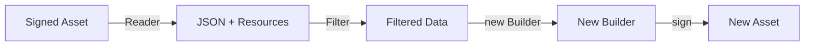
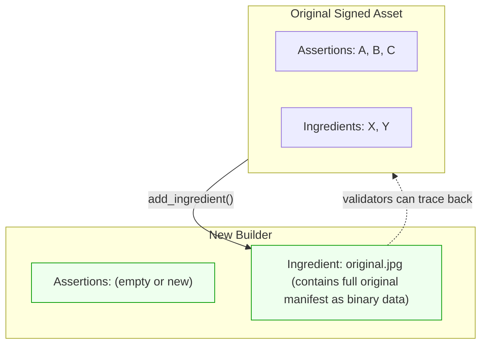
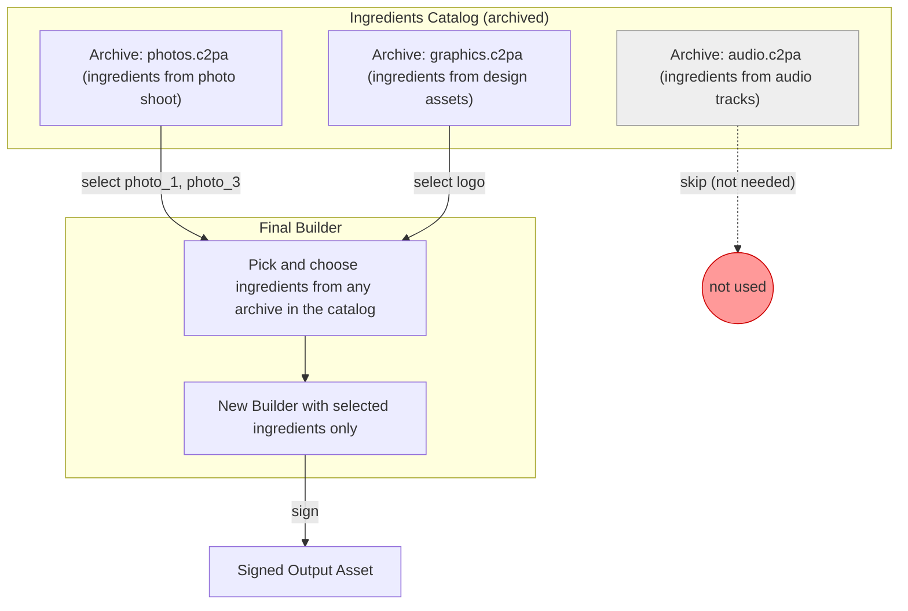
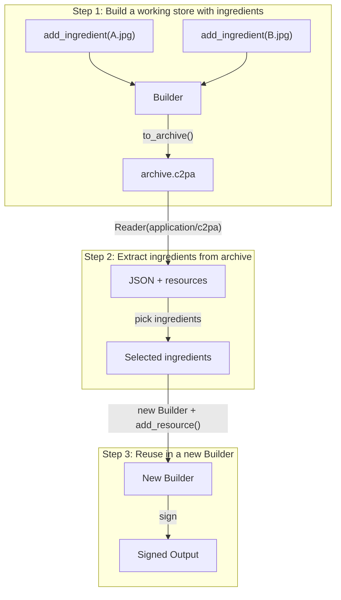
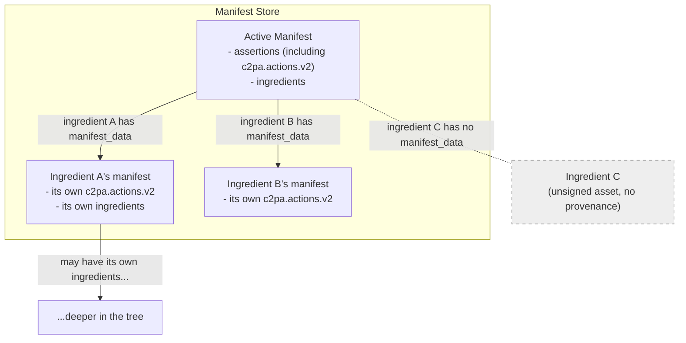
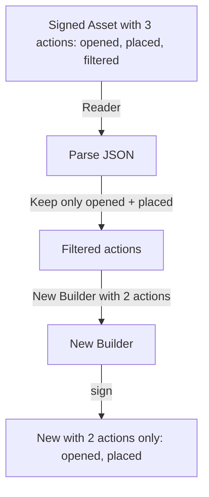
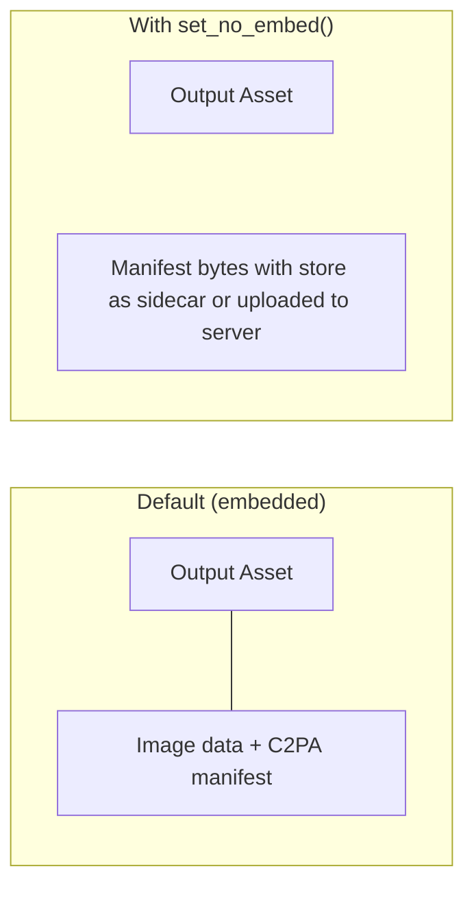
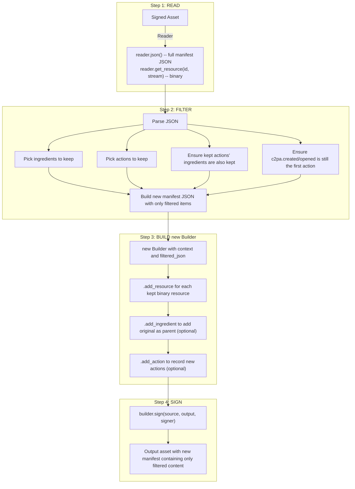

# Selective manifest construction

You can use `Builder` and `Reader` together to selectively construct manifests&mdash;keeping only the parts you need and omitting the rest. This is useful when you don't want to include all ingredients in a working store (for example, when some ingredient assets are not visible).

This process is best described as *filtering* or *rebuilding* a working store:

1. Read an existing manifest.
2. Choose which elements to retain.
3. Build a new manifest containing only those elements.

A manifest is a signed data structure attached to an asset that records provenance and which source assets (ingredients) contributed to it. It contains assertions (statements about the asset), ingredients (references to other assets), and references to binary resources (such as thumbnails).

Since both `Reader` and `Builder` are **read-only** by design (neither has a `remove()` method), to exclude content you must **read what exists, filter to keep what you need, and create a new** `Builder` **with only that information**. This produces a new `Builder` instance—a "rebuild."

> [!IMPORTANT]
> This process always creates a new `Builder`. The original signed asset and its manifest are never modified, neither is the starting working store. The `Reader` extracts data without side effects, and the `Builder` constructs a new manifest based on extracted data.

## Core concepts




The fundamental workflow is:

1. **Read** the existing manifest with `Reader` to get JSON and binary resources
2. **Identify and filter** the parts to keep (parse the JSON, select and gather elements)
3. **Create a new `Builder`** with only the selected parts based on the applied filtering rules
4. **Sign** the new `Builder` into the output asset

## Reading an existing manifest

Use `Reader` to extract the manifest store JSON and any binary resources (thumbnails, manifest data). The source asset is never modified.

```cpp
c2pa::Context context;
c2pa::Reader reader(context, "image/jpeg", source_stream);

// Get the full manifest store as JSON
std::string store_json = reader.json();
auto parsed = json::parse(store_json);

// Identify the active manifest, which is the current/latest manifest
std::string active = parsed["active_manifest"];
auto manifest = parsed["manifests"][active];

// Access specific parts
auto ingredients  = manifest["ingredients"];
auto assertions   = manifest["assertions"];
auto thumbnail_id = manifest["thumbnail"]["identifier"];
```

### Extracting binary resources

The JSON returned by `reader.json()` only contains string identifiers (JUMBF URIs) for binary data like thumbnails and ingredient manifest stores. Extract the actual binary content by using `get_resource()`:

```cpp
// Extract a thumbnail to a stream
std::stringstream thumb_stream(std::ios::in | std::ios::out | std::ios::binary);
reader.get_resource(thumbnail_id, thumb_stream);

// Or extract to a file
reader.get_resource(thumbnail_id, fs::path("thumbnail.jpg"));
```

## Filtering into a new Builder

Each example below creates a **new `Builder`** from filtered data. The original asset and its manifest store are never modified.

When transferring ingredients from a `Reader` to a new `Builder`, you must transfer both the JSON metadata and the associated binary resources (thumbnails, manifest data). The JSON contains identifiers that reference those resources; the same identifiers must be used when calling `builder.add_resource()`.

> **Transferring binary resources:** For each kept ingredient, call `reader.get_resource(id, stream)` for any `thumbnail` or `manifest_data` it contains, then `builder.add_resource(id, stream)` with the same identifier.

### Keep only specific ingredients

```cpp
c2pa::Context context;
c2pa::Reader reader(context, "image/jpeg", source_stream);
auto parsed = json::parse(reader.json());
std::string active = parsed["active_manifest"];
auto ingredients = parsed["manifests"][active]["ingredients"];

// Filter: keep only ingredients with a specific relationship
json kept_ingredients = json::array();
for (auto& ingredient : ingredients) {
    if (ingredient["relationship"] == "parentOf") {
        kept_ingredients.push_back(ingredient);
    }
}

// Create a new Builder with only the kept ingredients
json new_manifest = json::parse(base_manifest_json);
new_manifest["ingredients"] = kept_ingredients;

c2pa::Builder builder(context, new_manifest.dump());

// Transfer binary resources for kept ingredients (see note above)
for (auto& ingredient : kept_ingredients) {
    if (ingredient.contains("thumbnail")) {
        std::string id = ingredient["thumbnail"]["identifier"];
        std::stringstream s(std::ios::in | std::ios::out | std::ios::binary);
        reader.get_resource(id, s);
        s.seekg(0);
        builder.add_resource(id, s);
    }
    if (ingredient.contains("manifest_data")) {
        std::string id = ingredient["manifest_data"]["identifier"];
        std::stringstream s(std::ios::in | std::ios::out | std::ios::binary);
        reader.get_resource(id, s);
        s.seekg(0);
        builder.add_resource(id, s);
    }
}

// Sign the new Builder into an output asset
builder.sign(source_path, output_path, signer);
```

### Keep only specific assertions

```cpp
auto assertions = parsed["manifests"][active]["assertions"];

json kept_assertions = json::array();
for (auto& assertion : assertions) {
    // Keep training-mining assertions, filter out everything else
    if (assertion["label"] == "c2pa.training-mining") {
        kept_assertions.push_back(assertion);
    }
}

json new_manifest = json::parse(R"({
    "claim_generator_info": [{"name": "an-application", "version": "0.1.0"}]
})");
new_manifest["assertions"] = kept_assertions;

// Create a new Builder with only the filtered assertions
c2pa::Builder builder(context, new_manifest.dump());
builder.sign(source_path, output_path, signer);
```

### Start fresh and preserve provenance

Sometimes all existing assertions and ingredients may need to be discarded but the provenance chain should be maintained nevertheless. This is done by creating a new `Builder` with a new manifest definition and adding the original signed asset as an ingredient using `add_ingredient()`.

The function `add_ingredient()` does not copy the original's assertions into the new manifest. Instead, it stores the original's entire manifest store as opaque binary data inside the ingredient record. This means:

- The new manifest has its own, independent set of assertions
- The original's full manifest is preserved inside the ingredient, so validators can inspect the full provenance history
- The provenance chain is unbroken: anyone reading the new asset can follow the ingredient link back to the original




```cpp
// Create a new Builder with a new definition
c2pa::Builder builder(context);
builder.with_definition(R"({
    "claim_generator_info": [{"name": "an-application", "version": "0.1.0"}],
    "assertions": []
})");

// Add the original as an ingredient to preserve provenance chain.
// add_ingredient() stores the original's manifest as binary data inside the ingredient,
// but does NOT copy the original's assertions into this new manifest.
builder.add_ingredient(R"({"title": "original.jpg", "relationship": "parentOf"})",
                       original_signed_path);
builder.sign(source_path, output_path, signer);
```

## Adding actions to a working store

Actions record what was done to an asset (e.g., color adjustments, cropping, placing content). Use `builder.add_action()` to add them to a working store.

```cpp
builder.add_action(R"({
    "action": "c2pa.color_adjustments",
    "parameters": { "name": "brightnesscontrast" }
})");

builder.add_action(R"({
    "action": "c2pa.filtered",
    "parameters": { "name": "A filter" },
    "description": "Filtering applied"
})");
```

### Action JSON fields


| Field | Required | Description |
| --- | --- | --- |
| `action` | Yes | Action identifier, e.g. `"c2pa.created"`, `"c2pa.opened"`, `"c2pa.placed"`, `"c2pa.color_adjustments"`, `"c2pa.filtered"` |
| `parameters` | No | Free-form object with action-specific data (including `ingredientIds` for linking ingredients, for instance) |
| `description` | No | Human-readable description of what happened |
| `digitalSourceType` | Sometimes, depending on action | URI describing the digital source type (typically for `c2pa.created`) |


### Linking actions to ingredients

When an action involves a specific ingredient, the ingredient is linked to the action using `ingredientIds` (in the action's `parameters`), referencing a matching key in the ingredient.

#### How `ingredientIds` resolution works

The SDK matches each value in `ingredientIds` against ingredients using this priority:

1. `label` on the ingredient (primary): if set and non-empty, this is used as the linking key.
2. `instance_id` on the ingredient (fallback): used when `label` is absent or empty.

#### Linking with `label`

The `label` field on an ingredient is the **primary** linking key. Set a `label` on the ingredient and reference it in the action's `ingredientIds`. The label can be any string: it acts as a linking key between the ingredient and the action.

```cpp
c2pa::Context context;

auto manifest_json = R"(
{
    "claim_generator_info": [{ "name": "an-application", "version": "1.0" }],
    "assertions": [
        {
            "label": "c2pa.actions.v2",
            "data": {
                "actions": [
                    {
                        "action": "c2pa.created",
                        "digitalSourceType": "http://cv.iptc.org/newscodes/digitalsourcetype/digitalCreation"
                    },
                    {
                        "action": "c2pa.placed",
                        "parameters": {
                            "ingredientIds": ["c2pa.ingredient.v3"]
                        }
                    }
                ]
            }
        }
    ]
}
)";

c2pa::Builder builder(context, manifest_json);

// The label on the ingredient matches the value in ingredientIds
auto ingredient_json = R"(
{
    "title": "photo.jpg",
    "format": "image/jpeg",
    "relationship": "componentOf",
    "label": "c2pa.ingredient.v3"
}
)";
builder.add_ingredient(ingredient_json, photo_path);

builder.sign(source_path, output_path, signer);
```

##### Linking multiple ingredients

When linking multiple ingredients, each ingredient needs a unique label.

> [!NOTE]
> The labels used for linking in the working store may not be the exact labels that appear in the signed manifest. They are indicators for the SDK to know which ingredient to link with which action. The SDK assigns final labels during signing.

```cpp
auto manifest_json = R"(
{
    "claim_generator_info": [{ "name": "an-application", "version": "1.0" }],
    "assertions": [
        {
            "label": "c2pa.actions.v2",
            "data": {
                "actions": [
                    {
                        "action": "c2pa.opened",
                        "digitalSourceType": "http://cv.iptc.org/newscodes/digitalsourcetype/digitalCreation",
                        "parameters": {
                            "ingredientIds": ["c2pa.ingredient.v3_1"]
                        }
                    },
                    {
                        "action": "c2pa.placed",
                        "parameters": {
                            "ingredientIds": ["c2pa.ingredient.v3_2"]
                        }
                    }
                ]
            }
        }
    ]
}
)";

c2pa::Builder builder(context, manifest_json);

// parentOf ingredient linked to c2pa.opened
builder.add_ingredient(R"({
    "title": "original.jpg",
    "format": "image/jpeg",
    "relationship": "parentOf",
    "label": "c2pa.ingredient.v3_1"
})", original_path);

// componentOf ingredient linked to c2pa.placed
builder.add_ingredient(R"({
    "title": "overlay.jpg",
    "format": "image/jpeg",
    "relationship": "componentOf",
    "label": "c2pa.ingredient.v3_2"
})", overlay_path);

builder.sign(source_path, output_path, signer);
```

#### Linking with `instance_id`

When no `label` is set on an ingredient, the SDK matches `ingredientIds` against `instance_id`.

```cpp
c2pa::Context context;

// instance_id is used as the linking identifier and must be unique
std::string instance_id = "xmp:iid:939a4c48-0dff-44ec-8f95-61f52b11618f";

json manifest_json = {
    {"claim_generator_info", json::array({{{"name", "an-application"}, {"version", "1.0"}}})},
    {"assertions", json::array({
        {
            {"label", "c2pa.actions"},
            {"data", {
                {"actions", json::array({
                    {
                        {"action", "c2pa.opened"},
                        {"parameters", {
                            {"ingredientIds", json::array({instance_id})}
                        }}
                    }
                })}
            }}
        }
    })}
};

c2pa::Builder builder(context, manifest_json.dump());

// No label set: instance_id is used as the linking key
json ingredient = {
    {"title", "source_photo.jpg"},
    {"relationship", "parentOf"},
    {"instance_id", instance_id}
};
builder.add_ingredient(ingredient.dump(), source_photo_path);

builder.sign(source_path, output_path, signer);
```

> [!NOTE]
> The `instance_id` can be read back from the ingredient JSON after signing.

#### Reading linked ingredients

After signing, `ingredientIds` is gone. The action's `parameters.ingredients[]` contains hashed JUMBF URIs pointing to ingredient assertions. To match an action to its ingredient, extract the label from the URL:

```cpp
auto reader = c2pa::Reader(context, signed_path);
auto parsed = json::parse(reader.json());
std::string active = parsed["active_manifest"];
auto manifest = parsed["manifests"][active];

// Build a map: label -> ingredient
std::map<std::string, json> label_to_ingredient;
for (auto& ing : manifest["ingredients"]) {
    label_to_ingredient[ing["label"]] = ing;
}

// Match each action to its ingredients by extracting labels from URLs
for (auto& assertion : manifest["assertions"]) {
    if (assertion["label"] == "c2pa.actions.v2") {
        for (auto& action : assertion["data"]["actions"]) {
            if (action.contains("parameters") &&
                action["parameters"].contains("ingredients")) {
                for (auto& ref : action["parameters"]["ingredients"]) {
                    std::string url = ref["url"];
                    std::string label = url.substr(url.rfind('/') + 1);
                    auto& matched = label_to_ingredient[label];
                    // Now the ingredient is available
                }
            }
        }
    }
}
```

#### When to use `label` vs `instance_id`

| Property | `label` | `instance_id` |
| --- | --- | --- |
| **Who controls it** | Caller (any string) | Caller (any string, or from XMP metadata) |
| **Priority for linking** | Primary: checked first | Fallback: used when label is absent/empty |
| **When to use** | JSON-defined manifests where the caller controls the ingredient definition | Programmatic workflows using `read_ingredient_file()` or XMP-based IDs |
| **Survives signing** | SDK may reassign the actual assertion label | Unchanged |
| **Stable across rebuilds** | The caller controls the build-time value; the post-signing label may change | Yes, always the same set value |


**Use `label`** when defining manifests in JSON.
**Use `instance_id`** when working programmatically with ingredients whose identity comes from other sources, or when a stable identifier that persists unchanged across rebuilds is needed.

## Working with archives

A `Builder` represents a **working store**: a manifest that is being assembled but has not yet been signed. Archives serialize this working store (definition + resources) to a `.c2pa` binary format, allowing to save, transfer, or resume the work later. For more background on working stores and archives, see [Working stores](https://opensource.contentauthenticity.org/docs/rust-sdk/docs/working-stores).

There are two distinct types of archives, sharing the same binary format but being conceptually different: builder archives (working store archives) and ingredient archives.

### Builder archives vs. ingredient archives

A **builder archive** (also called a working store archive) is a serialized snapshot of a `Builder`. It contains the manifest definition, all resources, and any ingredients that were added. It is created by `builder.to_archive()` and restored with `Builder::from_archive()` or `builder.with_archive()`.

An **ingredient archive** contains the manifest store from an asset that was added as an ingredient.

The key difference: a builder archive is a work-in-progress (unsigned). An ingredient archive carries the provenance history of a source asset for reuse as an ingredient in other working stores.

### The ingredients catalog pattern

An **ingredients catalog** is a collection of archived ingredients that can be selected when constructing a final manifest. Each archive holds ingredients; at build time the caller selects only the ones needed.




```cpp
// Read from a catalog of archived ingredients
c2pa::Context archive_ctx;  // Add settings if needed, e.g. verify options

// Open one archive from the catalog
archive_stream.seekg(0);
c2pa::Reader reader(archive_ctx, "application/c2pa", archive_stream);
auto parsed = json::parse(reader.json());
std::string active = parsed["active_manifest"];
auto available_ingredients = parsed["manifests"][active]["ingredients"];

// Pick only the needed ingredients
json selected = json::array();
for (auto& ingredient : available_ingredients) {
    if (ingredient["title"] == "photo_1.jpg" || ingredient["title"] == "logo.png") {
        selected.push_back(ingredient);
    }
}

// Create a new Builder with selected ingredients
json manifest = json::parse(R"({
    "claim_generator_info": [{"name": "an-application", "version": "0.1.0"}]
})");
manifest["ingredients"] = selected;
c2pa::Builder builder(context, manifest.dump());

// Transfer binary resources for selected ingredients
for (auto& ingredient : selected) {
    if (ingredient.contains("thumbnail")) {
        std::string id = ingredient["thumbnail"]["identifier"];
        std::stringstream stream(std::ios::in | std::ios::out | std::ios::binary);
        reader.get_resource(id, stream);
        stream.seekg(0);
        builder.add_resource(id, stream);
    }
    if (ingredient.contains("manifest_data")) {
        std::string id = ingredient["manifest_data"]["identifier"];
        std::stringstream stream(std::ios::in | std::ios::out | std::ios::binary);
        reader.get_resource(id, stream);
        stream.seekg(0);
        builder.add_resource(id, stream);
    }
}

builder.sign(source_path, output_path, signer);
```

### Overriding ingredient properties 

When adding an ingredient from an archive or from a file, the JSON passed to `add_ingredient()` can override properties like `title` and `relationship`. This is useful when reusing archived ingredients in a different context:

```cpp
// Override title, relationship, and set a custom instance_id for tracking
json ingredient_override = {
    {"title", "my-custom-title.jpg"},
    {"relationship", "parentOf"},
    {"instance_id", "my-tracking-id:asset-example-id"}
};
builder.add_ingredient(ingredient_override.dump(), signed_asset_path);
```

The `title`, `relationship`, and `instance_id` fields in the provided JSON take priority. The library fills in the rest (thumbnail, manifest_data, format) from the source. This works with signed assets, `.c2pa` archives, or unsigned files.

### Using custom vendor parameters in actions

The C2PA specification allows **vendor-namespaced parameters** on actions using reverse domain notation. These parameters survive signing and can be read back, useful for tagging actions with IDs that support filtering.

```cpp
auto manifest_json = R"(
{
    "claim_generator_info": [{ "name": "an-application", "version": "1.0" }],
    "assertions": [
        {
            "label": "c2pa.actions.v2",
            "data": {
                "actions": [
                    {
                        "action": "c2pa.created",
                        "digitalSourceType": "http://c2pa.org/digitalsourcetype/compositeCapture",
                        "parameters": {
                            "com.mycompany.tool": "my-editor",
                            "com.mycompany.session_id": "session-abc-123"
                        }
                    },
                    {
                        "action": "c2pa.placed",
                        "description": "Placed an image",
                        "parameters": {
                            "com.mycompany.layer_id": "layer-42",
                            "ingredientIds": ["c2pa.ingredient.v3"]
                        }
                    }
                ]
            }
        }
    ]
}
)";
```

After signing, these custom parameters appear alongside the standard fields:

```json
{
    "action": "c2pa.placed",
    "parameters": {
        "com.mycompany.layer_id": "layer-42",
        "ingredients": [{"url": "self#jumbf=c2pa.assertions/c2pa.ingredient.v3"}]
    }
}
```

Custom vendor parameters can be used to filter actions. For example, to find all actions related to a specific layer:

```cpp
for (auto& action : actions) {
    if (action.contains("parameters") &&
        action["parameters"].contains("com.mycompany.layer_id") &&
        action["parameters"]["com.mycompany.layer_id"] == "layer-42") {
        // This action is related to layer-42
    }
}
```

> **Naming convention:** Vendor parameters must use reverse domain notation with period-separated components (e.g., `com.mycompany.tool`, `net.example.session_id`). Some namespaces (e.g., `c2pa` or `cawg`) may be reserved.

### Extracting ingredients from a working store

An example workflow is to build up a working store with multiple ingredients, archive it, and then later extract specific ingredients from that archive to use in a new working store.




**Step 1:** Build a working store and archive it:

```cpp
c2pa::Context context;
c2pa::Builder builder(context, manifest_json);

// Add ingredients to the working store
builder.add_ingredient(R"({"title": "A.jpg", "relationship": "componentOf"})",
                       path_to_A);
builder.add_ingredient(R"({"title": "B.jpg", "relationship": "componentOf"})",
                       path_to_B);

// Save the working store as an archive
std::stringstream archive_stream(std::ios::in | std::ios::out | std::ios::binary);
builder.to_archive(archive_stream);
```

**Step 2:** Read the archive and extract ingredients:

```cpp
// Read the archive (does not modify it)
archive_stream.seekg(0);
c2pa::Reader reader(context, "application/c2pa", archive_stream);
auto parsed = json::parse(reader.json());
std::string active = parsed["active_manifest"];
auto ingredients = parsed["manifests"][active]["ingredients"];
```

**Step 3:** Create a new Builder with the extracted ingredients:

```cpp
// Pick the desired ingredients
json selected = json::array();
for (auto& ingredient : ingredients) {
    if (ingredient["title"] == "A.jpg") {
        selected.push_back(ingredient);
    }
}

// Create a new Builder with only the selected ingredients
json new_manifest = json::parse(base_manifest_json);
new_manifest["ingredients"] = selected;
c2pa::Builder new_builder(context, new_manifest.dump());

// Transfer binary resources for the selected ingredients
for (auto& ingredient : selected) {
    if (ingredient.contains("thumbnail")) {
        std::string id = ingredient["thumbnail"]["identifier"];
        std::stringstream stream(std::ios::in | std::ios::out | std::ios::binary);
        reader.get_resource(id, stream);
        stream.seekg(0);
        new_builder.add_resource(id, stream);
    }
    if (ingredient.contains("manifest_data")) {
        std::string id = ingredient["manifest_data"]["identifier"];
        std::stringstream stream(std::ios::in | std::ios::out | std::ios::binary);
        reader.get_resource(id, stream);
        stream.seekg(0);
        new_builder.add_resource(id, stream);
    }
}

new_builder.sign(source_path, output_path, signer);
```

### Merging multiple working stores

In some cases you may need to merge ingredients from multiple working stores (builder archives) into a single `Builder`. This should be a **fallback strategy**—the recommended practice is to maintain a single active working store and add ingredients incrementally (archived ingredient catalogs help with this). Merging is available when multiple working stores must be consolidated.

When merging from multiple sources, resource identifier URIs can collide. Rename identifiers with a unique suffix when needed. Use two passes: (1) collect ingredients with collision handling, build the manifest, create the builder; (2) re-read each archive and transfer resources (use original ID for `get_resource()`, renamed ID for `add_resource()` when collisions occurred).

```cpp
std::set<std::string> used_ids;
int suffix_counter = 0;
json all_ingredients = json::array();
std::vector<std::pair<std::istream*, size_t>> archive_info;  // (stream, ingredient count)

// Pass 1: Collect ingredients, renaming IDs on collision
for (auto& archive_stream : archives) {
    archive_stream.seekg(0);
    c2pa::Reader reader(archive_ctx, "application/c2pa", archive_stream);
    auto parsed = json::parse(reader.json());
    auto ingredients = parsed["manifests"][parsed["active_manifest"]]["ingredients"];

    for (auto& ingredient : ingredients) {
        for (const char* key : {"thumbnail", "manifest_data"}) {
            if (!ingredient.contains(key)) continue;
            std::string id = ingredient[key]["identifier"];
            if (used_ids.count(id)) {
                ingredient[key]["identifier"] = id + "__" + std::to_string(++suffix_counter);
            }
            used_ids.insert(ingredient[key]["identifier"].get<std::string>());
        }
        all_ingredients.push_back(ingredient);
    }
    archive_info.emplace_back(&archive_stream, ingredients.size());
}

json manifest = json::parse(R"({
    "claim_generator_info": [{"name": "an-application", "version": "0.1.0"}]
})");
manifest["ingredients"] = all_ingredients;
c2pa::Builder builder(context, manifest.dump());

// Pass 2: Transfer resources (match by ingredient index)
size_t idx = 0;
for (auto& [stream, count] : archive_info) {
    stream->seekg(0);
    c2pa::Reader reader(archive_ctx, "application/c2pa", *stream);
    auto parsed = json::parse(reader.json());
    auto orig = parsed["manifests"][parsed["active_manifest"]]["ingredients"];

    for (size_t i = 0; i < count; ++i) {
        auto& o = orig[i];
        auto& m = all_ingredients[idx++];
        for (const char* key : {"thumbnail", "manifest_data"}) {
            if (!o.contains(key)) continue;
            std::stringstream s(std::ios::in | std::ios::out | std::ios::binary);
            reader.get_resource(o[key]["identifier"].get<std::string>(), s);
            s.seekg(0);
            builder.add_resource(m[key]["identifier"].get<std::string>(), s);
        }
    }
}

builder.sign(source_path, output_path, signer);
```

## Retrieving actions from a working store

Actions are stored in the `c2pa.actions.v2` assertion. Use `Reader` to extract them from a signed asset or an archived Builder.

### Reading actions

```cpp
c2pa::Context context;
c2pa::Reader reader(context, "image/jpeg", source_stream);
auto parsed = json::parse(reader.json());
std::string active = parsed["active_manifest"];
auto assertions = parsed["manifests"][active]["assertions"];

// Find the actions assertion
for (auto& assertion : assertions) {
    if (assertion["label"] == "c2pa.actions.v2") {
        auto actions = assertion["data"]["actions"];
        for (auto& action : actions) {
            std::cout << "Action: " << action["action"] << std::endl;
            if (action.contains("description")) {
                std::cout << "  Description: " << action["description"] << std::endl;
            }
        }
    }
}
```

### Reading actions from an archive

Use the same approach with format `"application/c2pa"` and an archive stream:

```cpp
std::ifstream archive_file("builder_archive.c2pa", std::ios::binary);
c2pa::Reader reader(context, "application/c2pa", archive_file);
// Then parse and iterate assertions as in the example above
```

### Understanding the manifest tree

The `Reader` returns a manifest store—a dictionary of manifests keyed by label (a URN like `contentauth:urn:uuid:...`). Conceptually it forms a tree: each manifest has assertions and ingredients; ingredients with `manifest_data` carry their own manifest store, which can have its own ingredients and assertions recursively. The `active_manifest` key indicates the root.




Not every ingredient has provenance. An unsigned asset added as an ingredient has `title`, `format`, and `relationship`, but no `manifest_data` and no entry in the `"manifests"` dictionary. Walking the tree reveals the full provenance chain: what each actor did at each step, including actions performed and ingredients used.

**To walk the tree and find actions at each level:**

```cpp
auto parsed = json::parse(reader.json());
std::string active = parsed["active_manifest"];
auto active_manifest = parsed["manifests"][active];

// Read the active manifest's actions
for (auto& assertion : active_manifest["assertions"]) {
    if (assertion["label"] == "c2pa.actions.v2") {
        std::cout << "Active manifest actions:" << std::endl;
        for (auto& action : assertion["data"]["actions"]) {
            std::cout << "  " << action["action"].get<std::string>() << std::endl;
        }
    }
}

// Walk into each ingredient's manifest
for (auto& ingredient : active_manifest["ingredients"]) {
    std::cout << "Ingredient: " << ingredient["title"].get<std::string>() << std::endl;

    // If this ingredient has its own manifest (it was a signed asset),
    // its manifest label is in "active_manifest"
    if (ingredient.contains("active_manifest")) {
        std::string ing_manifest_label = ingredient["active_manifest"];
        if (parsed["manifests"].contains(ing_manifest_label)) {
            auto ing_manifest = parsed["manifests"][ing_manifest_label];

            // This ingredient's manifest has its own actions
            for (auto& assertion : ing_manifest["assertions"]) {
                if (assertion["label"] == "c2pa.actions.v2") {
                    std::cout << "  Ingredient's actions:" << std::endl;
                    for (auto& action : assertion["data"]["actions"]) {
                        std::cout << "    " << action["action"].get<std::string>() << std::endl;
                    }
                }
            }

            // And its own ingredients (deeper in the tree)...
        }
    } else {
        // This ingredient has no manifest of its own (it was an unsigned asset).
        // It still has a title, format, and relationship, but no manifest_data,
        // no actions, and no deeper provenance chain.
        std::cout << "  (no content credentials)" << std::endl;
    }
}
```

## Filtering actions 

To remove actions, use the same read–filter–rebuild pattern: **read, pick the ones to keep, create a new Builder**.




### Basic action filtering

When filtering, remember that the first action must remain `c2pa.created` or `c2pa.opened` for the manifest to be valid. If the first action is removed, a new one must be added.

```cpp
c2pa::Context context;
c2pa::Reader reader(context, "image/jpeg", source_stream);
auto parsed = json::parse(reader.json());
std::string active = parsed["active_manifest"];
auto manifest = parsed["manifests"][active];

// Filter actions: keep c2pa.created/c2pa.opened (mandatory) and c2pa.placed, drop the rest
json kept_actions = json::array();
for (auto& assertion : manifest["assertions"]) {
    if (assertion["label"] == "c2pa.actions.v2") {
        for (auto& action : assertion["data"]["actions"]) {
            std::string action_type = action["action"];
            if (action_type == "c2pa.created" || action_type == "c2pa.opened" ||
                action_type == "c2pa.placed") {
                kept_actions.push_back(action);
            }
            // Skip c2pa.filtered, c2pa.color_adjustments, etc.
        }
    }
}

// Build a new manifest with only the kept actions
json new_manifest = json::parse(R"({
    "claim_generator_info": [{"name": "an-application", "version": "1.0"}]
})");

if (!kept_actions.empty()) {
    new_manifest["assertions"] = json::array({
        {
            {"label", "c2pa.actions"},
            {"data", {{"actions", kept_actions}}}
        }
    });
}

c2pa::Builder builder(context, new_manifest.dump());
builder.sign(source_path, output_path, signer);
```

### Filtering actions that reference ingredients

Some actions reference ingredients (via `parameters.ingredients[].url` after signing). If keeping an action that references an ingredient, **the corresponding ingredient and its binary resources must also be kept**. If an ingredient is dropped, any actions that reference it must also be dropped (or updated).

#### `c2pa.opened` action

The `c2pa.opened` action is special because it must be the first action and it references the asset that was opened (the `parentOf` ingredient). When filtering:

- **Always keep `c2pa.opened` or `c2pa.created`**: it is required for a valid manifest
- **Keep the ingredient it references**: the `parentOf` ingredient linked via its `parameters.ingredients[].url`
- Removing the ingredient that `c2pa.opened` points to will make the manifest invalid

#### `c2pa.placed` action

The `c2pa.placed` action references a `componentOf` ingredient that was composited into the asset. When filtering:

- If keeping `c2pa.placed`, keep the ingredient it references
- If the ingredient is dropped, also drop the `c2pa.placed` action
- If `c2pa.placed` is not required: it can safely be removed (and the ingredient it references, if it is the only reference)

#### Example

The code below provides an example of filtering with linked ingredients.

```cpp
c2pa::Context context;
c2pa::Reader reader(context, "image/jpeg", source_stream);
auto parsed = json::parse(reader.json());
std::string active = parsed["active_manifest"];
auto manifest = parsed["manifests"][active];

// Filter actions and track which ingredients are needed
json kept_actions = json::array();
std::set<std::string> needed_ingredient_labels;

for (auto& assertion : manifest["assertions"]) {
    if (assertion["label"] == "c2pa.actions.v2") {
        for (auto& action : assertion["data"]["actions"]) {
            std::string action_type = action["action"];

            // Always keep c2pa.opened/c2pa.created (required for valid manifest)
            // Keep c2pa.placed (optional -- kept here as an example)
            // Drop everything else
            bool keep = (action_type == "c2pa.opened" ||
                         action_type == "c2pa.created" ||
                         action_type == "c2pa.placed");

            if (keep) {
                kept_actions.push_back(action);

                // Track which ingredients this action needs
                if (action.contains("parameters") &&
                    action["parameters"].contains("ingredients")) {
                    for (auto& ing_ref : action["parameters"]["ingredients"]) {
                        std::string url = ing_ref["url"];
                        std::string label = url.substr(url.rfind('/') + 1);
                        needed_ingredient_labels.insert(label);
                    }
                }
            }
        }
    }
}

// Keep only the ingredients that are referenced by kept actions
json kept_ingredients = json::array();
for (auto& ingredient : manifest["ingredients"]) {
    if (ingredient.contains("label") &&
        needed_ingredient_labels.count(ingredient["label"])) {
        kept_ingredients.push_back(ingredient);
    }
}

// Build the new manifest with filtered actions and matching ingredients
json new_manifest = json::parse(R"({
    "claim_generator_info": [{"name": "an-application", "version": "1.0"}]
})");
new_manifest["ingredients"] = kept_ingredients;
if (!kept_actions.empty()) {
    new_manifest["assertions"] = json::array({
        {
            {"label", "c2pa.actions"},
            {"data", {{"actions", kept_actions}}}
        }
    });
}

c2pa::Builder builder(context, new_manifest.dump());

// Transfer binary resources for kept ingredients
for (auto& ingredient : kept_ingredients) {
    if (ingredient.contains("thumbnail")) {
        std::string id = ingredient["thumbnail"]["identifier"];
        std::stringstream stream(std::ios::in | std::ios::out | std::ios::binary);
        reader.get_resource(id, stream);
        stream.seekg(0);
        builder.add_resource(id, stream);
    }
    if (ingredient.contains("manifest_data")) {
        std::string id = ingredient["manifest_data"]["identifier"];
        std::stringstream stream(std::ios::in | std::ios::out | std::ios::binary);
        reader.get_resource(id, stream);
        stream.seekg(0);
        builder.add_resource(id, stream);
    }
}

builder.sign(source_path, output_path, signer);
```

> [!NOTE]
> When copying ingredient JSON objects from a reader, they keep their `label` field. Since the action URLs reference ingredients by label, the links resolve correctly as long as ingredients are not renamed or reindexed. If ingredients are re-added via `add_ingredient()` (which generates new labels), the action URLs will also need to be updated.

## Controlling manifest embedding

By default, `sign()` embeds the manifest directly inside the output asset file.

### Remove the manifest from the asset entirely

Use `set_no_embed()` so the signed asset contains no embedded manifest. The manifest bytes are returned from `sign()` and can be stored separately (as a sidecar file, on a server, etc.):




```cpp
c2pa::Builder builder(context, manifest_json);
builder.set_no_embed();
builder.set_remote_url("<<URI/URL to remote storage of manifest bytes>>");

auto manifest_bytes = builder.sign("image/jpeg", source, dest, signer);
// manifest_bytes contains the full manifest store
// Upload manifest_bytes to the remote URL
// The output asset has no embedded manifest
```

Reading back:

```cpp
c2pa::Reader reader(context, "image/jpeg", dest);
reader.is_embedded();    // false
reader.remote_url();     // "<<URI/URL to remote storage of manifest bytes>>"
```

## Complete workflow diagram



