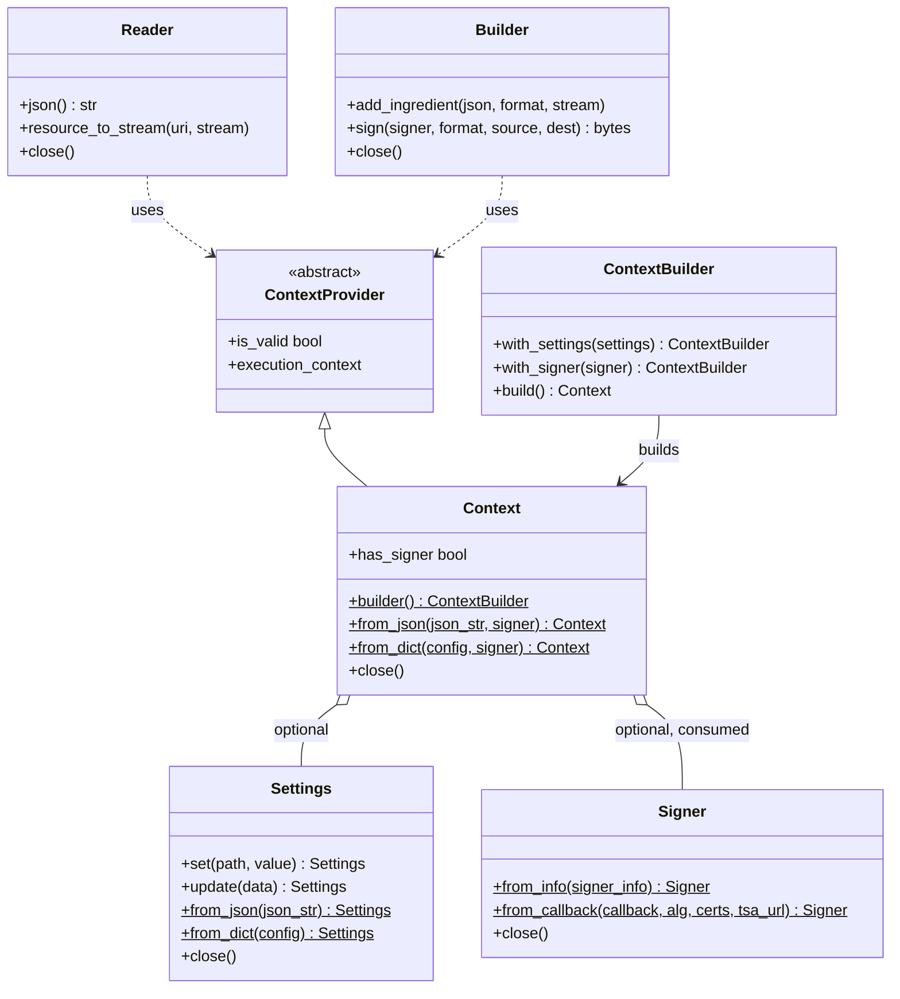

# Using the Python library

This package works with media files in the [supported formats](https://github.com/contentauth/c2pa-rs/blob/main/docs/supported-formats.md).

For complete working examples, see the [examples folder](https://github.com/contentauth/c2pa-python/tree/main/examples) in the repository.

## Import

Import the classes needed from the API:

```py
from c2pa import Builder, Reader, Signer, C2paSignerInfo, C2paSigningAlg
```

If you want to use per-instance configuration with `Context` and `Settings`:

```py
from c2pa import Settings, Context, ContextBuilder, ContextProvider
```

All of `Builder`, `Reader`, `Signer`, `Context`, and `Settings` support context managers (the `with` statement) for automatic resource cleanup.

## Define manifest JSON

The Python library works with both file-based and stream-based operations.
In both cases, the manifest JSON string defines the C2PA manifest to add to an asset. For example:

```py
manifest_json = json.dumps({
    "claim_generator": "python_test/0.1",
    "assertions": [
    {
      "label": "cawg.training-mining",
      "data": {
        "entries": {
          "cawg.ai_inference": {
            "use": "notAllowed"
          },
          "cawg.ai_generative_training": {
            "use": "notAllowed"
          }
        }
      }
    }
  ]
 })
```

## File-based operations

### Read and validate C2PA data

Use the `Reader` to read C2PA data from a file. The Reader examines the file for C2PA data and generates a report of any data it finds. If there are validation errors, the report includes a `validation_status` field.

An asset file may contain many manifests in a manifest store. The most recent manifest is identified by the value of the `active_manifest` field in the manifests map. The manifests may contain binary resources such as thumbnails which can be retrieved with `resource_to_stream` using the associated `identifier` field values and a `uri`.

NOTE: For a comprehensive reference to the JSON manifest structure, see the [Manifest store reference](https://opensource.contentauthenticity.org/docs/manifest/manifest-ref).

#### Reading without Context

```py
try:
    # Create a reader from a file path
    with Reader("path/to/media_file.jpg") as reader:
        # Print manifest store as JSON
        print("Manifest store:", reader.json())

        # Get the active manifest
        manifest = json.loads(reader.json())
        active_manifest = manifest["manifests"][manifest["active_manifest"]]
        if active_manifest:
            # Get the uri to the manifest's thumbnail and write it to a file
            uri = active_manifest["thumbnail"]["identifier"]
            with open("thumbnail.jpg", "wb") as f:
                reader.resource_to_stream(uri, f)

except Exception as err:
    print(err)
```

#### Reading with Context

Pass a `Context` to apply custom settings to the Reader, such as trust anchors or verification flags.

```py
try:
    settings = Settings.from_dict({
        "verify": {"verify_cert_anchors": True},
        "trust": {"trust_anchors": anchors_pem}
    })

    with Context(settings) as ctx:
        with Reader("path/to/media_file.jpg", context=ctx) as reader:
            print("Manifest store:", reader.json())

except Exception as err:
    print(err)
```

### Add a signed manifest

**WARNING**: These examples access the private key and security certificate directly from the local file system. This is fine during development, but doing so in production may be insecure. Instead use a Key Management Service (KMS) or a hardware security module (HSM) to access the certificate and key; for example as shown in the [C2PA Python Example](https://github.com/contentauth/c2pa-python-example).

#### Signing without Context

Use a `Builder` and `Signer` to add a manifest to an asset:

```py
try:
    # Load certificate and key files
    with open("path/to/cert.pem", "rb") as cert_file, open("path/to/key.pem", "rb") as key_file:
        cert_data = cert_file.read()
        key_data = key_file.read()

        # Create signer info with the correct field names
        signer_info = C2paSignerInfo(
            alg=C2paSigningAlg.PS256,
            sign_cert=cert_data,
            private_key=key_data,
            ta_url=b"http://timestamp.digicert.com"
        )

        # Create signer from the signer info
        signer = Signer.from_info(signer_info)

        # Create builder with manifest and add ingredients
        with Builder(manifest_json) as builder:
            with open("path/to/ingredient.jpg", "rb") as ingredient_file:
                ingredient_json = json.dumps({"title": "Ingredient Image"})
                builder.add_ingredient(ingredient_json, "image/jpeg", ingredient_file)

            # Sign the file (dest must be opened in w+b mode)
            with open("path/to/source.jpg", "rb") as source, open("path/to/output.jpg", "w+b") as dest:
                builder.sign(signer, "image/jpeg", source, dest)

        # Verify the signed file
        with Reader("path/to/output.jpg") as reader:
            manifest_store = json.loads(reader.json())
            active_manifest = manifest_store["manifests"][manifest_store["active_manifest"]]
            print("Signed manifest:", active_manifest)

except Exception as e:
    print("Failed to sign manifest store: " + str(e))
```

#### Signing with Context

Pass a `Context` to the Builder to apply custom settings during signing. The signer is still passed explicitly to `builder.sign()`.

```py
try:
    with open("path/to/cert.pem", "rb") as cert_file, open("path/to/key.pem", "rb") as key_file:
        cert_data = cert_file.read()
        key_data = key_file.read()

        signer_info = C2paSignerInfo(
            alg=C2paSigningAlg.PS256,
            sign_cert=cert_data,
            private_key=key_data,
            ta_url=b"http://timestamp.digicert.com"
        )

        with Context() as ctx:
            with Signer.from_info(signer_info) as signer:
                with Builder(manifest_json, ctx) as builder:
                    with open("path/to/ingredient.jpg", "rb") as ingredient_file:
                        ingredient_json = json.dumps({"title": "Ingredient Image"})
                        builder.add_ingredient(ingredient_json, "image/jpeg", ingredient_file)

                    # Sign using file paths (convenience method)
                    builder.sign_file("path/to/source.jpg", "path/to/output.jpg", signer)

            # Verify the signed file with the same context
            with Reader("path/to/output.jpg", context=ctx) as reader:
                manifest_store = json.loads(reader.json())
                active_manifest = manifest_store["manifests"][manifest_store["active_manifest"]]
                print("Signed manifest:", active_manifest)

except Exception as e:
    print("Failed to sign manifest store: " + str(e))
```

## Settings, Context, and ContextProvider

The `Settings` and `Context` classes provide per-instance configuration for Reader and Builder operations. This replaces the global `load_settings()` function, which is now deprecated.



### Settings

`Settings` controls behavior such as thumbnail generation, trust lists, and verification flags.

```py
from c2pa import Settings

# Create with defaults
settings = Settings()

# Set individual values by dot-notation path
settings.set("builder.thumbnail.enabled", "false")

# Method chaining
settings.set("builder.thumbnail.enabled", "false").set("verify.remote_manifest_fetch", "true")

# Dict-like access
settings["builder.thumbnail.enabled"] = "false"

# Create from JSON string
settings = Settings.from_json('{"builder": {"thumbnail": {"enabled": false}}}')

# Create from a dictionary
settings = Settings.from_dict({"builder": {"thumbnail": {"enabled": False}}})

# Merge additional configuration
settings.update({"verify": {"remote_manifest_fetch": True}})
```

### Context

A `Context` can carry `Settings` and a `Signer`, and is passed to `Reader` or `Builder` to control their behavior through settings propagation.

```py
from c2pa import Context, Settings, Reader, Builder, Signer

# Default context (no custom settings)
ctx = Context()

# Context with settings
settings = Settings.from_dict({"builder": {"thumbnail": {"enabled": False}}})
ctx = Context(settings=settings)

# Create from JSON or dict directly
ctx = Context.from_json('{"builder": {"thumbnail": {"enabled": false}}}')
ctx = Context.from_dict({"builder": {"thumbnail": {"enabled": False}}})

# Use with Reader (keyword argument)
reader = Reader("path/to/media_file.jpg", context=ctx)

# Use with Builder (positional or keyword argument)
builder = Builder(manifest_json, ctx)
```

### ContextBuilder (fluent API)

`ContextBuilder` provides a fluent interface for constructing a `Context`, matching the c2pa-rs `ContextBuilder` pattern. Use `Context.builder()` to get started.

```py
from c2pa import Context, ContextBuilder, Settings, Signer

# Fluent construction with settings and signer
ctx = (
    Context.builder()
    .with_settings(settings)
    .with_signer(signer)
    .build()
)

# Settings only
ctx = Context.builder().with_settings(settings).build()

# Default context (equivalent to Context())
ctx = Context.builder().build()
```

### Context with a Signer

When a `Signer` is passed to `Context`, the `Signer` object is consumed and must not be reused directly. The `Context` takes ownership of the underlying native signer. This allows signing without passing an explicit signer to `Builder.sign()`.

```py
from c2pa import Context, Settings, Builder, Signer, C2paSignerInfo, C2paSigningAlg

# Create a signer
signer_info = C2paSignerInfo(
    alg=C2paSigningAlg.ES256,
    sign_cert=cert_data,
    private_key=key_data,
    ta_url=b"http://timestamp.digicert.com"
)
signer = Signer.from_info(signer_info)

# Create context with signer (signer is consumed)
ctx = Context(settings=settings, signer=signer)
# The signer object is now invalid and must not be used directly again

# Build and sign without passing a signer, since the signer is in the context
builder = Builder(manifest_json, ctx)
with open("source.jpg", "rb") as src, open("output.jpg", "w+b") as dst:
    manifest_bytes = builder.sign(format="image/jpeg", source=src, dest=dst)
```

If both an explicit signer and a context signer are available, the explicit signer takes precedence:

```py
# Explicit signer wins over context signer
manifest_bytes = builder.sign(explicit_signer, "image/jpeg", source, dest)
```

### ContextProvider (abstract base class)

`ContextProvider` is an abstract base class (ABC) that allows third-party implementations of custom context providers. Any class that implements the `is_valid` and `execution_context` properties satisfies the interface and can be passed to `Reader` or `Builder` as `context`.

```py
from c2pa import ContextProvider, Context

# The built-in Context satisfies ContextProvider
ctx = Context()
assert isinstance(ctx, ContextProvider)
```

### Migrating from load_settings

The `load_settings()` function that set settings in a thread-local fashion is deprecated.
Replace it with `Settings` and `Context` usage to propagate configurations:

```py
# Before:
from c2pa import load_settings
load_settings({"builder": {"thumbnail": {"enabled": False}}})
reader = Reader("file.jpg")

# After:
from c2pa import Settings, Context, Reader

# Settings are on the context, and move with the context
settings = Settings.from_dict({"builder": {"thumbnail": {"enabled": False}}})
ctx = Context(settings=settings)
reader = Reader("file.jpg", context=ctx)
```

## Stream-based operations

Instead of working with files, you can read, validate, and add a signed manifest to streamed data.

### Read and validate C2PA data using streams

#### Stream reading without Context

```py
try:
    with open("path/to/media_file.jpg", "rb") as stream:
        with Reader("image/jpeg", stream) as reader:
            print("Manifest store:", reader.json())

            manifest = json.loads(reader.json())
            active_manifest = manifest["manifests"][manifest["active_manifest"]]
            if active_manifest:
                uri = active_manifest["thumbnail"]["identifier"]
                with open("thumbnail.jpg", "wb") as f:
                    reader.resource_to_stream(uri, f)

except Exception as err:
    print(err)
```

#### Stream reading with Context

```py
try:
    settings = Settings.from_dict({"verify": {"verify_cert_anchors": True}})

    with Context(settings) as ctx:
        with open("path/to/media_file.jpg", "rb") as stream:
            with Reader("image/jpeg", stream, context=ctx) as reader:
                print("Manifest store:", reader.json())

except Exception as err:
    print(err)
```

### Add a signed manifest to a stream

**WARNING**: These examples access the private key and security certificate directly from the local file system. This is fine during development, but doing so in production may be insecure. Instead use a Key Management Service (KMS) or a hardware security module (HSM) to access the certificate and key; for example as shown in the [C2PA Python Example](https://github.com/contentauth/c2pa-python-example).

#### Stream signing without Context

```py
try:
    with open("path/to/cert.pem", "rb") as cert_file, open("path/to/key.pem", "rb") as key_file:
        cert_data = cert_file.read()
        key_data = key_file.read()

        signer_info = C2paSignerInfo(
            alg=C2paSigningAlg.PS256,
            sign_cert=cert_data,
            private_key=key_data,
            ta_url=b"http://timestamp.digicert.com"
        )

        signer = Signer.from_info(signer_info)

        with Builder(manifest_json) as builder:
            with open("path/to/ingredient.jpg", "rb") as ingredient_file:
                ingredient_json = json.dumps({"title": "Ingredient Image"})
                builder.add_ingredient(ingredient_json, "image/jpeg", ingredient_file)

            # Sign using streams (dest must be opened in w+b mode)
            with open("path/to/source.jpg", "rb") as source, open("path/to/output.jpg", "w+b") as dest:
                builder.sign(signer, "image/jpeg", source, dest)

            # Verify the signed file
            with open("path/to/output.jpg", "rb") as stream:
                with Reader("image/jpeg", stream) as reader:
                    manifest_store = json.loads(reader.json())
                    active_manifest = manifest_store["manifests"][manifest_store["active_manifest"]]
                    print("Signed manifest:", active_manifest)

except Exception as e:
    print("Failed to sign manifest store: " + str(e))
```

#### Stream signing with Context

```py
try:
    with open("path/to/cert.pem", "rb") as cert_file, open("path/to/key.pem", "rb") as key_file:
        cert_data = cert_file.read()
        key_data = key_file.read()

        signer_info = C2paSignerInfo(
            alg=C2paSigningAlg.PS256,
            sign_cert=cert_data,
            private_key=key_data,
            ta_url=b"http://timestamp.digicert.com"
        )

        with Context() as ctx:
            with Signer.from_info(signer_info) as signer:
                with Builder(manifest_json, ctx) as builder:
                    with open("path/to/ingredient.jpg", "rb") as ingredient_file:
                        ingredient_json = json.dumps({"title": "Ingredient Image"})
                        builder.add_ingredient(ingredient_json, "image/jpeg", ingredient_file)

                    with open("path/to/source.jpg", "rb") as source, open("path/to/output.jpg", "w+b") as dest:
                        builder.sign(signer, "image/jpeg", source, dest)

            # Verify the signed file with the same context
            with open("path/to/output.jpg", "rb") as stream:
                with Reader("image/jpeg", stream, context=ctx) as reader:
                    manifest_store = json.loads(reader.json())
                    active_manifest = manifest_store["manifests"][manifest_store["active_manifest"]]
                    print("Signed manifest:", active_manifest)

except Exception as e:
    print("Failed to sign manifest store: " + str(e))
```
