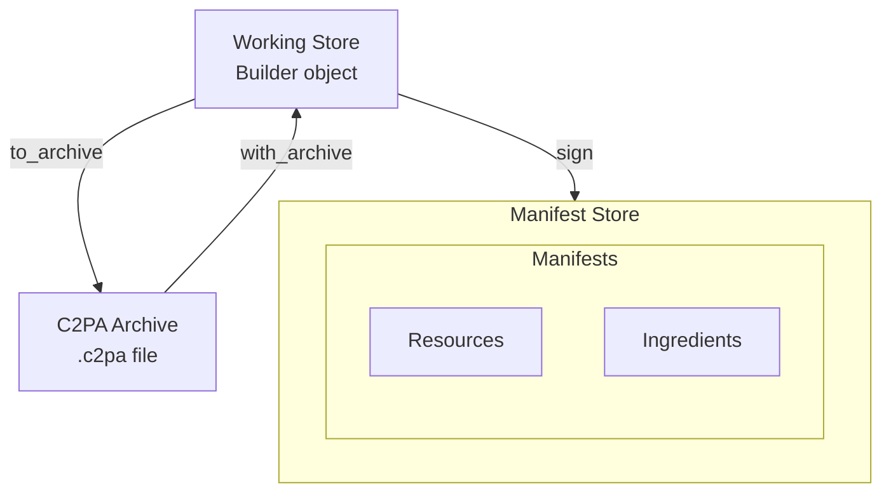
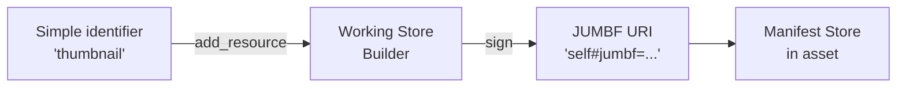

# Manifests, working stores, and archives

This table summarizes the fundamental entities that you work with when using the CAI SDK.

| Object | Description | Where it is | Primary API |
|--------|-------------|-------------|-------------|
| [**Manifest store**](#manifest-store) | Final signed provenance data. Contains one or more manifests. | Embedded in asset or remotely in cloud | `Reader` class |
| [**Working store**](#working-store) | Editable in-progress manifest. | `Builder` object | `Builder` class |
| [**Archive**](#archive) | Serialized working store | `.c2pa` file/stream | `Builder.to_archive()` / `Builder.with_archive()` |
| [**Resources**](#working-with-resources) | Binary assets referenced by manifest assertions, such as thumbnails or ingredient thumbnails. | In manifest. | `Builder.add_resource()` / `Reader.resource_to_stream()` |
| [**Ingredients**](#working-with-ingredients) | Source materials used to create an asset. | In manifest. | `Builder.add_ingredient()` |

This diagram summarizes the relationships among these entities.



## Key entities

### Manifest store

A _manifest store_ is the data structure that's embedded in (or attached to) a signed asset. It contains one or more manifests that contain provenance data and cryptographic signatures.

**Characteristics:**

- Final, immutable signed data embedded in or attached to an asset.
- Contains one or more manifests (identified by URIs).
- Has exactly one `active_manifest` property pointing to the most recent manifest.
- Read it by using a `Reader` object.

**Example:** When you open a signed JPEG file, the C2PA data embedded in it is the manifest store.

For more information, see:

- [Reading manifest stores from assets](#reading-manifest-stores-from-assets)
- [Creating and signing manifests](#creating-and-signing-manifests)
- [Embedded versus external manifests](#embedded-versus-external-manifests)

### Working store

A _working store_ is a `Builder` object representing an editable, in-progress manifest that has not yet been signed and bound to an asset. Think of it as a manifest in progress, or a manifest being built.

**Characteristics:**

- Editable, mutable state in memory (a `Builder` object).
- Contains claims, ingredients, and assertions that can be modified.
- Can be saved to a C2PA archive (`.c2pa` JUMBF binary format) for later use.

**Example:** When you create a `Builder` object and add assertions to it, you're dealing with a working store, as it is an "in progress" manifest being built.

For more information, see [Using working stores](#using-working-stores).

### Archive

A _C2PA archive_ (or just _archive_) contains the serialized bytes of a working store saved to a file or stream (typically a `.c2pa` file). It uses the standard JUMBF `application/c2pa` format.

**Characteristics:**

- Portable serialization of a working store (`Builder`).
- Save an archive by using `Builder.to_archive()` and restore a full working store from an archive by using `Builder.with_archive()` (with a `Builder` created from a `Context`).
- Useful for separating manifest preparation ("work in progress") from final signing.

For more information, see [Working with archives](#working-with-archives).

## Reading manifest stores from assets

Use the `Reader` class to read manifest stores from signed assets.

### Reading from a file

```py
from c2pa import Context, Reader

ctx = Context.from_dict({
    "verify": {
        "verify_after_sign": True
    }
})
reader = Reader("signed_image.jpg", context=ctx)
manifest_store_json = reader.json()
```

### Reading from a stream

```py
with open("signed_image.jpg", "rb") as stream:
    reader = Reader("image/jpeg", stream, context=ctx)
    manifest_json = reader.json()
```

For full details on `Context` and `Settings`, see [Context and settings](context-settings.md).

### Checking if the manifest store is embedded

```py
reader = Reader("signed_image.jpg")

if reader.is_embedded():
    print("Manifest store is embedded in the asset")
else:
    print("Manifest store is external")

    # Get remote URL if available
    remote_url = reader.get_remote_url()
    if remote_url is not None:
        print(f"Remote URL: {remote_url}")
```

### Understanding Reader output

`Reader.json()` returns a JSON string representing the manifest store. The top-level structure looks like this:

```json
{
  "active_manifest": "urn:uuid:...",
  "manifests": {
    "urn:uuid:...": {
      "claim_generator": "MyApp/1.0",
      "claim_generator_info": [{"name": "MyApp", "version": "0.1.0"}],
      "title": "signed_image.jpg",
      "assertions": [
        {"label": "c2pa.actions", "data": {"actions": [...]}},
        {"label": "c2pa.hash.data", "data": {...}}
      ],
      "ingredients": [...],
      "signature_info": {
        "alg": "Es256",
        "issuer": "...",
        "time": "2025-01-15T12:00:00Z"
      }
    }
  }
}
```

- `active_manifest`: The URI label of the most recent manifest. This is typically the one to inspect first.
- `manifests`: A dictionary of all manifests in the store, keyed by their URI label. Assets that have been re-signed or that contain ingredient history may have multiple manifests.
- Within each manifest: `assertions` contain the provenance statements, `ingredients` list source materials, and `signature_info` provides details about who signed and when.

The SDK also provides convenience methods to avoid manual JSON parsing:

```py
reader = Reader("signed_image.jpg", context=ctx)

# Get the active manifest directly as a dict
active = reader.get_active_manifest()

# Get a specific manifest by label
manifest = reader.get_manifest("urn:uuid:...")

# Check validation status
state = reader.get_validation_state()
results = reader.get_validation_results()
```

`Reader.detailed_json()` returns a more comprehensive JSON representation with a different structure than `json()`. It is useful when additional details about the manifest internals are needed.

## Using working stores

A **working store** is represented by a `Builder` object. It contains "live" manifest data as you add information to it.

### Creating a working store

```py
import json
from c2pa import Builder, Context

manifest_json = json.dumps({
    "claim_generator_info": [{
        "name": "example-app",
        "version": "0.1.0"
    }],
    "title": "Example asset",
    "assertions": []
})

ctx = Context.from_dict({
    "builder": {
        "thumbnail": {"enabled": True}
    }
})
builder = Builder(manifest_json, context=ctx)
```

### Modifying a working store

Before signing, you can modify the working store (`Builder`):

```py
import io

# Add binary resources (like thumbnails)
with open("thumbnail.jpg", "rb") as thumb:
    builder.add_resource("thumbnail", thumb)

# Add ingredients (source files)
ingredient_json = json.dumps({
    "title": "Original asset",
    "relationship": "parentOf"
})
with open("source.jpg", "rb") as ingredient:
    builder.add_ingredient(ingredient_json, "image/jpeg", ingredient)

# Add actions
action_json = {
    "action": "c2pa.created",
    "digitalSourceType": "http://cv.iptc.org/newscodes/digitalsourcetype/trainedAlgorithmicMedia"
}
builder.add_action(action_json)

# Configure embedding behavior
builder.set_no_embed()  # Don't embed manifest in asset
builder.set_remote_url("https://example.com/manifests/")
```

### From working store to manifest store

When you sign an asset, the working store (`Builder`) becomes a manifest store embedded in the output:

```py
from c2pa import Signer, C2paSignerInfo, C2paSigningAlg, Context

# Create a signer
signer_info = C2paSignerInfo(
    alg=C2paSigningAlg.ES256,
    sign_cert=certs,
    private_key=private_key,
    ta_url=b"http://timestamp.digicert.com"
)
signer = Signer.from_info(signer_info)

ctx = Context.from_dict({
    "builder": {"thumbnail": {"enabled": True}},
    "signer": signer,
})
builder = Builder(manifest_json, context=ctx)

# Sign the asset - working store becomes a manifest store
with open("source.jpg", "rb") as src, open("signed.jpg", "w+b") as dst:
    builder.sign("image/jpeg", src, dst)

# Now "signed.jpg" contains a manifest store
# You can read it back with Reader
reader = Reader("signed.jpg", context=ctx)
manifest_store_json = reader.json()
```

## Creating and signing manifests

### Creating a Signer

For testing, create a `Signer` with certificates and private key:

```py
from c2pa import Signer, C2paSignerInfo, C2paSigningAlg

# Load credentials
with open("certs.pem", "rb") as f:
    certs = f.read()
with open("private_key.pem", "rb") as f:
    private_key = f.read()

# Create signer
signer_info = C2paSignerInfo(
    alg=C2paSigningAlg.ES256,  # ES256, ES384, ES512, PS256, PS384, PS512, ED25519
    sign_cert=certs,            # Certificate chain in PEM format
    private_key=private_key,    # Private key in PEM format
    ta_url=b"http://timestamp.digicert.com"  # Optional timestamp authority URL
)
signer = Signer.from_info(signer_info)
```

**WARNING**: Never hard-code or directly access private keys in production. Use a Hardware Security Module (HSM) or Key Management Service (KMS).

### Signing an asset

The `Builder` must be created with a `Context` that includes a signer. Then call `sign()` without passing a signer argument:

```py
try:
    with open("source.jpg", "rb") as src, open("signed.jpg", "w+b") as dst:
        manifest_bytes = builder.sign("image/jpeg", src, dst)
    print("Signed successfully!")
except Exception as e:
    print(f"Signing failed: {e}")
```

### Signing with file paths

You can also sign using file paths directly:

```py
manifest_bytes = builder.sign_file("source.jpg", "signed.jpg")
```

### Complete example

This code combines the above examples to create, sign, and read a manifest.

```py
import json
from c2pa import Builder, Reader, Context, Signer, C2paSignerInfo, C2paSigningAlg

try:
    # 1. Define manifest
    manifest_json = json.dumps({
        "claim_generator_info": [{"name": "demo-app", "version": "0.1.0"}],
        "title": "Signed image",
        "assertions": []
    })

    # 2. Load credentials and create signer
    with open("certs.pem", "rb") as f:
        certs = f.read()
    with open("private_key.pem", "rb") as f:
        private_key = f.read()

    signer_info = C2paSignerInfo(
        alg=C2paSigningAlg.ES256,
        sign_cert=certs,
        private_key=private_key,
        ta_url=b"http://timestamp.digicert.com"
    )
    signer = Signer.from_info(signer_info)

    # 3. Create context with settings and signer
    ctx = Context.from_dict({
        "builder": {"thumbnail": {"enabled": True}}
    }, signer=signer)

    # 4. Create Builder with context and sign
    builder = Builder(manifest_json, context=ctx)
    with open("source.jpg", "rb") as src, open("signed.jpg", "w+b") as dst:
        builder.sign("image/jpeg", src, dst)

    print("Asset signed with context settings")

    # 5. Read back the manifest store
    reader = Reader("signed.jpg", context=ctx)
    print(reader.json())

except Exception as e:
    print(f"Error: {e}")
```

## Working with resources

_Resources_ are binary assets referenced by manifest assertions, such as thumbnails or ingredient thumbnails.

C2PA manifest data is not just JSON. A manifest store also contains binary resources (thumbnails, ingredient data, and other embedded files) that are referenced from the JSON metadata by JUMBF URIs. When `reader.json()` is called, the JSON includes URI references (like `"self#jumbf=c2pa.assertions/c2pa.thumbnail.claim.jpeg"`) that point to these binary resources. To retrieve the actual binary data, use `reader.resource_to_stream()` with the URI from the JSON. This separation keeps the JSON lightweight while allowing manifests to carry rich binary content alongside the metadata.

### Understanding resource identifiers

When you add a resource to a working store (`Builder`), you assign it an identifier string. When the manifest store is created during signing, the SDK automatically converts this to a proper JUMBF URI.

**Resource identifier workflow:**



1. **During manifest creation**: You use a string identifier (e.g., `"thumbnail"`, `"thumbnail1"`).
2. **During signing**: The SDK converts these to JUMBF URIs (e.g., `"self#jumbf=c2pa.assertions/c2pa.thumbnail.claim.jpeg"`).
3. **After signing**: The manifest store contains the full JUMBF URI that you use to extract the resource.

### Extracting resources from a manifest store

To extract a resource, you need its JUMBF URI from the manifest store:

```py
import json

reader = Reader("signed_image.jpg", context=ctx)
manifest_store = json.loads(reader.json())

# Get active manifest
active_uri = manifest_store["active_manifest"]
manifest = manifest_store["manifests"][active_uri]

# Extract thumbnail if it exists
if "thumbnail" in manifest:
    # The identifier is the JUMBF URI
    thumbnail_uri = manifest["thumbnail"]["identifier"]
    # Example: "self#jumbf=c2pa.assertions/c2pa.thumbnail.claim.jpeg"

    # Extract to a stream
    with open("thumbnail.jpg", "wb") as f:
        reader.resource_to_stream(thumbnail_uri, f)
    print("Thumbnail extracted")
```

### Extracting to a stream

Use `resource_to_stream()` to extract a resource to any writable stream, including in-memory buffers:

```py
import io

# Extract a thumbnail to an in-memory stream
thumbnail_buf = io.BytesIO()
reader.resource_to_stream(thumbnail_uri, thumbnail_buf)
thumbnail_bytes = thumbnail_buf.getvalue()

# Or extract to a file
with open("thumbnail.jpg", "wb") as f:
    reader.resource_to_stream(thumbnail_uri, f)
```

### Adding resources to a working store

When building a manifest, you add resources using identifiers. The SDK will reference these in your manifest JSON and convert them to JUMBF URIs during signing.

```py
ctx = Context.from_dict({"builder": {"thumbnail": {"enabled": True}}, "signer": signer})
builder = Builder(manifest_json, context=ctx)

# Add resource from a stream
with open("thumbnail.jpg", "rb") as thumb:
    builder.add_resource("thumbnail", thumb)

# Sign: the "thumbnail" identifier becomes a JUMBF URI in the manifest store
with open("source.jpg", "rb") as src, open("signed.jpg", "w+b") as dst:
    builder.sign("image/jpeg", src, dst)
```

## Working with ingredients

Ingredients represent source materials used to create an asset, preserving the provenance chain. Adding an ingredient to a manifest creates a verifiable link from the current asset back to its source material.

The `relationship` field describes how the source (ingredient) was used: `"parentOf"` for a direct edit, `"componentOf"` for an element composited into a larger work, or `"inputTo"` for a general input.

Ingredients themselves can be turned into ingredient archives (`.c2pa`). An ingredient archive is a `Builder` archive containing _exactly one_ ingredient. Ingredient archives can be added directly as an ingredient to another working store using the `application/c2pa` MIME type — no un-archiving step is needed.

### Ingredient vs. ingredient archive

A **(plain) ingredient** is a source asset that the builder reads at `add_ingredient` time. The builder sees the asset's bytes and stores the required ingredient data (including any caller-set `instance_id`) inside the new manifest.

An **ingredient archive** (in c2pa archive format) is a `.c2pa` file that already contains a fully-formed ingredient. It can be produced with `write_ingredient_archive` (dedicated ingredient archive APIs) or with `to_archive()` on a builder holding one ingredient (legacy). When passed to `add_ingredient`, the builder treats the archive's contents as opaque provenance: the archive's internal fields are not exposed as live JSON the signing builder can introspect or use for linking to actions. Only the JSON the caller supplies in the current `add_ingredient` call is visible to the builder in that round.

Once an ingredient is archived, the original ingredient asset is no longer needed: the `.c2pa` ingredient archive stands in for it and carries the ingredient's provenance.

> [!NOTE]
> The relationship is one-directional. For legacy support you can _read_ an ingredient out of a builder archive, but you should not try to restore a `Builder` from an ingredient archive — consume it as an ingredient with `add_ingredient_from_archive` (or the legacy `add_ingredient(json, "application/c2pa", archive)` path) instead.

For the dedicated ingredient archive APIs, see [Single-ingredient archive APIs](#single-ingredient-archive-apis).

This difference governs how each can be linked to an action via `ingredientIds`. The table below covers all three cases: plain ingredients, ingredient archives loaded via the dedicated APIs (recommended), and ingredient archives loaded via the legacy `add_ingredient` path:

| Aspect | Ingredient | Ingredient archive (dedicated APIs: `write_ingredient_archive` + `add_ingredient_from_archive`) | Ingredient archive (legacy load via `add_ingredient(json, "application/c2pa", archive)`) |
| --- | --- | --- | --- |
| Source format passed to `add_ingredient` | Asset MIME type (`image/jpeg`, `video/mp4`, ...) | N/A — loaded via `add_ingredient_from_archive(stream)` | `"application/c2pa"` |
| What it is | "Live" asset | A serialized single-ingredient archive (opaque provenance) | A serialized manifest store (opaque provenance) |
| Linking via `label` | Primary linking key, set on the signing builder's `add_ingredient` JSON | Pass `label` value as archive key to `write_ingredient_archive`; flows through as `ingredientIds` value | Only linking key that works, set on the signing builder's `add_ingredient` JSON |
| Linking via `instance_id` | Alternative to using `label` | Pass `instance_id` value as archive key to `write_ingredient_archive`; flows through as `ingredientIds` value | Does not link, signing-time error |
| Linking via a `label` baked in at archive-creation time | N/A (not an archive) | N/A — archive key is set explicitly at `write_ingredient_archive` call time | Does not carry through, must be re-asserted on the signing builder's `add_ingredient` JSON |

#### When to use `label` vs `instance_id`

| Property | `label` | `instance_id` |
| --- | --- | --- |
| Who controls it | Caller (any string) | Caller (any string, or from XMP metadata) |
| Priority for linking | Primary: checked first | Fallback: used when `label` is absent/empty |
| When to use | JSON-defined manifests where the caller controls the ingredient definition | Programmatic workflows where a stable identifier persisting unchanged across rebuilds is needed |
| Survives signing | SDK may reassign the actual assertion label in the signed manifest | Unchanged |
| Stable across rebuilds | The caller controls the build-time value; the post-signing label may change | Yes, always the same set value |

Use `label` when defining manifests in JSON. Use `instance_id` when a stable identifier that persists unchanged across rebuilds is needed. The `label` used at build time may be reassigned by the SDK during signing and will not appear unchanged in `reader.json()` output.

### Adding ingredients to a working store

When creating a manifest, add ingredients to preserve the provenance chain:

```py
ctx = Context.from_dict({"builder": {"claim_generator_info": {"name": "my-app", "version": "0.1.0"}}, "signer": signer})
builder = Builder(manifest_json, context=ctx)

# Define ingredient metadata
ingredient_json = json.dumps({
    "title": "Original asset",
    "relationship": "parentOf"
})

# Add ingredient from a stream
with open("source.jpg", "rb") as ingredient:
    builder.add_ingredient(ingredient_json, "image/jpeg", ingredient)

# Sign: ingredients become part of the manifest store
with open("new_asset.jpg", "rb") as src, open("signed_asset.jpg", "w+b") as dst:
    builder.sign("image/jpeg", src, dst)
```

### Linking an ingredient archive to an action

To link an ingredient archive to an action via `ingredientIds`, you must use a `label` set in the `add_ingredient()` call on the signing builder. Labels baked into the archive ingredient are not carried through, and `instance_id` does not work as a linking key for ingredient archives regardless of where it is set.

```py
import io, json

# Step 1: Create the ingredient archive.
archive_builder = Builder.from_json({
    "claim_generator_info": [{"name": "an-application", "version": "0.1.0"}],
    "assertions": [],
})
with open("photo.jpg", "rb") as f:
    archive_builder.add_ingredient(
        {"title": "photo.jpg", "relationship": "componentOf"},
        "image/jpeg",
        f,
    )
archive = io.BytesIO()
archive_builder.to_archive(archive)
archive.seek(0)

# Step 2: Build a manifest with an action that references the ingredient.
manifest_json = {
    "claim_generator_info": [{"name": "an-application", "version": "0.1.0"}],
    "assertions": [
        {
            "label": "c2pa.actions.v2",
            "data": {
                "actions": [
                    {
                        "action": "c2pa.placed",
                        "parameters": {
                            "ingredientIds": ["my-ingredient"]
                        },
                    }
                ]
            },
        }
    ],
}

ctx = Context.from_dict({"signer": signer})
builder = Builder(manifest_json, context=ctx)

# Step 3: Add the ingredient archive with a label matching the ingredientIds value.
# The label MUST be set here, on the signing builder's add_ingredient call.
builder.add_ingredient(
    {"title": "photo.jpg", "relationship": "componentOf", "label": "my-ingredient"},
    "application/c2pa",
    archive,
)

with open("source.jpg", "rb") as src, open("signed.jpg", "w+b") as dst:
    builder.sign("image/jpeg", src, dst)
```

When linking multiple ingredient archives, give each a distinct label and reference it in the appropriate action's `ingredientIds` array.

If each ingredient has its own action (e.g., one `c2pa.opened` for the parent and one `c2pa.placed` for a composited element), set up two actions with separate `ingredientIds`:

```py
manifest_json = {
    "claim_generator_info": [{"name": "an-application", "version": "0.1.0"}],
    "assertions": [{
        "label": "c2pa.actions.v2",
        "data": {
            "actions": [
                {
                    "action": "c2pa.opened",
                    "digitalSourceType": "http://cv.iptc.org/newscodes/digitalsourcetype/digitalCreation",
                    "parameters": {"ingredientIds": ["parent-photo"]},
                },
                {
                    "action": "c2pa.placed",
                    "parameters": {"ingredientIds": ["overlay-graphic"]},
                },
            ]
        },
    }],
}

builder = Builder(manifest_json, context=ctx)

builder.add_ingredient(
    {"title": "photo.jpg", "relationship": "parentOf", "label": "parent-photo"},
    "application/c2pa",
    photo_archive,
)
builder.add_ingredient(
    {"title": "overlay.png", "relationship": "componentOf", "label": "overlay-graphic"},
    "application/c2pa",
    overlay_archive,
)
```

A single `c2pa.placed` action can also reference several `componentOf` ingredients composited together. List all labels in the `ingredientIds` array:

```py
manifest_json = {
    "claim_generator_info": [{"name": "an-application", "version": "0.1.0"}],
    "assertions": [{
        "label": "c2pa.actions.v2",
        "data": {
            "actions": [{
                "action": "c2pa.placed",
                "parameters": {
                    "ingredientIds": ["base-layer", "overlay-layer"]
                },
            }]
        },
    }],
}

builder = Builder(manifest_json, context=ctx)

builder.add_ingredient(
    {"title": "base.jpg", "relationship": "componentOf", "label": "base-layer"},
    "application/c2pa",
    base_archive,
)
builder.add_ingredient(
    {"title": "overlay.jpg", "relationship": "componentOf", "label": "overlay-layer"},
    "application/c2pa",
    overlay_archive,
)
```

After signing, the action's `parameters.ingredients` array contains one resolved URL per ingredient.

### Ingredient relationships

Specify the relationship between the ingredient and the current asset:

| Relationship | Meaning |
|--------------|---------|
| `parentOf` | The ingredient is a direct parent of this asset |
| `componentOf` | The ingredient is a component used in this asset |
| `inputTo` | The ingredient was an input to creating this asset |

Example with explicit relationship:

```py
ingredient_json = json.dumps({
    "title": "Base layer",
    "relationship": "componentOf"
})

with open("base_layer.png", "rb") as ingredient:
    builder.add_ingredient(ingredient_json, "image/png", ingredient)
```

## Working with archives

An _archive_ (C2PA archive) is a serialized working store (`Builder` object) saved to a stream.

Using archives provides these advantages:

- **Save work-in-progress**: Persist a working store between sessions.
- **Separate creation from signing**: Prepare manifests on one machine, sign on another.
- **Share manifests**: Transfer working stores between systems.
- **Offline preparation**: Build manifests offline, sign them later.

The default binary format of an archive is the **C2PA JUMBF binary format** (`application/c2pa`), which is the standard way to save and restore working stores.

### Which archive API to use

Two archive API families share the same binary format but serve different purposes:

| | Full-builder APIs | Single-ingredient APIs |
| --- | --- | --- |
| APIs | `to_archive`, `with_archive`, `Builder.from_archive` | `write_ingredient_archive`, `add_ingredient_from_archive` |
| What is archived | Entire builder: manifest definition + all ingredients + all resources | One ingredient only (other builder state is omitted) |
| Typical use | Checkpoint or transfer a manifest-in-progress between sessions or machines | Ingredient catalog; selectively load individual ingredients at sign time |
| Linking key | N/A (full builder is restored as-is) | Archive key (`label` or `instance_id`) flows through automatically as `ingredientIds` value |

Use `to_archive` / `with_archive` to pause and resume a signing workflow, or to hand off a complete manifest-in-progress to another process or machine. Use `write_ingredient_archive` / `add_ingredient_from_archive` to distribute or cache individual ingredients independently, or to assemble a manifest from a catalog of pre-archived ingredients at sign time.

The subsections below cover the full-builder APIs. For single-ingredient archive workflows, see [Single-ingredient archive APIs](#single-ingredient-archive-apis).

### Saving a working store to archive

```py
import io

ctx = Context.from_dict({"builder": {"claim_generator_info": {"name": "my-app", "version": "0.1.0"}}})
builder = Builder(manifest_json, context=ctx)
with open("thumbnail.jpg", "rb") as thumb:
    builder.add_resource("thumbnail", thumb)
with open("source.jpg", "rb") as ingredient:
    builder.add_ingredient(ingredient_json, "image/jpeg", ingredient)

# Save working store to archive stream
archive = io.BytesIO()
builder.to_archive(archive)

# Or save to a file
with open("manifest.c2pa", "wb") as f:
    archive.seek(0)
    f.write(archive.read())

print("Working store saved to archive")
```

A `Builder` containing **only one ingredient and only the ingredient data** (no other ingredient, no other actions) is an ingredient archive. Ingredient archives can be added directly as ingredient to other working stores too.

### Restoring a working store from archive

To restore a `Builder` from a working store, use `with_archive()`. The restored `Builder` will have the settings used when the `Builder` was created with a `Context`. The archive replaces only the manifest definition; the `Context` and `Settings` are preserved.

```py
# Create context with custom settings and signer
ctx = Context.from_dict({
    "builder": {
        "thumbnail": {"enabled": False},
        "claim_generator_info": {"name": "My App", "version": "0.1.0"}
    },
    "signer": signer,
})

# Create builder with context, then load archive into it
with open("manifest.c2pa", "rb") as archive:
    builder = Builder({}, context=ctx)
    builder.with_archive(archive)

# The builder has the archived manifest definition
# but keeps the context settings (no thumbnails, custom claim generator)
with open("asset.jpg", "rb") as src, open("signed.jpg", "w+b") as dst:
    builder.sign("image/jpeg", src, dst)
```

> [!IMPORTANT]
> Calling `with_archive()` replaces the `Builder`'s manifest definition with the one from the archive, discarding any definition passed to `Builder()` when it was created. An empty dict `{}` is idiomatic for the initial definition when you plan to load an archive immediately after.

### Restoring with context preservation

Create a `Builder` with a custom `Context` first, then load the archive into it. The context settings (thumbnails, claim generator, signer) are preserved, and only the manifest definition is replaced by the archive.

```py
from c2pa import Builder, Context

ctx = Context.from_dict({
    "builder": {
        "thumbnail": {"enabled": False}
    }
})

# Load archive into this working store
with open("manifest.c2pa", "rb") as archive_stream:
    builder = Builder({}, context=ctx)
    builder.with_archive(archive_stream)

# The builder has the archived manifest but keeps the custom context
```

> [!NOTE]
> Calling `with_archive()` replaces the builder's current manifest state. You cannot merge multiple archives.

### Two-phase workflow example

**Phase 1: Prepare manifest**

This step prepares the manifest on a `Builder`, and archives it into a `Builder` archive for later reuse.

```py
import io
import json

ctx = Context.from_dict({"builder": {"claim_generator_info": {"name": "my-app", "version": "0.1.0"}}})
manifest_json = json.dumps({
    "title": "Artwork draft",
    "assertions": []
})
builder = Builder(manifest_json, context=ctx)

with open("thumb.jpg", "rb") as thumb:
    builder.add_resource("thumbnail", thumb)
with open("sketch.png", "rb") as sketch:
    builder.add_ingredient(
        json.dumps({"title": "Sketch"}), "image/png", sketch
    )

# Save working store as archive
with open("artwork_manifest.c2pa", "wb") as f:
    builder.to_archive(f)

print("Working store saved to artwork_manifest.c2pa")
```

**Phase 2: Sign the asset**

Restore the working store with a `Context` so that settings (e.g. thumbnails on/off) and the signer are applied:

```py
ctx = Context.from_dict({
    "builder": {"thumbnail": {"enabled": False}},
    "signer": signer,
})

with open("artwork_manifest.c2pa", "rb") as archive:
    builder = Builder({}, context=ctx)
    builder.with_archive(archive)

# Sign using the context's signer
with open("artwork.jpg", "rb") as src, open("signed_artwork.jpg", "w+b") as dst:
    builder.sign("image/jpeg", src, dst)
```

### Single-ingredient archive APIs

> [!NOTE]
> These are the recommended dedicated ingredient archive APIs for ingredient archive workflows. Use `write_ingredient_archive` and `add_ingredient_from_archive` in preference to the legacy `to_archive` / `with_archive` pattern for ingredient use cases.

The `Builder` class exposes two dedicated APIs for moving a single ingredient between builders without manual JSON manipulation:

- `builder.write_ingredient_archive(ingredient_id, stream)` writes one already-registered ingredient out as a single-ingredient JUMBF archive. The destination stream must be writable and seekable.
- `builder.add_ingredient_from_archive(stream)` loads one such archive into a builder. The source stream must be readable and seekable, **positioned at byte 0** before the call. After calling `write_ingredient_archive`, always call `stream.seek(0)` before passing the stream to `add_ingredient_from_archive`.

#### How `add_ingredient` and `write_ingredient_archive` interact

`add_ingredient(json, format, stream)` is the registration step. It hashes the source asset, builds the ingredient assertion, and stores the ingredient in the builder under an id read from the JSON. The id is the `label` field if present, otherwise `instance_id`.

`write_ingredient_archive(ingredient_id, stream)` is a lookup step rather than a factory. It finds an ingredient that was already registered under `ingredient_id` and serializes that one ingredient as a JUMBF archive. Calling it without a prior `add_ingredient` for that id raises `C2paError`.

The exported archive is not a lossless slice of the parent. It contains one cloned ingredient and a fresh claim instance id. Any other ingredients on the parent builder are omitted.

`add_ingredient_from_archive(stream)` adds the ingredient back to a consuming builder, keyed by the same id the producer used.

#### Example 1: Write a single-ingredient archive

```py
import io
from c2pa import Builder

manifest = {
    "claim_generator_info": [{"name": "c2pa-test", "version": "0.1.0"}],
    "assertions": [],
}
builder = Builder.from_json(manifest)

# Register three ingredients. The `label` becomes each ingredient's id.
with open("first.jpg", "rb") as f:
    builder.add_ingredient({"title": "first.jpg", "relationship": "componentOf", "label": "first"}, "image/jpeg", f)
with open("second.jpg", "rb") as f:
    builder.add_ingredient({"title": "second.jpg", "relationship": "componentOf", "label": "second"}, "image/jpeg", f)
with open("third.jpg", "rb") as f:
    builder.add_ingredient({"title": "third.jpg", "relationship": "componentOf", "label": "third"}, "image/jpeg", f)

# Look up "second" and write only that one to the archive stream.
archive = io.BytesIO()
builder.write_ingredient_archive("second", archive)
```

The archive contains exactly one ingredient.

#### Example 2: Load an ingredient archive into a fresh builder

```py
import io
from c2pa import Builder

consumer = Builder.from_json(manifest)

# `archive` is a stream produced by write_ingredient_archive on another builder.
archive.seek(0)
consumer.add_ingredient_from_archive(archive)

# The ingredient is now registered on `consumer`. Sign as usual.
with open("source.jpg", "rb") as src, open("output.jpg", "w+b") as dst:
    consumer.sign(signer, "image/jpeg", src, dst)
```

#### Id resolution

The id passed to `write_ingredient_archive` is matched against each registered ingredient's `label` and its `instance_id`. The first ingredient whose `label` or `instance_id` equals the id is selected (OR-match, no precedence). If both are set on the same ingredient, pass whichever value is to be used as the linking key. See [Lookup keys and action linking](#lookup-keys-and-action-linking) for the full table of linking outcomes.

#### Errors when handling ingredient archives with write_ingredient_archive

`write_ingredient_archive` raises `C2paError` when:

- The producing `Builder` has no prior `add_ingredient` registration. The lookup table is empty, so no id can resolve.
- The id does not match any registered ingredient's `label` or `instance_id`.

```py
builder = Builder.from_json(manifest)
with open("photo.jpg", "rb") as f:
    builder.add_ingredient({"title": "photo.jpg", "relationship": "componentOf", "label": "real-id"}, "image/jpeg", f)

archive = io.BytesIO()
# Raises C2paError: "wrong-id" was never registered.
builder.write_ingredient_archive("wrong-id", archive)
```

To correct, pass the same string used in the ingredient's `label` or `instance_id` field:

```py
builder = Builder.from_json(manifest)
with open("photo.jpg", "rb") as f:
    builder.add_ingredient({"title": "photo.jpg", "relationship": "componentOf", "label": "ingredient-id"}, "image/jpeg", f)

archive = io.BytesIO()
# Correct: "real-id" matches the registered label.
builder.write_ingredient_archive("ingredient-id", archive)
```

For a multi-archive use case (one catalog, many ingredients picked at build time), see [The ingredients catalog pattern](./selective-manifests.md#the-ingredients-catalog-pattern).

#### Migration guide: from `to_archive` / `with_archive` to single-ingredient APIs

The legacy approach wrapped one ingredient in a full builder archive, then restored it with `with_archive`:

```py
# Legacy: one ingredient archived as a full builder, restored with with_archive
builder = Builder.from_json(manifest)
with open("photo.jpg", "rb") as f:
    builder.add_ingredient({"title": "photo.jpg", "relationship": "componentOf"}, "image/jpeg", f)
archive = io.BytesIO()
builder.to_archive(archive)

# Consumer:
archive.seek(0)
restored = Builder({})
restored.with_archive(archive)
with open("source.jpg", "rb") as src, open("output.jpg", "w+b") as dst:
    restored.sign(signer, "image/jpeg", src, dst)
```

With the dedicated ingredient archive APIs, the producer writes a single-ingredient archive directly, and the consumer loads it with `add_ingredient_from_archive`:

```py
# Current API: one archive per ingredient via write_ingredient_archive
builder = Builder.from_json(manifest)
with open("photo.jpg", "rb") as f:
    builder.add_ingredient({"title": "photo.jpg", "relationship": "componentOf", "instance_id": "my-photo"}, "image/jpeg", f)

archive = io.BytesIO()
builder.write_ingredient_archive("my-photo", archive)

# Consumer:
consumer = Builder.from_json(manifest)
archive.seek(0)
consumer.add_ingredient_from_archive(archive)
with open("source.jpg", "rb") as src, open("output.jpg", "w+b") as dst:
    consumer.sign(signer, "image/jpeg", src, dst)
```

Key differences: no JSON parsing, no `add_resource` loops, each archive holds exactly one ingredient, and the consumer loads selectively without deserializing anything else.

Action linking also changes between the two APIs. The legacy load path (`add_ingredient(json, "application/c2pa", archive)`) accepts only `label` as the linking key on the signing builder's `add_ingredient` JSON. See [Linking an ingredient archive to an action](#linking-an-ingredient-archive-to-an-action). The dedicated ingredient archive APIs (`write_ingredient_archive` + `add_ingredient_from_archive`) accept the archive key, which can be either `label` or `instance_id`. See [Lookup keys and action linking](#lookup-keys-and-action-linking). When migrating code that linked by label, pass that same label as the archive key to keep `ingredientIds` unchanged.

## How `instance_id` survives archiving and signing

### What is an instance_id?

`instance_id` is a string field on an ingredient. It is optional in C2PA ingredient assertion starting versions 2, which the SDK currently writes by default. Version 1 required it.

In priority order, this value comes from:

1. The caller: if you set `instance_id` in the JSON passed to `add_ingredient`, that value is stored as-is. No normalization or transformation is applied.
2. XMP fallback: if no `instance_id` was provided and the source asset has `xmpMM:InstanceID` in its XMP metadata, the library reads that value and sets it on the ingredient.
3. Auto-generated default: if neither caller nor XMP provided a value, the library generates `xmp.iid:<uuid>` automatically (required for V1 assertion compatibility).

### Instance_id across operations

`instance_id` is kept through every archiving and signing operation this library performs. The table below covers the common paths:

| Operation | `instance_id` kept? |
| --- | --- |
| `add_ingredient`, `write_ingredient_archive`, `add_ingredient_from_archive`, then sign | Yes |
| `add_ingredient`, `to_archive`, then `reader.json()` | Yes |
| `add_ingredient`, sign, then `reader.json()` (no archive) | Yes |
| `add_ingredient_from_archive` (loaded from prior archive), sign, then `reader.json()` | Yes |

### Lookup keys and action linking

The first argument to `write_ingredient_archive`, called the _archive key_, has two roles. It locates the ingredient on the producer builder by matching against either `label` or `instance_id`. It also becomes the `ingredientIds` value on the signing builder: `add_ingredient_from_archive` stores the archive key in the archive metadata and restores it as the ingredient's linking label.

Whatever string you pass as the archive key is the string you must use in `ingredientIds`.

| Producer sets | Archive key to pass | `ingredientIds` value |
| --- | --- | --- |
| `label` only | `label` value | same `label` value |
| `instance_id` only | `instance_id` value | same `instance_id` value |
| both `label` and `instance_id` | either value | same string you passed |

The linking label is a builder-only concept. It does not appear in `reader.json()` output after signing. Only `instance_id` is observable in the signed manifest.

If the archive key matches neither `label` nor `instance_id` of any ingredient on the producer builder, `write_ingredient_archive` raises immediately with `C2paError`.

#### Linking with `instance_id` only

When no `label` is set, pass the `instance_id` value to `write_ingredient_archive`. Use that same string in `ingredientIds` on the signing builder.

Producer:

```py
import io
from c2pa import Builder

producer = Builder.from_json(manifest_str)
with open(source_path, "rb") as f:
    producer.add_ingredient(
        {"title": "photo.jpg", "relationship": "componentOf", "instance_id": "catalog:photo-A"},
        "image/jpeg", f
    )

archive = io.BytesIO()
producer.write_ingredient_archive("catalog:photo-A", archive)
```

Signing builder:

```py
signing_manifest = {
    "claim_generator_info": [{"name": "app", "version": "1.0"}],
    "assertions": [{
        "label": "c2pa.actions.v2",
        "data": {"actions": [{"action": "c2pa.placed",
            "parameters": {"ingredientIds": ["catalog:photo-A"]}}]}
    }]
}

consumer = Builder.from_json(signing_manifest)
archive.seek(0)
consumer.add_ingredient_from_archive(archive)
with open(source_path, "rb") as src, open(output_path, "w+b") as dst:
    consumer.sign(signer, "image/jpeg", src, dst)
```

#### Linking with `label` only

When only `label` is set, pass the `label` value to `write_ingredient_archive`. Use that same string in `ingredientIds`.

This works even though `label` is not preserved as an ingredient field after signing. `add_ingredient_from_archive` carries the archive key in the archive's metadata and restores it as a builder-only linking key, so the action resolves to the ingredient at signing time.

Producer:

```py
producer = Builder.from_json(manifest_str)
with open(source_path, "rb") as f:
    producer.add_ingredient(
        {"title": "photo.jpg", "relationship": "componentOf", "label": "my-photo"},
        "image/jpeg", f
    )

archive = io.BytesIO()
producer.write_ingredient_archive("my-photo", archive)
```

Signing builder:

```py
signing_manifest = {
    "claim_generator_info": [{"name": "app", "version": "1.0"}],
    "assertions": [{
        "label": "c2pa.actions.v2",
        "data": {"actions": [{"action": "c2pa.placed",
            "parameters": {"ingredientIds": ["my-photo"]}}]}
    }]
}

consumer = Builder.from_json(signing_manifest)
archive.seek(0)
consumer.add_ingredient_from_archive(archive)
with open(source_path, "rb") as src, open(output_path, "w+b") as dst:
    consumer.sign(signer, "image/jpeg", src, dst)
```

#### Linking when both `label` and `instance_id` are set

If both `label` and `instance_id` are set on an ingredient, pass whichever value is to be used as the linking key to `write_ingredient_archive`. That string, and only that string, is what `ingredientIds` must reference on the signing builder.

Producer (passing `label` as the key):

```py
producer = Builder.from_json(manifest_str)
with open(source_path, "rb") as f:
    producer.add_ingredient(
        {"title": "photo.jpg", "relationship": "componentOf", "label": "my-photo", "instance_id": "iid:abc123"},
        "image/jpeg", f
    )

archive = io.BytesIO()
# Pass "my-photo": this becomes the ingredientIds key.
# Passing "iid:abc123" instead would also work, but then ingredientIds
# must use "iid:abc123", not "my-photo".
producer.write_ingredient_archive("my-photo", archive)
```

Signing builder:

```py
# ingredientIds uses "my-photo": the value passed to write_ingredient_archive.
signing_manifest = {
    "claim_generator_info": [{"name": "app", "version": "1.0"}],
    "assertions": [{
        "label": "c2pa.actions.v2",
        "data": {"actions": [{"action": "c2pa.placed",
            "parameters": {"ingredientIds": ["my-photo"]}}]}
    }]
}

consumer = Builder.from_json(signing_manifest)
archive.seek(0)
consumer.add_ingredient_from_archive(archive)
with open(source_path, "rb") as src, open(output_path, "w+b") as dst:
    consumer.sign(signer, "image/jpeg", src, dst)
```

### Catalog lookups with the read-filter-rebuild APIs

With the legacy `to_archive` + `Reader` pattern, `instance_id` survives into the Reader output and can be used to find a specific ingredient by scanning `reader.json()`:

```py
import json
from c2pa import Reader

reader = Reader("archive.c2pa")
parsed = json.loads(reader.json())
active = parsed["active_manifest"]
ingredients = parsed["manifests"][active].get("ingredients", [])

for ing in ingredients:
    if ing.get("instance_id") == "catalog:photo-A":
        # Found the ingredient
        pass
```

Using the dedicated archive API, this loop is unnecessary: each archive holds exactly and explicitly one ingredient, so `add_ingredient_from_archive` loads precisely what was written.

## Embedded versus external manifests

By default, manifest stores are **embedded** directly into the asset file. You can also use **external** or **remote** manifest stores.

### Default: embedded manifest stores

By default, the manifest store is embedded in the output asset.

```py
ctx = Context.from_dict({"builder": {"thumbnail": {"enabled": True}}, "signer": signer})
builder = Builder(manifest_json, context=ctx)

# Default behavior: manifest store is embedded in the output
with open("source.jpg", "rb") as src, open("signed.jpg", "w+b") as dst:
    builder.sign("image/jpeg", src, dst)

# Read it back — manifest store is embedded
reader = Reader("signed.jpg", context=ctx)
```

### External manifest stores (no embed)

Call `set_no_embed()` on the `Builder` instance to prevent embedding the manifest store in the asset. For example:

```py
ctx = Context.from_dict({"signer": signer})
builder = Builder(manifest_json, context=ctx)

builder.set_no_embed()  # Don't embed the manifest store

# Sign: manifest store is NOT embedded, manifest bytes are returned
with open("source.jpg", "rb") as src, open("output.jpg", "w+b") as dst:
    manifest_bytes = builder.sign("image/jpeg", src, dst)

# manifest_bytes contains the manifest store
# Save it separately (as a sidecar file or upload to server)
with open("output.c2pa", "wb") as f:
    f.write(manifest_bytes)

print("Manifest store saved externally to output.c2pa")
```

### Remote manifest stores

Call `set_remote_url()` on the `Builder` instance to reference a manifest store stored at a remote URL. For example:

```py
ctx = Context.from_dict({"signer": signer})
builder = Builder(manifest_json, context=ctx)

builder.set_remote_url("https://example.com/manifests/")

# The asset will contain a reference to the remote manifest store
with open("source.jpg", "rb") as src, open("output.jpg", "w+b") as dst:
    builder.sign("image/jpeg", src, dst)
```

### Checking manifest store location

```py
reader = Reader("asset.jpg")

if reader.is_embedded():
    print("Manifest store is embedded in the asset")
else:
    # External or remote
    remote_url = reader.get_remote_url()
    if remote_url is not None:
        print(f"Manifest store is remote: {remote_url}")
    else:
        print("Manifest store is external (sidecar)")
```

## Best practices

- **Use `Context` for all configuration.** Pass a `Context` to `Builder` and `Reader` rather than using global state. See [Context and settings](context-settings.md).
- **Use ingredients to build provenance chains.** Add a `parentOf` ingredient whenever editing an existing asset. See [Working with ingredients](#working-with-ingredients).
- **Never hard-code private keys in production.** Use a Hardware Security Module (HSM) or Key Management Service (KMS) to access credentials.

## Additional resources

- [Manifest reference](https://opensource.contentauthenticity.org/docs/manifest/manifest-ref)
- [X.509 certificates](https://opensource.contentauthenticity.org/docs/c2patool/x_509)
- [Trust lists](https://opensource.contentauthenticity.org/docs/conformance/trust-lists/)
- [CAWG identity](https://cawg.io/identity/)
