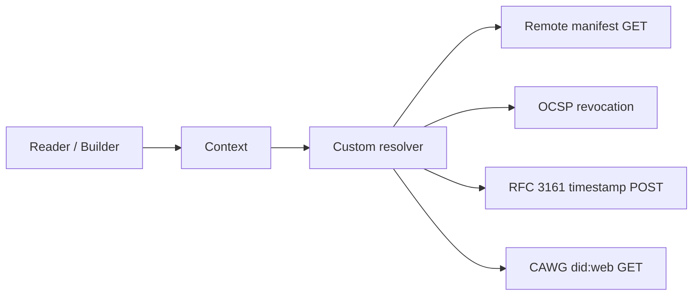
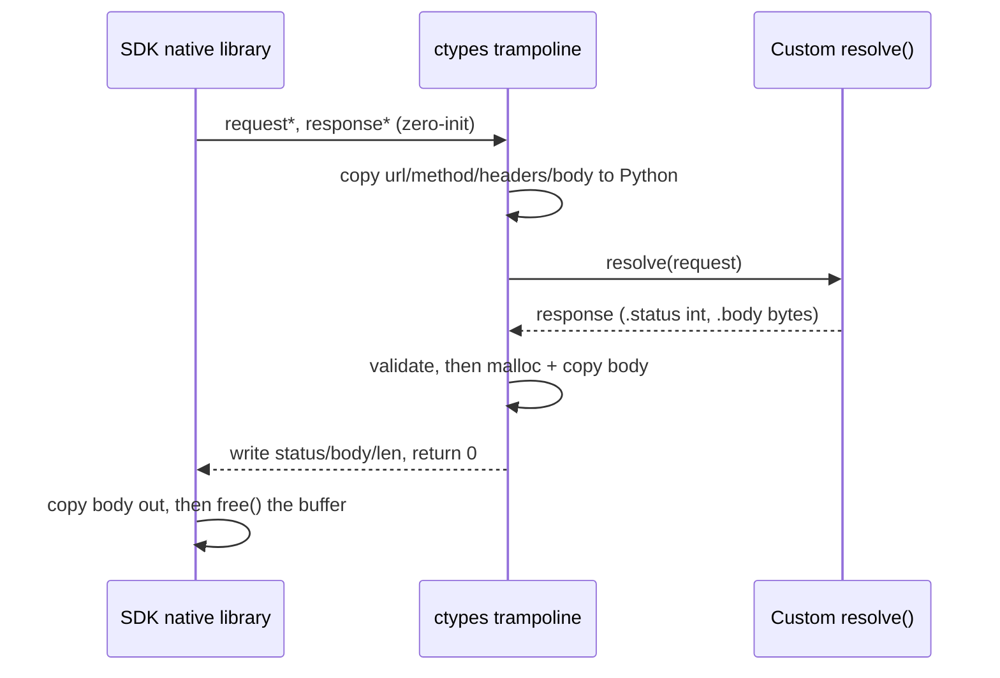
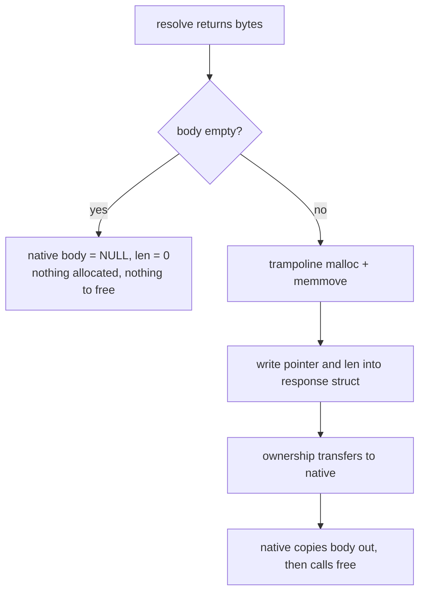

# Custom HTTP resolvers

This document explains how (custom) HTTP resolvers work end to end, what the SDK does and does not do with HTTP, and the platform differences (Linux, Windows, macOS) that affect a resolver in practice.

## HTTP resolvers overview

A custom HTTP resolver intercepts every HTTP request the SDK makes through a `Context`, so an application can add headers, cache responses, or serve responses from memory in tests.

c2pa ships no resolver types at all: there is no `HttpRequest`, `HttpResponse`, or `HttpResolver` to import from `c2pa`. `ContextBuilder.with_resolver()` (and the `Context(resolver=...)` constructor argument, also accepted by `Context.from_json`/`from_dict`) never does an `isinstance` check. It accepts either:

- any callable taking one request argument;
- any object with a `resolve(request)` method.

The request passed to the custom resolver exposes `.url` (str), `.method` (str), `.headers` (dict), and `.body` (bytes). The value it returns only needs `.status` (int) and `.body` (bytes) attributes. The minimal form needs no imports at all:

```py
def my_resolver(request):
    # request.url, request.method, request.headers, request.body
    return SomeResponse(status=200, body=b"...")

context = c2pa.Context.builder().with_resolver(my_resolver).build()
reader = c2pa.Reader("image/jpeg", stream, context=context)
```

The resolver is validated immediately: something with a wrong shape raises `TypeError` from `with_resolver()` itself (or from the `Context` constructor on the direct path), not later at `.build()`. If a resolver object has both a `resolve()` method and is itself callable, `resolve()` wins.

[`http_resolver_example_impl.py`](./http_resolver_example_impl.py) is an example implementation of that shape. It defines `HttpRequest`, `HttpResponse`, and an optional `HttpResolver` abstract base class (subclassing it is not required, as it just provides a documented, type-checkable contract instead of duck typing), and three example resolvers:

- `DebugHttpResolver`: logs every request/response, delegates the transfer to `urllib`.
- `CachingHttpResolver`: TTL'd LRU cache plus retry/backoff for throttled requests.
- `AlwaysFailResolver`: answers every request with a fixed status and needs no network.

The module has no dependency on `c2pa` itself. Only the tests import `c2pa`, to exercise the resolvers against real `Context`/`Reader`/`Builder` instances.

## How the SDK uses the network (and why http or https)

The SDK asks the resolver whenever verifying or signing needs a remote resource.

Four kinds of request flow through, all triggered by reading or signing an asset:

- Remote manifest fetch: a `GET` for a manifest stored outside the asset (the asset carries only a URL). Happens while reading, and while signing when an ingredient has a remote manifest.
- OCSP revocation: a request that checks whether the signing certificate has been revoked. The URL comes from the certificate's Authority Information Access extension, not from the custom resolver.
- RFC 3161 timestamps: a `POST` to a timestamp authority while signing, so the signature carries a trusted time.
- CAWG `did:web` resolution: a `GET` for the DID document backing an identity assertion, when a manifest uses CAWG identity.

One HTTP(S) resolver, attached to one `Context`, is where all four pass through:



### Why http or why https

The SDK does not pick the scheme to use, since it uses a URL it sees in the data and uses the protocol suggested by the URL (HTTP or HTTPS). It uses whatever the URL carries, and that URL comes from outside the SDK: the manifest's remote reference, the certificate's OCSP URL, the configured timestamp authority, or the DID. The scheme is a property of the endpoint, not a setting the application controls.

Manifest fetches, timestamps, and `did:web` are normally `https`. OCSP is often plain `http`: an OCSP response is itself CMS-signed, so its integrity does not depend on TLS, and fetching revocation over `https` risks a circular dependency (validating a certificate would require validating the OCSP responder's own certificate first). An `http` OCSP URL sitting next to `https` everywhere else is normal, not a downgrade.

Because the URL can be tweaked (it can come from whatever asset a caller supplies), a custom resolver should reject schemes it does not expect before making any request. The two network-facing examples, `DebugHttpResolver` and `CachingHttpResolver`, reject any URL whose scheme is not `http`/`https` for this reason (`AlwaysFailResolver` makes no request, so it does not). See the host-filtering note under [What the SDK leaves to the resolver](#what-the-sdk-leaves-to-the-resolver).

## Notes on runtime

The native library and the Python process must share a C runtime: buffers the HTTP resolver bridge allocates are freed on the native side with `libc::free`, so a native library built against a different C runtime (e.g. a static-musl `.so`) than the one the Python process loads will corrupt memory.

## What traffic flows through a resolver (and when)

A resolver attached to a `Context` handles **every** HTTP request the SDK makes through that `Context`. Scope and gating to keep in mind:

- The resolver is **per-Context**. `Reader` and `Builder` instances created *without* that `Context` keep using the SDK's built-in resolver. Attaching a resolver to one `Context` changes nothing anywhere else.
- `with_resolver()` can be called multiple times when creating a context to use: the last resolver set wins and will be used.
- **Settings still gate the resolver.** With `verify.remote_manifest_fetch` set to `false`, the resolver is never invoked for a remote-manifest read. The read fails instead. A resolver is not a way to re-enable disabled fetching.

## How resolution works, end to end

Conceptually the pipeline is: native code decides it needs an HTTP resource, calls back into Python, the custom resolver performs the transfer however it likes, then the response is copied back into native memory.

The **trampoline** is the small ctypes callback that bridges the two sides. It is a function (built by `C2paHttpResolverBridge._make_trampoline`) that native code invokes through a raw C function pointer, and whose only job is to bounce that call into Python: decode the native request, call the custom resolver's `resolve()`, and encode the result back into native memory. It is a thin shim that exists only to redirect a call from one calling convention (here, the C ABI) into another (a Python callable). The call bounces off it into Python and the result bounces back across the C FFI boundary. It adapts between the two sides but does none of the HTTP work itself.

Concretely, step by step:

1. **Wiring.** `Context.__init__` normalizes the custom resolver into a plain callable (the `resolve` bound method, or the callable itself) and wraps it in a ctypes trampoline (`C2paHttpResolverBridge._make_trampoline`). A short-lived native resolver handle is created via `c2pa_http_resolver_create` and consumed by `c2pa_context_builder_set_http_resolver`. The native context builder takes ownership, so there is nothing for the caller to free.
2. **Invocation.** Whenever the native library needs an HTTP resource through that context, it synchronously invokes the trampoline with a pointer to a native request struct and a pointer to a zero-initialized native response struct. The call blocks the SDK operation (`Reader(...)`, `builder.sign(...)`, `add_ingredient(...)`) that triggered it, and **there is no SDK-side timeout**. A resolver that hangs, hangs that SDK call. Timeouts are entirely the custom resolver's responsibility (the network-facing examples pass `timeout=` to `urllib.request.urlopen`).
3. **Decode.** The trampoline copies everything out of the native request struct (URL, method, headers, body) into a plain Python object (`C2paHttpRequestData`) holding `str`/`bytes`. Because it is a copy, the request object stays valid after `resolve()` returns. Storing it (as `DebugHttpResolver` stores `(method, url)` tuples) is safe.
4. **Resolve.** The custom resolver's `resolve()` runs and returns a response-shaped object, or raises.
5. **Encode.** The trampoline validates the response (`.status` must be an `int`, `.body` must be `bytes`/`bytearray`), copies a non-empty body into a buffer allocated with the C runtime `malloc`, and writes status/body/length into the native response struct. Ownership of that buffer transfers to native code, which frees it on both the success and the error path. The custom resolver never allocates or frees anything. It only ever returns `bytes`.
6. **Consume.** The native side copies the body out, frees the buffer, and hands the response to whatever validation or signing logic asked for it.



## Request semantics

- `url` is the absolute request URL.
- `method` is the HTTP verb: `GET` for manifest fetches, `POST` for timestamp requests.
- `headers` is a dict. Header names arrive **lowercased** by the native layer. Repeated headers are delivered as separate lines internally. In the dict, the **last occurrence wins**.
- `body` is `b""` when there is no body (manifest fetches). Timestamp requests `POST` a body. `request.body or None` is the idiomatic way to hand it to `urllib.request.Request`, as the network-facing examples do.

## Response and error semantics

- **Status passes through.** Return the real status, and do not translate. For a remote manifest fetch, only `200` is accepted. Anything else surfaces to the SDK caller as a typed `C2paError`. `DebugHttpResolver` shows the right pattern for `urllib`: an `HTTPError` is still a response, so it returns `HttpResponse(e.code, e.read())` and lets the SDK produce its own error.
- **Raising marks a hard failure.** A transport-level problem (DNS failure, connection refused, timeout) is not a response. Raise, and the SDK reports the request as failed. The examples deliberately do *not* catch `urllib.error.URLError` for exactly this reason.
- **A raised exception does not propagate as itself.** Exceptions cannot unwind across the ctypes/native boundary. The trampoline catches everything the custom resolver raises, including `BaseException` and `KeyboardInterrupt`, records its message in the native error slot, and the failure re-emerges as a typed `C2paError` raised from the `Reader`/`Builder` call that triggered the fetch. An `except MyCustomError:` around `c2pa.Reader(...)` will never fire. Callers should catch `c2pa.C2paError` and read the message.
- **Shape errors are caught early.** Returning a `str` body, a `None` or `bool` status, or a status outside the 100-599 range is rejected inside the trampoline with a clear `TypeError` message, which then surfaces the same way (as a `C2paError`).
- An **empty body** is fine: return `b""` (as `AlwaysFailResolver` does), and the trampoline correctly leaves the native body pointer/length pair empty together.

## Lifetimes

- **The resolver outlives `Context.close()`.** Native `Reader`/`Builder` instances hold their own reference to the underlying native context, so the custom resolver can still be invoked after the Python `Context` is closed, for as long as any `Reader` or `Builder` created from it is alive. A custom resolver must not tear down its resources (close a session, release a pool) on `Context.close()`. Those should be tied to the resolver's own lifetime instead. The SDK internally pins the callback thunk to keep this safe, so there is nothing the caller needs to hold onto.
- **No reentrancy.** A custom resolver must not call c2pa APIs from inside `resolve()`. Re-entering the FFI while a call is in flight is undefined.
- **Do not close while a call is in flight.** A `Context`/`Reader`/`Builder` must not be closed while a call is still running on that same object, including a resolver call it triggered. This is a general property of these objects, not something specific to resolvers.

## What the SDK leaves to the resolver

The SDK delegates the *transfer* entirely; the resolver *is* the HTTP client. That means:

- **No redirects.** The SDK does not follow redirects. A `301`/`302` returned as-is is just a non-200. Delegating to `urllib.request` (as the network-facing examples do) gives redirect handling. Make sure to implement (or block) redirects as needed by the custom resolver.
- **Host filtering is bypassed.** The `core.allowed_network_hosts` setting only filters the *built-in* resolver. A custom resolver receives every request regardless; one that needs an allowlist must enforce it in `resolve()` (raise or return an error status for disallowed hosts). The URL comes from a remote-manifest reference embedded in the asset. The network-facing examples reject any URL whose scheme is not `http`/`https` before doing anything else. Validating the host (and, depending on the deployment, the resolved address and port) is worth considering too.
- **TLS belongs to the resolver.** Certificate verification, trust stores, and proxy handling all belong to whatever HTTP stack the custom resolver uses. The SDK sees only status and bytes. This is where most of the platform-specific behavior lives. See the platform section below.
- **No Content-Length plumbing.** The resolver response carries no `Content-Length`, so remote manifests larger than 10 MB are truncated **without an error**. A resolver that serves large manifests should note the failure mode downstream is a validation error, not a size error.
- **No caching, retries, or backoff.** Each needed resource is requested; policy belongs to the custom resolver. `CachingHttpResolver` is the reference for a reasonable policy: cache only `GET`s answered with `200` (never `POST`s, since timestamp requests must not be replayed from cache, and never error responses), retry only `429`/`503` with a capped `Retry-After` or exponential backoff, and pass every other status through untouched.

## Platform differences: Linux, Windows, macOS

The trampoline itself behaves identically everywhere, but three areas differ per platform in ways that bite resolver implementers.

### 1. The C runtime and the response buffer (why a resolver never allocates)

The response body buffer must be allocated by the **same C runtime whose `free()` the native library calls** (on the Rust side that is `libc::free`). On Linux and macOS there is effectively one C runtime per process (glibc/musl, libSystem), so "the process's own libc" is always the right allocator. **Windows is different:** a process can host several C runtimes side by side, each with its own heap. Rust's MSVC targets link the Universal CRT, so `free` there is `ucrtbase`'s, while the legacy `msvcrt.dll` is a *different* heap. Allocating from one and freeing into the other is heap corruption, not a leak, and it corrupts silently until it crashes somewhere unrelated.

This is the reason the bindings carry `ManagedResource._get_native_malloc()` rather than allocating the response buffer from Python's own memory or a plain `ctypes` call. The helper resolves, once and lazily, the exact `malloc` whose heap matches the native library's `free`:

- On Windows it loads `ucrtbase` first and falls back to `msvcrt`, matching the CRT that Rust's `libc::free` uses.
- On Linux and macOS it opens the process's own C library with `ctypes.CDLL(None)`, so its `malloc` and the native `free` come from the same libc.

The helper also sets `malloc.restype = ctypes.c_void_p`. Without that, `ctypes` assumes a `c_int` return and truncates a 64-bit pointer to 32 bits. The truncated address handed to native `free` is a second, quieter way to corrupt the heap. The looked-up function is cached on the class, so the resolution happens at most once per process.

The trampoline calls that `malloc`, copies the returned `bytes` into the buffer, and writes the pointer into the native response struct, and native code frees it afterwards. That is the whole reason a custom resolver returns `bytes` and nothing else: **it returns `bytes`, never a pointer, and never memory it allocated with `ctypes` itself.** The reason this rule exists is Windows.

The body buffer's ownership follows one path:



### 2. TLS trust stores

The example resolvers delegate to `urllib`, so they inherit Python's `ssl` defaults, which differ by platform:

- **macOS:** python.org builds do **not** use the system Keychain. If `Install Certificates.command` was never run after installing Python, every HTTPS fetch fails with `CERTIFICATE_VERIFY_FAILED`. Workaround without reinstalling: prefix the run with `SSL_CERT_FILE=$(python -m certifi)`.
- **Linux:** OpenSSL uses the distribution's CA bundle. On a normal desktop this just works. In slim container images the `ca-certificates` package is often missing, producing the same `CERTIFICATE_VERIFY_FAILED`. Install the package or set `SSL_CERT_FILE`.
- **Windows:** Python's `ssl` loads roots from the Windows certificate store, so system-managed (including enterprise-injected) roots are honored automatically. Corporate TLS-interception proxies therefore tend to *work* on Windows and *fail* on macOS/Linux with the same code. If a fetch verifies on one machine and not another, compare trust stores before suspecting the resolver.

A resolver using a different HTTP stack has that stack's trust behavior instead. TLS trust is resolver-side, per-platform, and invisible to the SDK.

### 3. Proxies

`urllib` discovers proxies differently per platform: environment variables (`http_proxy`, `https_proxy`, `no_proxy`) everywhere, **plus** the Windows registry (Internet Settings) on Windows and the System Configuration framework (Network preferences) on macOS. On Linux, environment variables are the only source. So a resolver built on `urllib` silently follows OS-level proxy settings on Windows/macOS but ignores them on Linux, another way the same resolver code behaves differently per machine. For deterministic behavior, a custom resolver should configure the proxy (or its absence) explicitly rather than relying on discovery.

## Examples and tests

- [`http_resolver_example_impl.py`](./http_resolver_example_impl.py): the reference shapes (`HttpRequest`, `HttpResponse`, optional `HttpResolver` ABC) and the three resolvers described above. Copy it into a project and adapt it. It does not import `c2pa`.
- [`test_http_resolver_debug.py`](./test_http_resolver_debug.py): exercises `DebugHttpResolver`, verifying that a remote-manifest read logs a `GET`, that signing with a remote-manifest ingredient fetches it through the resolver, and that re-reading the signed (embedded-manifest) output performs no HTTP at all.
- [`test_http_resolver_cache.py`](./test_http_resolver_cache.py): exercises `CachingHttpResolver` (reading twice / ingesting the same ingredient repeatedly hits the cache exactly as the hit/miss counters predict) and `AlwaysFailResolver` (a non-200 answer surfaces as a clean typed `C2paError`, with no network needed).

Those examples need network access to fetch the remote manifest for `tests/fixtures/cloud.jpg`, and fail without it.

If the Python runtime has no CA bundle configured, every fetch fails with `CERTIFICATE_VERIFY_FAILED` (see the TLS section above). On macOS python.org builds this is the common case, so the commands below include the fix.

Run them in a CLI with the commands:

```bash
python ./tests/http_resolver/test_http_resolver_debug.py
python ./tests/http_resolver/test_http_resolver_cache.py

# Or the whole directory via unittest discovery:
python -m unittest discover -s tests/http_resolver -v
```

On some operating systems, if a CERTIFICATE_VERIFY_FAILED error appears, this prefix on the commands fixes it:

```bash
SSL_CERT_FILE=$(python -m certifi) python ./tests/http_resolver/test_http_resolver_debug.py
SSL_CERT_FILE=$(python -m certifi) python ./tests/http_resolver/test_http_resolver_cache.py

# Or the whole directory via unittest discovery:
SSL_CERT_FILE=$(python -m certifi) python -m unittest discover -s tests/http_resolver -v
```

## See also

- [`http_resolver_example_impl.py`](./http_resolver_example_impl.py) — copyable reference resolvers (`DebugHttpResolver`, `CachingHttpResolver`, `AlwaysFailResolver`).
- [`../../docs/context-settings.md`](../../docs/context-settings.md) — settings that gate networking, including `core.allowed_network_hosts` and `verify.remote_manifest_fetch`.
- [`../../docs/native-resources-management.md`](../../docs/native-resources-management.md) — how the SDK manages native handles and their lifetimes, including behavior across process boundaries.
